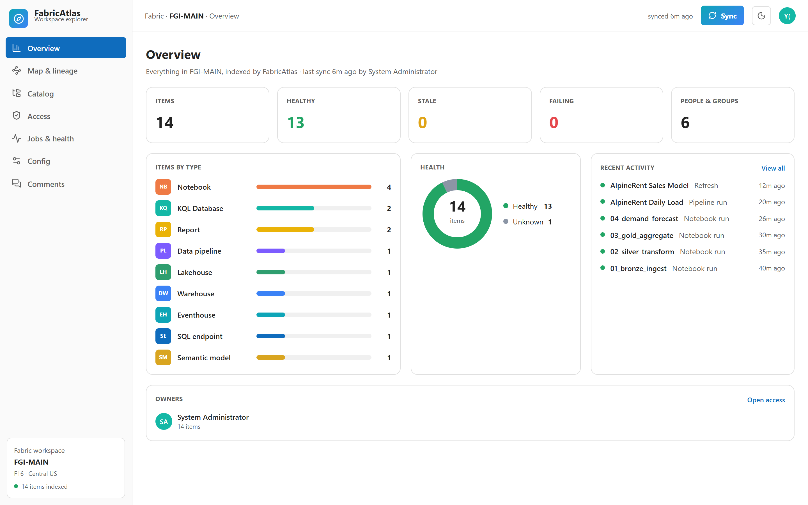
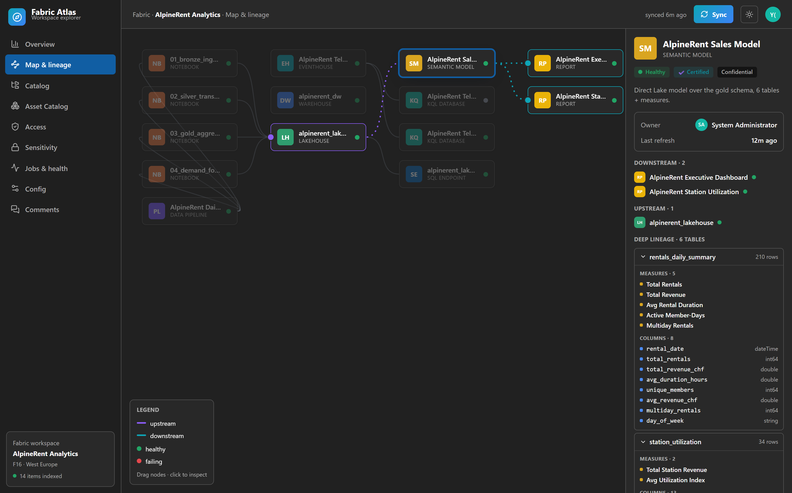
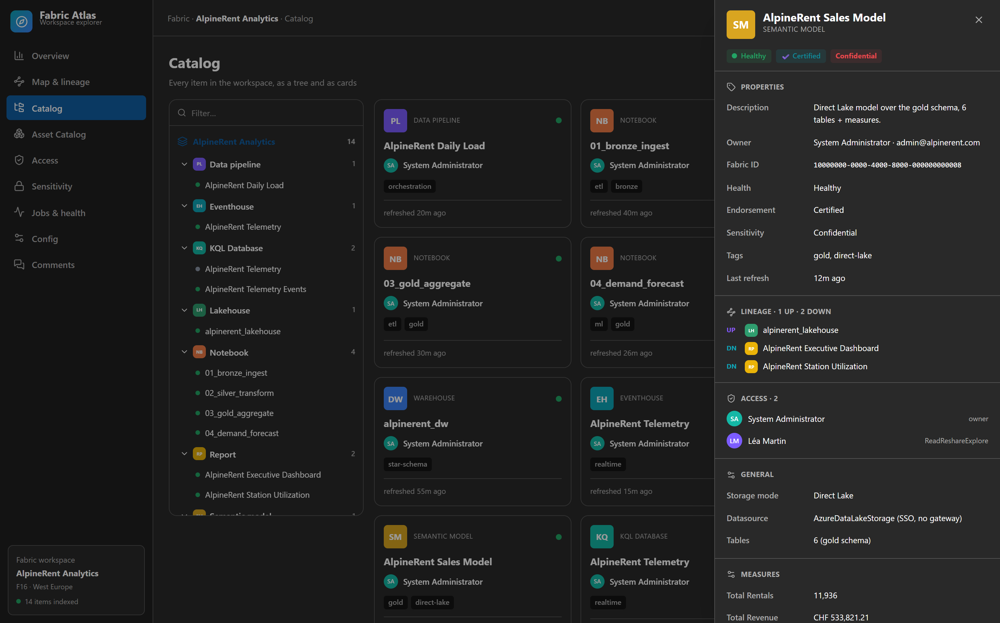
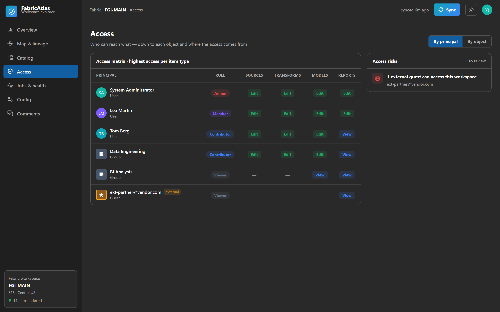
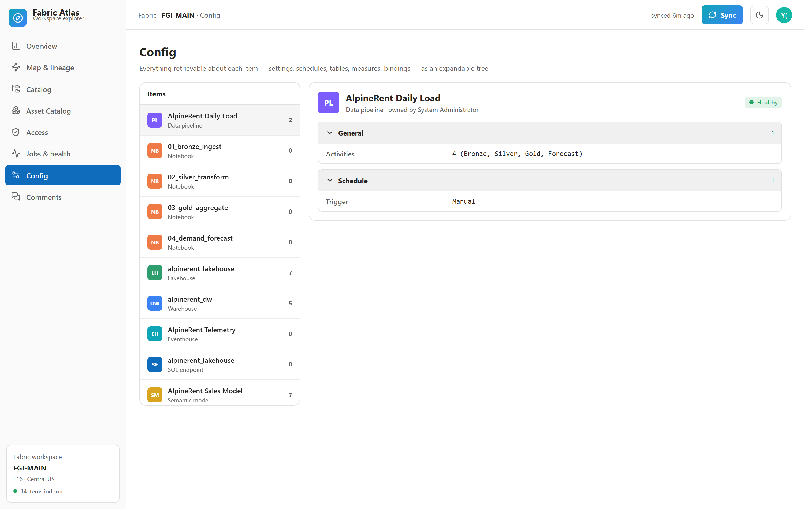
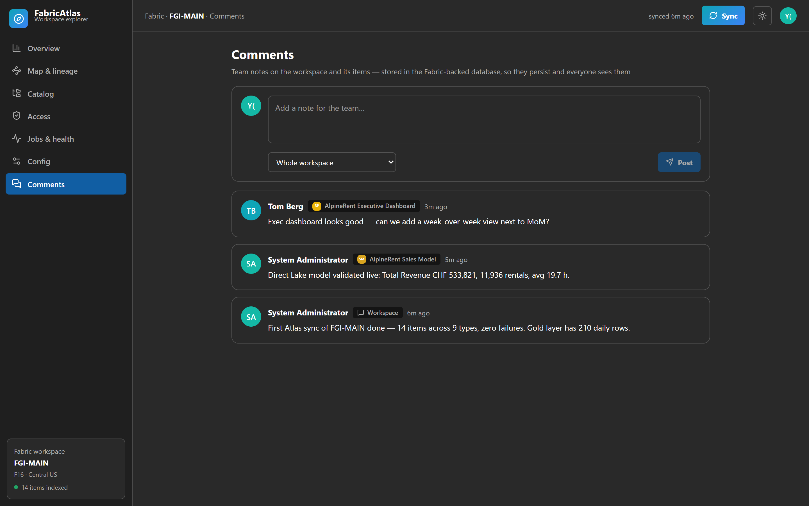
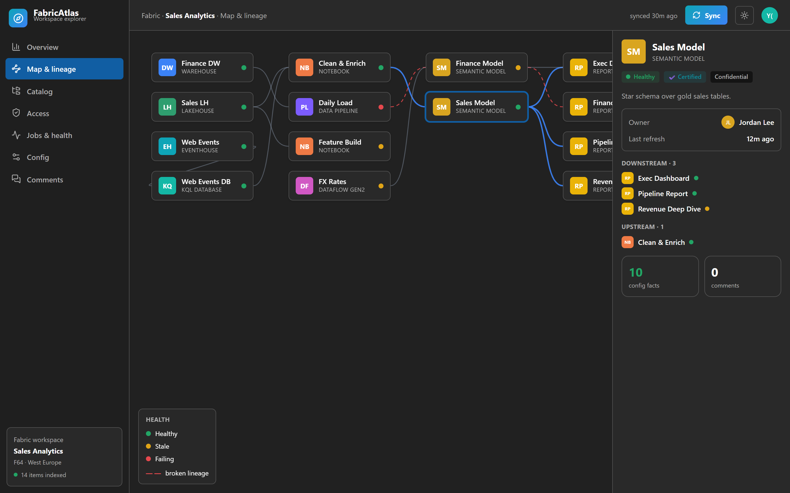

<div align="center">

# 🧭 FabricAtlas

### Everything in your Microsoft Fabric workspace, in one place.

Items, lineage, catalog, access, jobs, config — and a team comment layer that lives in the database.
Built as a [Rayfin](https://github.com/microsoft/rayfin) Data App and deployed straight into Fabric.

</div>



---

## What is FabricAtlas?

A Fabric workspace grows fast: lakehouses, notebooks, pipelines, semantic models, reports. Nobody has
the full picture — what depends on what, who can see what, what just failed, who owns it.

FabricAtlas gives you that picture. Click **Sync** and it reads your workspace from the Fabric APIs
and stores everything in its own data model. Then it draws it: a living map of your items and their
lineage, a catalog you can browse as a tree or as cards, an access matrix down to each object, a jobs
board, an exhaustive config tree per item, and a comment thread your whole team shares.

No business data required. FabricAtlas only reads your workspace metadata, so you can point it at any
workspace and get value on the first Sync.

## A tour

### Map & lineage
A cartography of every item and how they connect. Broken lineage is called out in red. Click any node
to inspect it, walk upstream and downstream, and jump around.



### Catalog
Every item as a collapsible tree and as rich cards — owner, health, endorsement, tags, freshness.



### Access
Who can reach what. A matrix by principal, and a drill-down by object that explains where each grant
comes from (workspace role, direct share, group, org link). Risks are surfaced automatically.



### Config
Everything retrievable about an item — settings, schedules, tables, measures, bindings — as an
expandable tree.



### Comments
Team notes on the workspace or any item, stored in the Fabric-backed database so they persist and
everyone sees them.



### Light and dark
White by default, with a one-click dark theme that also follows the Fabric portal.



## Why Rayfin

FabricAtlas is a Rayfin Data App, so the whole backend is described in TypeScript and provisioned by
Rayfin on Fabric:

- The **data model** is nine decorator classes in `rayfin/data/`. Rayfin turns them into a governed
  Fabric SQL database with a typed Data API — that is where the synced metadata and the comments live.
- **Auth** is Fabric brokered (Entra ID). **Hosting** is Rayfin static hosting. **Storage** is ready
  for attachments.
- One command deploys everything and applies schema changes: `rayfin up`.

And because it is declarative, you can grow it by prompting an AI agent. See
[docs/evolving-with-rayfin.md](docs/evolving-with-rayfin.md).

## Quickstart

```bash
git clone https://github.com/fredgis/FabricAtlas.git
cd FabricAtlas
npm install

# explore locally with sample data (no Fabric needed)
npm run dev            # http://localhost:5173

# deploy into your Fabric workspace
npx rayfin login --tenant <your-tenant-id> --select
npx rayfin up --workspace "FGIMain"
```

Full steps in [docs/installation.md](docs/installation.md).

## Docs

| Doc | About |
| --- | --- |
| [Installation & deployment](docs/installation.md) | Prerequisites, local preview, deploy to Fabric |
| [Architecture](docs/architecture.md) | How the SPA, Rayfin data layer and Sync fit together |
| [Data model](docs/data-model.md) | The nine entities and their fields |
| [Evolving with Rayfin](docs/evolving-with-rayfin.md) | Grow the app with prompts and `rayfin up` |

## Repo layout

```
rayfin/
  rayfin.yml            # services: auth, data (mssql), storage, static hosting
  data/                 # 9 entity classes + schema.ts
src/
  App.tsx               # shell: sidebar, top bar, theme, sync, tab routing
  atlas/
    model.ts            # types, item-type metadata, sample dataset
    store.tsx           # data + sync + comments (preview / Rayfin backed)
    backend.ts          # persistence + Fabric sync boundary
    ui.tsx              # avatars, glyphs, health chips, cards
    views/              # Overview, Map, Catalog, Access, Jobs, Config, Comments
docs/                   # this documentation + screenshots
```

## License

MIT © 2026. Built with [Rayfin](https://github.com/microsoft/rayfin) on Microsoft Fabric.
