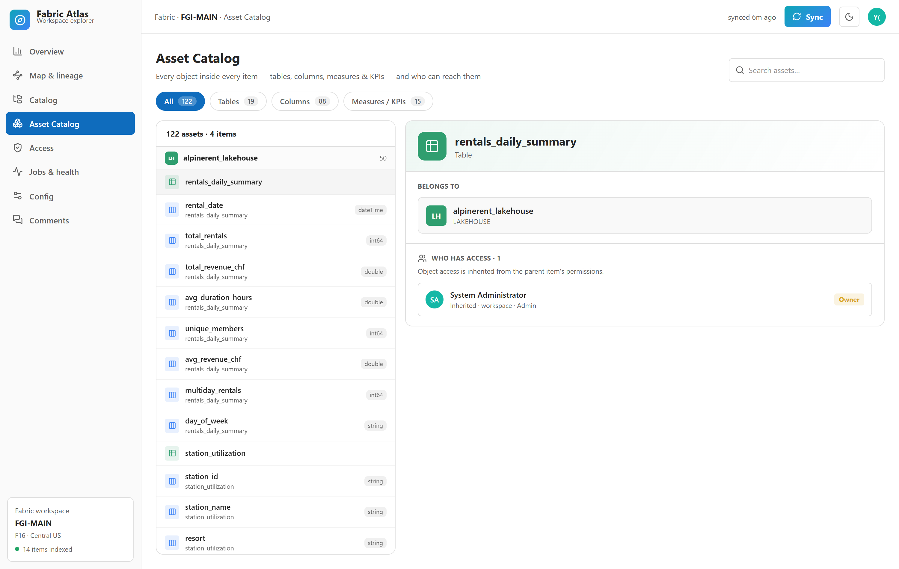
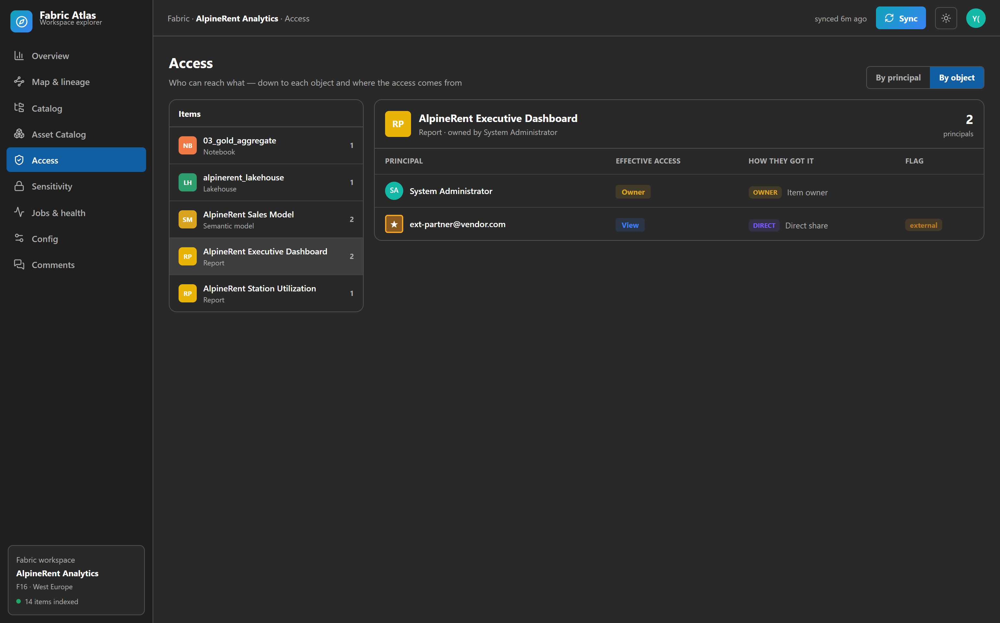
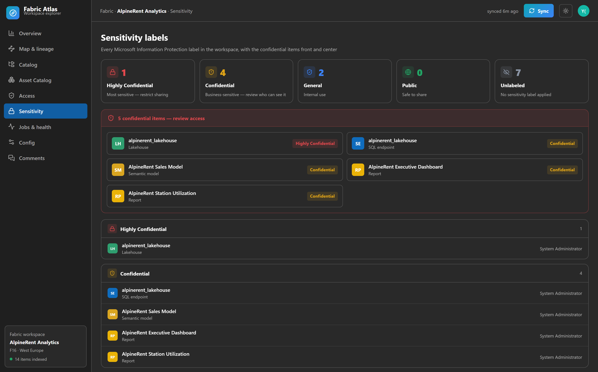
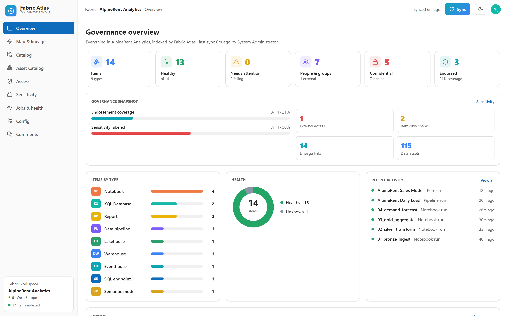
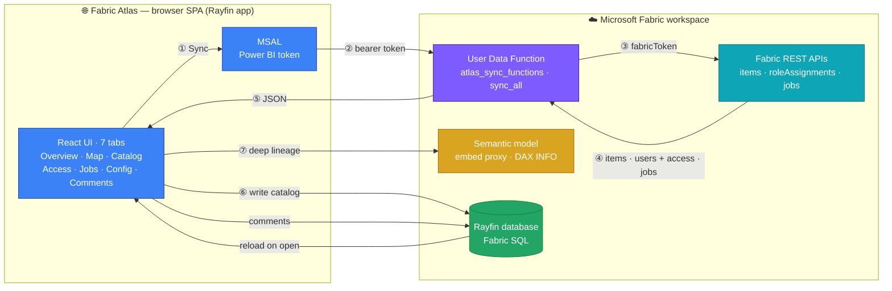

<div align="center">

# 🧭 Fabric Atlas

### Everything in your Microsoft Fabric workspace, in one place.

Items, lineage, catalog, access, jobs, config — and a team comment layer that lives in the database.
Built as a [Rayfin](https://github.com/microsoft/rayfin) Data App and deployed straight into Fabric.

</div>

## Overview in less than one minute

https://github.com/user-attachments/assets/21b1d273-da69-4869-a96c-26d4b6003aa7

https://github.com/user-attachments/assets/52052323-f1f2-479b-8d39-18f7400fba24

---

## What is Fabric Atlas?

A Fabric workspace grows fast: lakehouses, notebooks, pipelines, semantic models, reports. Nobody has
the full picture — what depends on what, who can see what, what just failed, who owns it.

Fabric Atlas gives you that picture. Click **Sync** and it reads your workspace from the Fabric APIs
and stores everything in its own data model. Then it draws it: a living map of your items and their
lineage, a catalog you can browse as a tree or as cards, an access matrix down to each object, a jobs
board, an exhaustive config tree per item, and a comment thread your whole team shares.

No business data required. Fabric Atlas only reads your workspace metadata, so you can point it at any
workspace and get value on the first Sync.

## A tour

### Overview
A one-glance dashboard: items by type, health, recent activity and jump-off points into the rest of the app.


### Map & lineage
A cartography of every item and how they connect. **Drag nodes** to rearrange the graph, and click any
node to light up its **upstream (violet)** and **downstream (teal)** in both directions while everything
else dims. The inspector walks the lineage all the way down to a semantic model's tables, columns and
measures.


### Catalog
Every item as a collapsible tree and as rich cards — owner, health, endorsement, tags, freshness.
Click any card to slide open a panel with **all of its properties**: identity, lineage, access,
config facts and recent jobs.


### Asset Catalog
Goes _inside_ the items: every table, column, measure and KPI across the workspace, searchable and
grouped by item. Pick any object and see exactly **who can access it** — inherited from the parent
item's permissions.



### Access
Who can reach what. Toggle **By principal** or **By object**. The matrix computes **real effective
access** from the actual grants; click a principal to expand every **item and asset** they can reach.
Item-level shares are surfaced too: someone given a single report or model, without workspace
membership, shows up as **item-only**, and the risk panel calls out external guests and service
principals.




### Sensitivity
Every Microsoft Information Protection label in the workspace, with confidential and
highly-confidential items spotlighted for review.



### Config
Everything retrievable about an item — storage mode, OneLake paths, SQL endpoint, tables and measures —
as an expandable tree. When a detail can't be read (for example a warehouse's tables need a SQL
connection), it says so.


### Comments
Team notes on the workspace or any item, stored in the Fabric-backed database so they persist and
everyone sees them.


### Light and dark
Light by default, with a one-click dark theme (most shots here are dark). When embedded, it follows
the Fabric portal theme.



## Why Rayfin

Fabric Atlas is a Rayfin Data App, so the whole backend is described in TypeScript and provisioned by
Rayfin on Fabric:

- The **data model** is nine decorator classes in `rayfin/data/`. Rayfin turns them into a governed
  Fabric SQL database with a typed Data API — that is where the synced metadata and the comments live.
- **Auth** is Fabric brokered (Entra ID). **Hosting** is Rayfin static hosting. **Storage** is ready
  for attachments.
- One command deploys everything and applies schema changes: `rayfin up`.

And because it is declarative, you can grow it by prompting an AI agent. See
[docs/evolving-with-rayfin.md](docs/evolving-with-rayfin.md).

> ### ℹ️ Why a Fabric User Data Function?
>
> A deployed Rayfin app is a browser SPA with a Fabric SSO session, but Rayfin never
> exposes a Fabric access token to app code, and the Fabric REST APIs don't allow browser
> CORS. So the app cannot call the Fabric management APIs (list items, lineage,
> permissions, jobs) directly from the browser. Fabric Atlas therefore ships a small Fabric
> User Data Function (`atlas_sync_functions`, Python) that runs server-side, receives the
> user's token, calls the Fabric REST APIs on their behalf, and returns the results, which
> the Sync button writes into the Atlas database. The semantic-model deep lineage (tables,
> columns, measures) is read in-app through the Fabric embed proxy (DAX `INFO` functions),
> which is the one Fabric data path a browser app is allowed to use. Fabric does not expose
> a REST API to publish a User Data Function, so that one step is done once in the Fabric
> portal (Publish), after which the app invokes it. The function's source and the publish
> steps live in [`fabric/udf/atlas_sync_functions/`](fabric/udf/atlas_sync_functions/).

## How it works



The **Sync** button acquires a Power BI token (MSAL), the `sync_all` User Data
Function reads the workspace with it, and the result — items, the list of
workspace **users and their access**, and jobs — is written into the Rayfin
database and rendered. Comments and the last sync are read back on open.

> ### 💡 What would make this simpler — Rayfin vs Fabric
>
> Building Fabric Atlas surfaced a few gaps. Some are for **Rayfin** (the Data App
> framework); the rest need a **new or extended Fabric platform API**.
>
> **Rayfin (the Data App framework):**
> - Expose a scoped, opt-in brokered Fabric token to app code, so the app can call
>   Fabric REST without a separate User Data Function and app registration.
> - Add first-class server functions to the Data App template — a place to run
>   trusted server-side code (like `sync_all`) without provisioning a separate UDF.
> - Support bulk `upsert` and CLI seeding for `@authenticated` entities, so a first
>   dataset can load at deploy time, not only from the signed-in app.
>
> **Fabric platform (a new or extended API):**
> - A REST/CLI way to publish a User Data Function and read its invoke URL, so
>   deployment is fully scriptable instead of a manual portal click.
> - A native Fabric lineage API (item level and intra-item: tables, columns,
>   measures), so lineage isn't stitched from the admin scanner and DAX `INFO`.
> - CORS on the Fabric management endpoints, for delegated browser calls.

## Quickstart

```bash
git clone https://github.com/fredgis/FabricAtlas.git
cd FabricAtlas
npm install

# explore locally with sample data (no Fabric needed)
npm run dev            # http://localhost:5173

# deploy into your Fabric workspace
npx rayfin login --tenant <your-tenant-id> --select
npx rayfin up --workspace "<workspace-name>"
```

Full steps in [docs/installation.md](docs/installation.md).

## Reuse it as a Rayfin template

Fabric Atlas is a standard Rayfin Data App, so you can hand it to the rest of the
org as a Rayfin template: teammates scaffold their own copy, wired to *their*
workspace, in one command. The [`rayfin-template.yml`](rayfin-template.yml)
manifest at the repo root already marks it as one.

**Scaffold a fresh app from the repo** — no setup, nothing to publish first:

```bash
rayfin init my-atlas -t https://github.com/fredgis/FabricAtlas
cd my-atlas && npm install
```

`rayfin init -t <git-url>` clones the template, renames the project, and leaves you
with a fresh, deployable app. Pin a version with `...FabricAtlas#v1.0.0` if you want.

**Publish it to an internal template gallery** so it appears in the interactive
`rayfin init` picker for everyone. Add one entry to a shared registry file —
registries merge in tier order: bundled, then user-global
`~/.rayfin/template-registries.yml`, then project-local `.rayfin/template-registries.yml`:

```yaml
# ~/.rayfin/template-registries.yml
registries:
  - name: fabric-atlas
    displayName: Fabric Atlas
    description: Workspace governance explorer
    url: https://github.com/fredgis/FabricAtlas   # or your internal GitHub / Azure DevOps mirror
    ref: main                                     # a tag or commit SHA is safer for a shared registry
    templateName: fabric-atlas
```

Because every id is env-driven (the privacy scrub in this repo), the template ships
code only: no tenant, workspace, or client id travels with it. Each team supplies
its own `.env`, publishes its own Sync function and app registration
([docs/installation.md](docs/installation.md)), then runs `rayfin up`.

## Docs

| Doc | About |
| --- | --- |
| [Installation & deployment](docs/installation.md) | Prerequisites, local preview, deploy to Fabric |
| [Architecture](docs/architecture.md) | How the SPA, Rayfin data layer and Sync fit together |
| [Data model](docs/data-model.md) | The nine entities and their fields |
| [Evolving with Rayfin](docs/evolving-with-rayfin.md) | Grow the app with prompts and `rayfin up` |

## Repo layout

```
rayfin/
  rayfin.yml            # services: auth, data (mssql), storage, static hosting
  data/                 # 9 entity classes + schema.ts
src/
  App.tsx               # shell: sidebar, top bar, theme, sync, tab routing
  atlas/
    model.ts            # types, item-type metadata, sample dataset
    store.tsx           # data + sync + comments (preview / Rayfin backed)
    backend.ts          # persistence + Fabric sync boundary
    ui.tsx              # avatars, glyphs, health chips, cards
    views/              # Overview, Map, Catalog, Asset Catalog, Access, Sensitivity, Jobs, Config, Comments
docs/                   # this documentation + screenshots
```

---

A free sample, shared as-is. Built with [Rayfin](https://github.com/microsoft/rayfin) on Microsoft Fabric.
