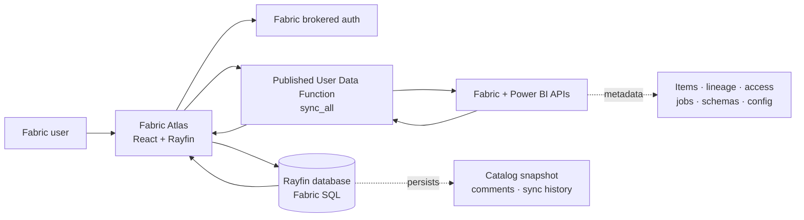

<div align="center">

# 🧭 Fabric Atlas

### The open-source governance map for Microsoft Fabric workspaces

Catalog every item. Trace lineage. Review effective access. Surface risks.
Keep configuration and team context together — directly inside Fabric.

[](https://github.com/fredgis/FabricAtlas/releases/latest)
[](LICENSE)
[](https://react.dev/)
[](https://github.com/microsoft/rayfin)
[](https://www.microsoft.com/microsoft-fabric)

[See the release](https://github.com/fredgis/FabricAtlas/releases/latest)
·
[Install](docs/installation.md)
·
[Architecture](docs/architecture.md)
·
[Changelog](CHANGELOG.md)

</div>

---

## Why Fabric Atlas?

Fabric workspaces grow quickly: lakehouses, notebooks, pipelines, semantic
models, reports, permissions, labels and scheduled jobs. The information exists,
but it is distributed across many portal screens and APIs.

Fabric Atlas creates one living operational map from that metadata.

| Discover | Govern | Operate |
|---|---|---|
| Browse every workspace item and sub-object | Review effective access and sensitivity gaps | Track jobs, configuration and team notes |
| Follow upstream and downstream lineage | Identify guests, broad shares and service principals | Refresh the catalog through one guided sync |
| Search tables, columns and measures | Understand inherited versus direct permissions | Keep shared context in the Fabric-backed database |

> **Metadata only.** Fabric Atlas does not copy or persist workspace business data.

## See it in action

https://github.com/user-attachments/assets/21b1d273-da69-4869-a96c-26d4b6003aa7

https://github.com/user-attachments/assets/52052323-f1f2-479b-8d39-18f7400fba24

## Product tour

### Governance command center

A workspace hero, health pulse, coverage signals, risks and direct paths into
the parts of the estate that need attention.


### Focused lineage

Lineage is normalized from source to consumer and arranged through six stages:
orchestration, transformation, storage, endpoints, models and consumption.
Impact mode can isolate one dependency path, while normal mode keeps the entire
workspace visible. Selecting an item highlights it without moving the graph.


### Catalog and Asset Catalog

The Catalog provides a grouped workspace inventory with dense governance cards
and a structured details drawer. Asset Catalog goes inside items to expose
tables, columns, measures, data types and effective access.

| Catalog | Asset Catalog |
|---|---|
|  |  |

### Access and sensitivity

Review access by principal or by object. Expand a principal to see every item and
asset they can reach, then inspect external access, item-only shares and
sensitivity coverage.

| Access | Sensitivity |
|---|---|
|  |  |

### Workspace Hub

Configuration and team notes share one operational workspace. Inspect settings,
schemas and bindings, then keep decisions and follow-ups beside the technical
context they explain.

| Configuration | Team notes |
|---|---|
|  |  |

## Features

- **Guided synchronization** — every deployed build starts with one metadata
  refresh and shows live progress.
- **Impact-aware lineage** — transitive upstream and downstream paths, stable
  node selection, filters, minimap, zoom and item/object modes.
- **Workspace catalog** — searchable item inventory with health, owner,
  endorsement, tags and freshness.
- **Object catalog** — tables, columns, measures and inherited access.
- **Effective access** — workspace roles, direct shares, item-only access,
  guests and service principals.
- **Sensitivity posture** — label coverage, confidential spotlight and
  unlabeled gaps.
- **Operational history** — Fabric jobs grouped by time with duration and
  status.
- **Workspace Hub** — configuration explorer and persistent team notes.
- **Open-source project view** — release, source, clone and license information.
- **Dark by default** — persistent light theme available on demand.

## How it works


```mermaid
flowchart LR
  U["Fabric user"] --> APP["Fabric Atlas<br/>React + Rayfin"]
  APP --> AUTH["Fabric brokered auth"]
  APP --> UDF["Published User Data Function<br/>sync_all"]
  UDF --> REST["Fabric + Power BI APIs"]
  REST --> UDF
  UDF --> APP
  APP --> DB[("Rayfin database<br/>Fabric SQL")]
  DB --> APP

  REST -. metadata .-> ITEMS["Items · lineage · access<br/>jobs · schemas · config"]
  DB -. persists .-> CONTEXT["Catalog snapshot<br/>comments · sync history"]
```

The browser cannot call Fabric management APIs directly because those endpoints
do not support the required browser CORS flow. The published
`atlas_sync_functions` User Data Function runs server-side, calls the Fabric and
Power BI APIs with the signed-in user's delegated token, and returns metadata to
the app. Rayfin persists the synchronized snapshot and team notes.

See [Architecture](docs/architecture.md) for the complete flow.

## Quickstart

### Local preview

```powershell
git clone https://github.com/fredgis/FabricAtlas.git
Set-Location FabricAtlas
npm install
npm run dev
```

The standalone app uses the included AlpineRent preview estate. No business data
or Fabric workspace is required.

### Deploy to Microsoft Fabric

```powershell
npx rayfin login --tenant <tenant-id> --select
npx rayfin up --workspace "<workspace-name>"
```

Publish the User Data Function in
[`fabric/udf/atlas_sync_functions/`](fabric/udf/atlas_sync_functions/), then add
the public values to the git-ignored `rayfin/.env` file:

```dotenv
RAYFIN_PUBLIC_ATLAS_SPA_CLIENT_ID=<entra-client-id>
RAYFIN_PUBLIC_ATLAS_UDF_URL=https://<host>/functions/sync_all/invoke
RAYFIN_PUBLIC_ATLAS_WORKSPACE_NAME=<workspace-display-name>
```

Run `npx rayfin up` again. The deployed app opens on its guided synchronization
screen.

Full prerequisites and Entra configuration are documented in
[Installation and deployment](docs/installation.md).

## Development

```powershell
npm test
npm run lint
npm run build
```

| Path | Purpose |
|---|---|
| `src/atlas/views/` | Product views |
| `src/atlas/store.tsx` | Hydration, synchronization and comments |
| `src/atlas/lineage.ts` | Edge normalization, impact traversal and layout |
| `src/atlas/backend.ts` | Rayfin persistence boundary |
| `src/atlas/live-sync.ts` | Fabric UDF invocation and payload mapping |
| `rayfin/data/` | Persisted entity model |
| `fabric/udf/atlas_sync_functions/` | Server-side Fabric metadata sync |
| `docs/` | Architecture, data model and deployment guides |

## Reuse as a Rayfin template

```powershell
rayfin init my-atlas -t https://github.com/fredgis/FabricAtlas#v1.3.0
Set-Location my-atlas
npm install
```

The repository includes [`rayfin-template.yml`](rayfin-template.yml), so it can
also be added to an internal Rayfin template registry.

## Open-source project

- [Releases](https://github.com/fredgis/FabricAtlas/releases)
- [Changelog](CHANGELOG.md)
- [Contributing](.github/CONTRIBUTING.md)
- [Security policy](.github/SECURITY.md)
- [Code of conduct](.github/CODE_OF_CONDUCT.md)
- [Installation guide](docs/installation.md)
- [Architecture](docs/architecture.md)
- [Data model](docs/data-model.md)

Issues and pull requests are welcome. Keep changes focused, preserve the
metadata-only security boundary, and include tests for new synchronization or
lineage behavior.

---

<div align="center">

Built openly with React, Rayfin and Microsoft Fabric.

</div>
