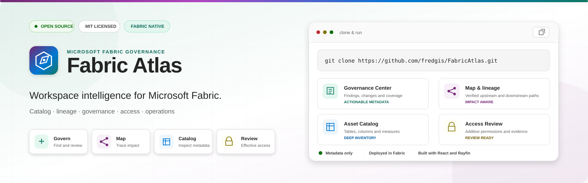
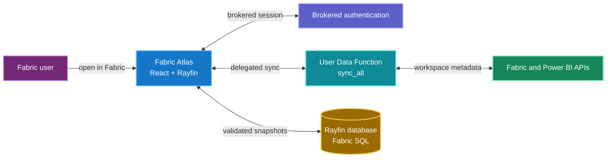

<div align="center">



Fabric Atlas gives a team one readable map of its Fabric workspace. It brings
together lineage, item metadata, access, sensitivity and run history, then keeps
the last validated snapshot in Fabric so everyone sees the same state.

[](https://github.com/fredgis/FabricAtlas/releases/latest)
[](LICENSE)
[](https://react.dev/)
[](https://github.com/microsoft/rayfin)
[](https://www.microsoft.com/microsoft-fabric)

[Install](docs/installation.md) ·
[Architecture](docs/architecture.md) ·
[Functionalities](#functionalities) ·
[Roadmap](#roadmap) ·
[Changelog](CHANGELOG.md) ·
[Contribute](.github/CONTRIBUTING.md)

</div>

## Quick look

https://github.com/user-attachments/assets/21b1d273-da69-4869-a96c-26d4b6003aa7

## What it does

Fabric workspaces spread operational metadata across many portal pages and APIs.
Fabric Atlas collects that metadata without copying business data.

- Browse workspace items and their internal objects.
- Inspect Lakehouse, Warehouse and SQL Database tables or views, Semantic Model
  columns and measures, and Report pages when Fabric exposes them.
- Trace item and object lineage from source to report.
- Review effective access, direct shares and external principals.
- Check sensitivity coverage and confidential assets.
- Compare validated snapshots and review governance findings.
- Search the whole workspace with `Ctrl+K` and save useful filter views.
- Export access reviews and verified lineage impact reports.
- Inspect jobs, configuration and team notes in one workspace hub.
- Refresh the catalog through a guided synchronization flow.

## Functionalities

<details>
<summary><strong>Workspace synchronization and reliability</strong></summary>

| Functionality | What it provides |
|---|---|
| Guided first synchronization | A dedicated deployment screen with staged progress before the first catalog becomes visible |
| Header synchronization | Reuses the same progress model for later refreshes without leaving the current page |
| Immutable snapshots | Writes catalog rows first and publishes the workspace manifest only after every write succeeds |
| Last-known-good fallback | Ignores incomplete snapshots and loads the newest valid workspace state |
| Deployment gate | Requires one synchronization for each deployed build before users enter the catalog |
| Trusted synchronizer | Restricts snapshot publication to the configured synchronization account |
| Snapshot history | Loads previous validated snapshots for comparisons and governance trends |

</details>

<details>
<summary><strong>Governance Center</strong></summary>

| Functionality | What it provides |
|---|---|
| Findings | Actionable access, metadata, operations and lineage checks based on synchronized evidence |
| Change Center | Compares any two validated snapshots across items, schema, access, sensitivity, lineage and jobs |
| Governance history | Tracks items, labels, external principals, failures, lineage and schema inventory over time |
| Metadata coverage | Shows descriptions, owners, sensitivity, endorsement and object-inventory completeness |
| Sensitivity posture | Groups protected and unlabeled items and surfaces confidential assets |
| Saved governance views | Persists personal filters such as metadata gaps, external access or failed operations |

</details>

<details>
<summary><strong>Catalog and object inventory</strong></summary>

| Functionality | What it provides |
|---|---|
| Workspace catalog | Groups Fabric items by type with search, health, ownership, labels, tags and detail drawers |
| Asset Catalog | Lists tables, views, columns and measures under their parent Fabric item |
| Deep metadata | Shows data types, descriptions, visibility, sources, row counts and measure expressions when available |
| Item context | Keeps properties, lineage, access, configuration and job history beside the selected item |
| Collapsed groups | Starts inventory lists grouped and collapsed for faster scanning |

</details>

<details>
<summary><strong>Lineage and impact</strong></summary>

| Functionality | What it provides |
|---|---|
| Item lineage | Places Fabric items in lifecycle stages from orchestration to consumption |
| Object mode | Expands synchronized tables, columns and measures without claiming unsupported field bindings |
| Impact tracing | Highlights upstream and downstream paths without moving the selected node |
| Multi-selection | Moves several selected item or object nodes together |
| Layout controls | Provides zoom, fit, reset, filters, minimap and persistent deep links |
| Impact reports | Exports verified dependency evidence as Markdown for an item or schema object |

</details>

<details>
<summary><strong>Access and information protection</strong></summary>

| Functionality | What it provides |
|---|---|
| Additive effective access | Combines workspace and item grants so a direct share never reduces inherited access |
| Access Review matrix | Reviews every reachable principal and item pair with permission, source and evidence |
| Principal review | Groups all reachable items under collapsible principal sections |
| Review decisions | Persists Reviewed, Accepted or Needs action status with an optional personal note |
| CSV export | Downloads the currently filtered access evidence |
| Risk filters | Isolates external, broad, service-principal, admin and unresolved access |

</details>

<details>
<summary><strong>Operations and collaboration</strong></summary>

| Functionality | What it provides |
|---|---|
| Jobs and health | Groups refresh, pipeline and notebook activity with status, duration and errors |
| Job filters | Searches run history, isolates failures and saves recurring operational views |
| Workspace Hub | Keeps synchronized configuration and shared team notes in one grouped interface |
| Item notes | Attaches persistent context to the workspace or a specific Fabric item |
| Sync audit | Records who synchronized the workspace, when it ran and how much metadata was indexed |

</details>

<details>
<summary><strong>Search, navigation and personalization</strong></summary>

| Functionality | What it provides |
|---|---|
| Global `Ctrl+K` search | Searches items, tables, views, columns, measures, principals, jobs, configuration and notes |
| Targeted navigation | Opens the matching drawer, asset, review, job or Workspace Hub section |
| Personal saved views | Stores user-scoped filter presets in the Fabric-backed Rayfin database |
| Light and dark themes | Uses a Fabric-aligned light mode by default with an optional persistent dark mode |
| Responsive navigation | Keeps grouped Explore, Govern, Operate and System sections usable on smaller screens |

</details>

<details>
<summary><strong>Security, deployment and open source</strong></summary>

| Functionality | What it provides |
|---|---|
| Fabric brokered authentication | Runs inside the Fabric portal with the signed-in Entra identity |
| Bound token selection | Matches the Power BI token account and tenant to the current Fabric user |
| Metadata-only storage | Stores governance metadata and notes, never workspace business data |
| User-scoped preferences | Protects saved views and access-review decisions with Rayfin row policies |
| Fabric deployment | Builds, migrates the schema and deploys the app through `npx rayfin up` |
| Open-source project | Includes MIT licensing, contribution guidance, security reporting and release history |

</details>

## Product screenshots

### Workspace overview

The overview brings health, freshness, governance signals and inventory reach
together in a Fabric-native operational landing page.


### Guided deployment sync

Each deployed build starts with a controlled metadata refresh. Progress, target
workspace and the source-to-insight topology stay visible throughout the scan.


### Interactive lineage

The map follows Fabric assets from orchestration to consumption. Selecting an
item highlights its verified path while the inspector keeps schema, access,
runs and impact actions beside the graph.


### Object lineage

Object mode expands a synchronized table into its columns and connected Fabric
items. The inspector keeps ownership, impact and related metadata visible while
objects are selected or rearranged.


### Asset Catalog

Tables, views, columns and measures are grouped by Fabric item. Selecting an
asset exposes its source, model context and additive effective access.


### Governance Center

Findings, snapshot changes, history, coverage and sensitivity are grouped into
one governance workspace with saved views and evidence links.


### Access Review

The review matrix combines inherited and direct permissions, then supports
focused filtering, personal decisions and CSV export.


### Impact reports

An item or schema object can produce an exportable report with verified
upstream, downstream and relationship evidence.


## How it works


```mermaid
flowchart LR
  U["Fabric user"]
  APP["Fabric Atlas<br/>React + Rayfin"]
  AUTH["Brokered authentication"]
  UDF["User Data Function<br/>sync_all"]
  API["Fabric and Power BI APIs"]
  DB[("Rayfin database<br/>Fabric SQL")]

  U -->|"open in Fabric"| APP
  APP <-->|"brokered session"| AUTH
  APP <-->|"delegated sync"| UDF
  UDF <-->|"workspace metadata"| API
  APP <-->|"validated snapshots"| DB

  classDef user fill:#742774,stroke:#a66dd4,color:#ffffff,stroke-width:2px;
  classDef app fill:#1677c8,stroke:#6fc7ff,color:#ffffff,stroke-width:2px;
  classDef auth fill:#5b5fc7,stroke:#a7a9ff,color:#ffffff,stroke-width:2px;
  classDef udf fill:#0e8a99,stroke:#67e8e2,color:#ffffff,stroke-width:2px;
  classDef api fill:#16855b,stroke:#6ee7a8,color:#ffffff,stroke-width:2px;
  classDef database fill:#9a6b00,stroke:#f2c94c,color:#ffffff,stroke-width:2px;

  class U user;
  class APP app;
  class AUTH auth;
  class UDF udf;
  class API api;
  class DB database;
```

The browser cannot call Fabric management APIs directly. A published User Data
Function performs the metadata scan server-side with the signed-in user's
delegated token. The app validates the result, stores a workspace-scoped
snapshot through Rayfin, and keeps the previous valid snapshot if a refresh
fails.

See [Architecture](docs/architecture.md) for the full data flow.

## Roadmap

Multi-workspace catalog support is planned and tracked in
[#4](https://github.com/fredgis/FabricAtlas/issues/4). The implementation will
stay focused on a controlled set of workspaces rather than scanning an entire
tenant automatically.

| Target | Planned PR | Release | Engineering scope | Exit criteria |
|---|---:|---|---|---|
| Q4 CY26 | PR 1 | `v2.0.0` | Keep catalog reads shared with the authorized app audience and restrict scope changes to the configured synchronizer. Refactor persistence around an explicit `workspaceId`, add independent manifests and migrate the existing single-workspace snapshot. | A failed or incomplete workspace refresh cannot invalidate another workspace snapshot. |
| Q4 CY26 | PR 2 | `v2.0.0` | Add UDF workspace discovery, persist the selected indexing scope, and run a bounded synchronization queue with progress and errors reported per workspace. | The synchronizer can select workspaces, refresh them independently and retry only failures. |
| Q4 CY26 | PR 3 | `v2.0.0` | Add available, selected and active workspace state with lazy snapshot loading. Aggregate Overview, Catalog, Asset Catalog, Access, Sensitivity and Jobs. Keep Workspace Hub, configuration and comments tied to one active workspace. | Multi-workspace catalog MVP ready for release. |
| Q1 CY27 | PR 4 | `v2.0.1` | Use composite graph IDs, open one workspace by default and allow comparison of up to three workspaces in separate visual groups. Show local lineage only at this stage. | Comparison stays readable and never creates an inferred connection. |
| Q1 CY27 | PR 5 | `v2.0.2` | Run grouped metadata scans for the selected workspaces, build a global item index and persist source and target workspace IDs on relationships returned by Microsoft. | Verified cross-workspace lineage appears only when both endpoints are part of the indexed scope. |

`v2.0.0` is the multi-workspace catalog milestone planned for Q4 CY26.
`v2.0.1` adds lineage comparison, followed by verified cross-workspace
relationships in `v2.0.2` during Q1 CY27. These dates are targets and may move
if Fabric API coverage changes.

## Quickstart

### Local preview

```powershell
git clone https://github.com/fredgis/FabricAtlas.git
Set-Location FabricAtlas
npm install
npm run dev
```

The local app uses the included AlpineRent preview estate.

### Deploy to Fabric

```powershell
npx rayfin login --tenant <tenant-id> --select
npx rayfin up --workspace "<workspace-name>"
```

Publish the function in
[`fabric/udf/atlas_sync_functions/`](fabric/udf/atlas_sync_functions/), then add
these public values to the git-ignored `rayfin/.env` file:

```dotenv
RAYFIN_PUBLIC_ATLAS_SPA_CLIENT_ID=<entra-client-id>
RAYFIN_PUBLIC_ATLAS_UDF_URL=https://<host>/functions/sync_all/invoke
RAYFIN_PUBLIC_ATLAS_WORKSPACE_NAME=<workspace-display-name>
RAYFIN_PUBLIC_ATLAS_SYNC_ADMIN_EMAIL=<authorized-sync-user>
```

Run `npx rayfin up` again. The app opens on a guided synchronization screen.

The complete Entra, UDF and deployment steps are in
[docs/installation.md](docs/installation.md).

## Development

```powershell
npm test
npm run lint
npm run build
```

| Path | Purpose |
|---|---|
| `src/atlas/views/` | Application pages |
| `src/atlas/store.tsx` | Hydration, synchronization and comments |
| `src/atlas/history.ts` | Validated snapshot comparison and governance trends |
| `src/atlas/governance.ts` | Effective access, findings and metadata coverage |
| `src/atlas/search.ts` | Global workspace search index |
| `src/atlas/lineage.ts` | Lineage normalization, traversal and layout |
| `src/atlas/backend.ts` | Workspace snapshots and Rayfin persistence |
| `src/atlas/live-sync.ts` | UDF invocation and response mapping |
| `rayfin/data/` | Persisted entity model |
| `fabric/udf/atlas_sync_functions/` | Server-side Fabric metadata scan |

## Security

Fabric Atlas stores workspace metadata and team notes. It does not persist
workspace business data. Tokens and deployment values stay outside Git in
`rayfin/.env`.

The project has been reviewed against OWASP Top 10:2025 and ASVS 5.0. Security
hardening is part of the release process.

Report vulnerabilities through
[GitHub private vulnerability reporting](https://github.com/fredgis/FabricAtlas/security/advisories/new).

## Contributing

Found a bug, a missing Fabric object type or a useful governance workflow?
[Open an issue](https://github.com/fredgis/FabricAtlas/issues/new/choose).

Pull requests are welcome. Read
[the contribution guide](.github/CONTRIBUTING.md) before starting.

## Project links

- [Releases](https://github.com/fredgis/FabricAtlas/releases)
- [Changelog](CHANGELOG.md)
- [Installation](docs/installation.md)
- [Architecture](docs/architecture.md)
- [Data model](docs/data-model.md)
- [Security policy](.github/SECURITY.md)
- [Code of conduct](.github/CODE_OF_CONDUCT.md)

<div align="center">

MIT licensed. Built with React, Rayfin and Microsoft Fabric.

</div>
