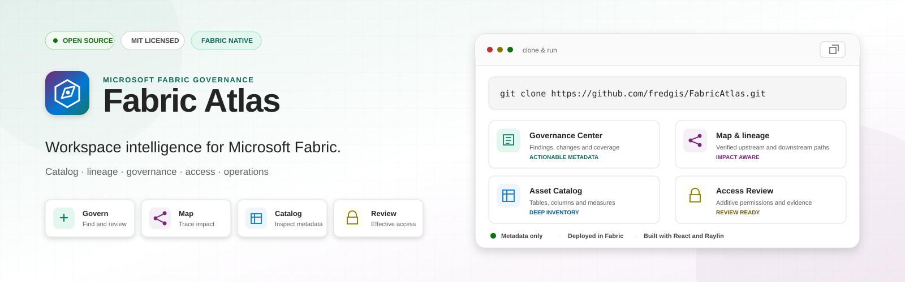
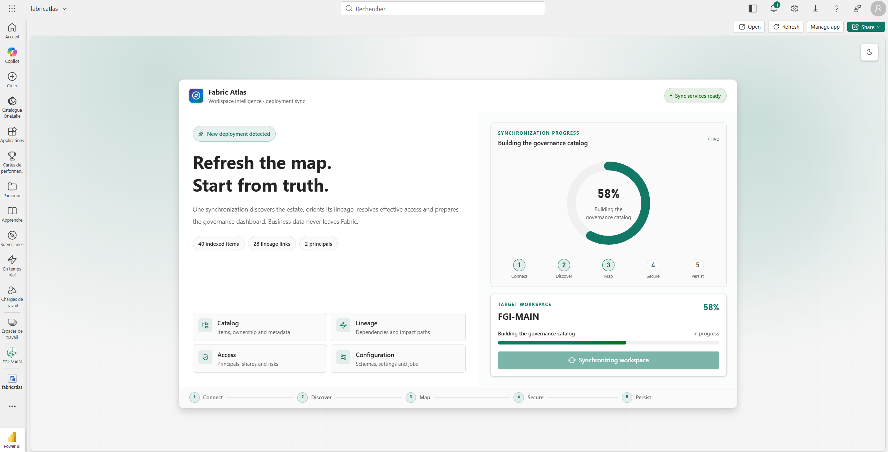
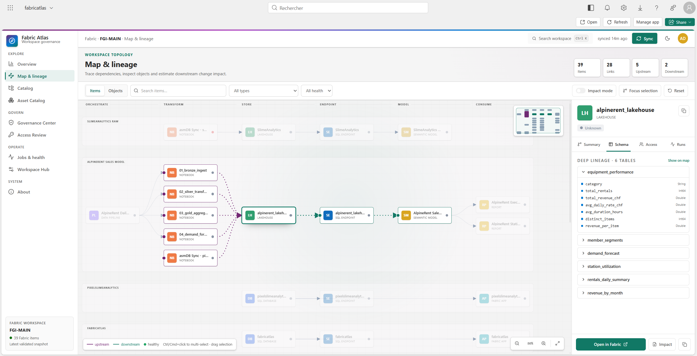
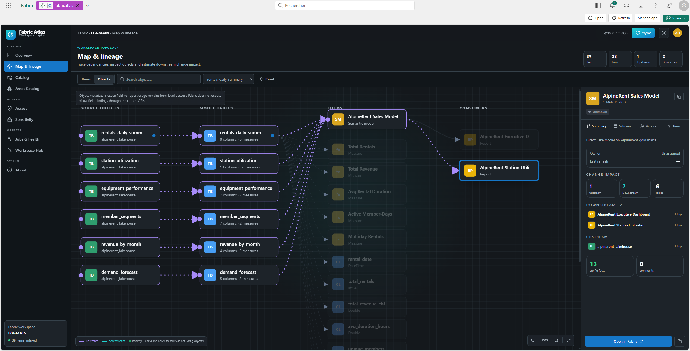
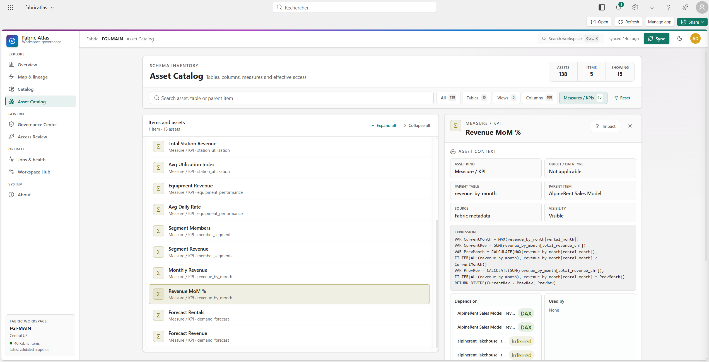
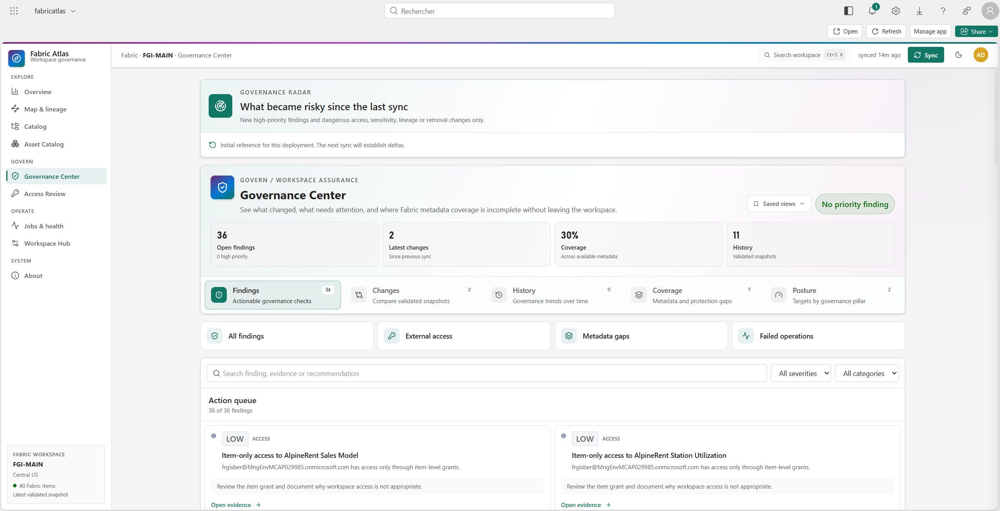
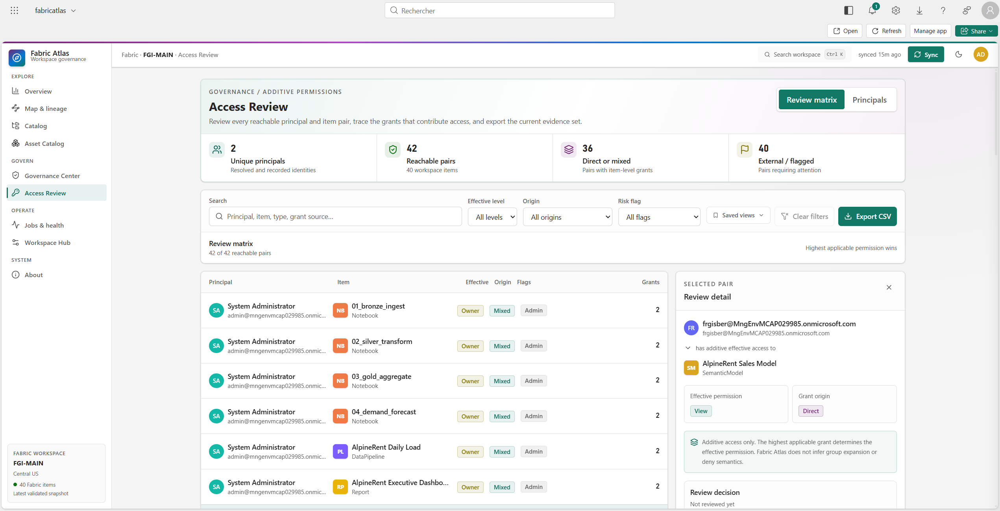
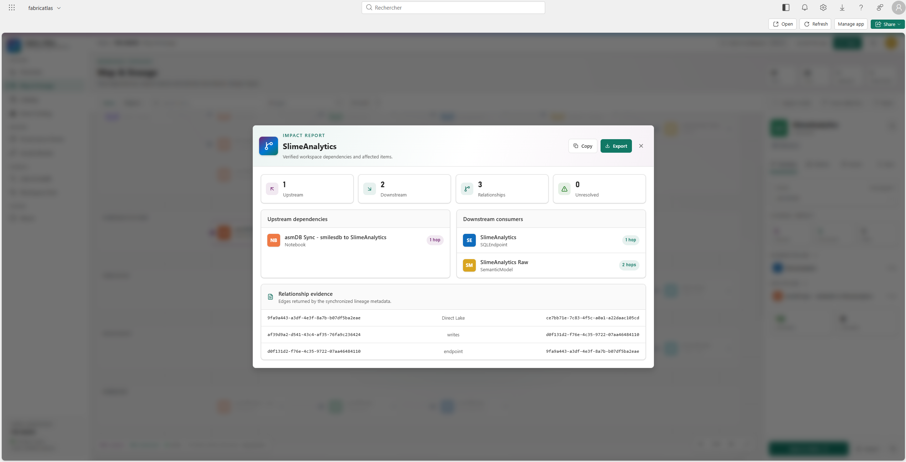
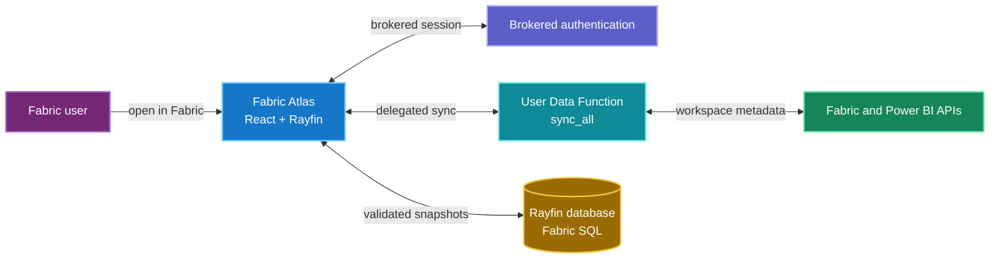

<div align="center">



Fabric Atlas gives a team one readable map of its Fabric workspace. It brings
together lineage, item metadata, access, sensitivity and run history, then keeps
the last validated snapshot in Fabric so everyone sees the same state.

[](https://github.com/fredgis/FabricAtlas/releases/latest)
[](LICENSE)
[](https://react.dev/)
[](https://github.com/microsoft/rayfin)
[](https://www.microsoft.com/microsoft-fabric)

[Install](docs/installation.md) ·
[Architecture](docs/architecture.md) ·
[Functionalities](#functionalities) ·
[Roadmap](#roadmap) ·
[Changelog](CHANGELOG.md) ·
[Contribute](.github/CONTRIBUTING.md)

</div>

## Quick look

https://github.com/user-attachments/assets/9b7162a0-fefc-432b-8c01-e90dacb8f1db

[Watch the Full HD version on YouTube](https://youtu.be/cgkhUFTEPeI)

## What it does

Fabric workspaces spread operational metadata across many portal pages and APIs.
Fabric Atlas collects that metadata without copying business data.

- Browse workspace items and their internal objects.
- Inspect Lakehouse, Warehouse and SQL Database tables or views, Semantic Model
  columns and measures, and Report pages when Fabric exposes them.
- Trace item and object lineage from source to report.
- Review effective access, direct shares and external principals.
- Check sensitivity coverage and confidential assets.
- Compare validated snapshots and review governance findings.
- Focus on newly introduced risks with Governance Radar and personal acknowledgements.
- Track six posture pillars against explicit governance targets.
- Generate departure packs with ownership, blast radius and reassignment evidence.
- Trace resolved DAX dependencies between measures and synchronized schema objects.
- Search the whole workspace with `Ctrl+K` and save useful filter views.
- Export access reviews and verified lineage impact reports.
- Inspect jobs, configuration and team notes in one workspace hub.
- Refresh the catalog through a guided synchronization flow.

## Functionalities

<details>
<summary><strong>Workspace synchronization and reliability</strong></summary>

| Functionality | What it provides |
|---|---|
| Guided first synchronization | A dedicated deployment screen with staged progress before the first catalog becomes visible |
| Header synchronization | Reuses the same progress model and atomically refreshes every view against the new snapshot |
| Progress donut | Replaces the initial topology illustration with an accessible percentage and stage-driven donut |
| Immutable snapshots | Writes catalog rows first and publishes the workspace manifest only after every write succeeds |
| Last-known-good fallback | Ignores incomplete snapshots and loads the newest valid workspace state |
| Trusted snapshot retention | Keeps 2–50 validated snapshots, supports explicit writer rotation and removes stale rows only after a new manifest is published |
| Lightweight history | Stores versioned trend summaries in manifests and loads detailed comparisons only when selected |
| Versioned sync contract | Records required, optional and metadata-capability status for every synchronized snapshot |
| Bounded UDF execution | Applies one deadline, bounded retries and payload limits below Fabric's public endpoint ceilings |
| Accessible sync feedback | Announces stages and errors, while reduced-motion preferences disable repeating motion |
| Deployment gate | Requires synchronization for the first deployment or a new major/minor snapshot contract, while compatible patch releases reuse validated history |
| Trusted synchronizer | Restricts snapshot publication to the configured synchronization account |
| Snapshot history | Loads previous validated snapshots for comparisons and governance trends |

</details>

<details>
<summary><strong>Governance Center</strong></summary>

| Functionality | What it provides |
|---|---|
| Findings | Actionable access, metadata, operations and lineage checks based on synchronized evidence |
| Governance Radar | Establishes a visible first-snapshot baseline, shows only new priority risks, and links non-risky changes to the exact latest comparison |
| Personal Radar state | Acknowledges one occurrence or mutes a stable finding for the signed-in user |
| Change Center | Compares any two validated snapshots across items, schema, access, sensitivity, lineage and jobs |
| Shareable comparisons | Preserves both selected snapshots, section and filters in the URL |
| Governance history | Tracks items, labels, external principals, failures, lineage and schema inventory over time |
| Lazy Change Center evidence | Keeps the ledger immediate and hydrates older detailed catalogs only for the selected comparison |
| Metadata coverage | Separates collected gaps from metadata that Fabric did not expose, using explicit `N/A` states |
| Posture targets | Scores six reproducible pillars, compares targets and tracks historical trends without false zeroes |
| Sensitivity posture | Groups protected and unlabeled items and surfaces confidential assets |
| Saved governance views | Persists personal filters such as metadata gaps, external access or failed operations |

</details>

<details>
<summary><strong>Catalog and object inventory</strong></summary>

| Functionality | What it provides |
|---|---|
| Workspace catalog | Groups Fabric items by type with search, health, ownership, labels, tags and detail drawers |
| Asset Catalog | Lists tables, views, columns and measures under their parent Fabric item, while keeping synchronized schema-capable items visible when no objects are exposed |
| Deep metadata | Shows data types, descriptions, visibility, sources, row counts, measure expressions and collection provenance when available |
| DAX dependency evidence | Resolves measure references only to real synchronized columns or measures and labels inferred source hops |
| Item context | Keeps properties, lineage, access, configuration and job history beside the selected item |
| Collapsed groups | Starts inventory lists grouped and collapsed for faster scanning |

</details>

<details>
<summary><strong>Lineage and impact</strong></summary>

| Functionality | What it provides |
|---|---|
| Item lineage | Places Fabric items in lifecycle stages from orchestration to consumption |
| Object mode | Expands synchronized tables, columns and measures without claiming unsupported field bindings |
| Impact tracing | Highlights upstream and downstream paths without moving the selected node |
| Indexed graph engine | Reuses adjacency indexes for traversal, impact, connected groups and staged layout |
| Accessible relationships | Exposes item and object edges as text and distinguishes upstream paths with a dashed pattern |
| Multi-selection | Moves several selected item or object nodes together |
| Layout controls | Provides zoom, fit, reset, filters, minimap and persistent deep links |
| Impact reports | Exports verified dependency evidence as Markdown for an item or schema object |
| Object-level impact | Switches to DAX-resolved object granularity when evidence exists and preserves item fallback otherwise |

</details>

<details>
<summary><strong>Access and information protection</strong></summary>

| Functionality | What it provides |
|---|---|
| Additive effective access | Combines workspace and item grants so a direct share never reduces inherited access |
| Stable principal identity | Uses Fabric principal IDs and safely correlates legacy name or email references across snapshots |
| Access Review matrix | Reviews every reachable principal and item pair with permission, source and evidence |
| Responsive access ledger | Uses one keyboard-navigable representation across mobile and desktop without hidden duplicate rows |
| Principal review | Groups all reachable items under collapsible principal sections |
| Review decisions | Persists Reviewed, Accepted or Needs action status with an optional personal note |
| CSV export | Downloads the currently filtered access evidence |
| Risk filters | Isolates external, broad, service-principal, admin and unresolved access |
| Departure packs | Finds sole ownership, urgent orphan risk, downstream blast radius and deterministic reassignment candidates |
| Offboarding exports | Downloads reassignment CSV, effective-access CSV and a complete Markdown handover pack |

</details>

<details>
<summary><strong>Operations and collaboration</strong></summary>

| Functionality | What it provides |
|---|---|
| Jobs and health | Groups refresh, pipeline and notebook activity with status, duration and errors |
| Responsive job timeline | Shows compact mobile cards and an aligned desktop grid without horizontal table scrolling |
| Job filters | Searches run history, isolates failures and saves recurring operational views |
| Active filter chips | Removes search, status, focused item or focused run constraints independently |
| Workspace Hub | Keeps synchronized configuration and shared team notes in one grouped interface |
| Item notes | Attaches persistent context to the workspace or a specific Fabric item |
| Sync audit | Records who synchronized the workspace, when it ran and how much metadata was indexed |

</details>

<details>
<summary><strong>Search, navigation and personalization</strong></summary>

| Functionality | What it provides |
|---|---|
| Global `Ctrl+K` search | Searches items, tables, views, columns, measures, principals, jobs, configuration and notes |
| Debounced workspace index | Reuses one index per snapshot and never activates results from an earlier query |
| Targeted navigation | Opens the matching drawer, asset, review, job or Workspace Hub section |
| Shareable view state | Keeps active sections, filters, searches, selected assets and focused runs in namespaced URL parameters |
| Personal saved views | Stores user-scoped filter presets in the Fabric-backed Rayfin database |
| Light and dark themes | Uses a Fabric-aligned light mode by default with an optional persistent dark mode |
| Responsive navigation | Keeps grouped Explore, Govern, Operate and System sections usable on smaller screens |
| Keyboard-first controls | Adds managed dialogs, focus restoration, skip navigation and Arrow/Home/End tab navigation |
| Large-list containment | Lets Chromium skip off-screen rendering work for dense Access, Asset Catalog and Jobs blocks |

</details>

<details>
<summary><strong>Security, deployment and open source</strong></summary>

| Functionality | What it provides |
|---|---|
| Fabric brokered authentication | Runs inside the Fabric portal with the signed-in Entra identity |
| Bound token selection | Matches the Power BI token account and tenant to the current Fabric user |
| Metadata-only storage | Allowlists governance metadata and excludes rows, datasource details, connections and Power Query or source expressions |
| User-scoped preferences | Protects saved views and access-review decisions with Rayfin row policies |
| User-scoped Radar actions | Protects acknowledgements and mutes through the authenticated subject claim |
| Fabric deployment | Builds, migrates the schema and deploys the app through `npx rayfin up` |
| Open-source project | Includes MIT licensing, contribution guidance, security reporting and release history |

</details>

## Product screenshots

### Workspace overview

The overview brings health, freshness, governance signals and inventory reach
together in a Fabric-native operational landing page.


### Guided deployment sync

The first deployment or a new major/minor snapshot contract starts with a
controlled metadata refresh. Progress, target workspace and the live progress
donut stay visible throughout the scan; compatible patch releases reuse the
validated catalog.



### Interactive lineage

The map follows Fabric assets from orchestration to consumption. Selecting an
item highlights its verified path while the inspector keeps schema, access,
runs and impact actions beside the graph.



### Object lineage

Object mode expands a synchronized table into its columns and connected Fabric
items. The inspector keeps ownership, impact and related metadata visible while
objects are selected or rearranged.



### Asset Catalog

Tables, views, columns and measures are grouped by Fabric item. Selecting an
asset exposes its source, model context and additive effective access.



### Governance Center

Governance Radar, findings, snapshot changes, history, coverage and posture are
grouped into one governance workspace with saved views and evidence links.



### Access Review

The review matrix combines inherited and direct permissions, then supports
focused filtering, personal decisions and CSV export.



### Impact reports

An item or schema object can produce an exportable report with verified
upstream, downstream and relationship evidence.



## How it works


```mermaid
flowchart LR
  U["Fabric user"]
  APP["Fabric Atlas<br/>React + Rayfin"]
  AUTH["Brokered authentication"]
  UDF["User Data Function<br/>sync_all"]
  API["Fabric and Power BI APIs"]
  DB[("Rayfin database<br/>Fabric SQL")]

  U -->|"open in Fabric"| APP
  APP <-->|"brokered session"| AUTH
  APP <-->|"delegated sync"| UDF
  UDF <-->|"workspace metadata"| API
  APP <-->|"validated snapshots"| DB

  classDef user fill:#742774,stroke:#a66dd4,color:#ffffff,stroke-width:2px;
  classDef app fill:#1677c8,stroke:#6fc7ff,color:#ffffff,stroke-width:2px;
  classDef auth fill:#5b5fc7,stroke:#a7a9ff,color:#ffffff,stroke-width:2px;
  classDef udf fill:#0e8a99,stroke:#67e8e2,color:#ffffff,stroke-width:2px;
  classDef api fill:#16855b,stroke:#6ee7a8,color:#ffffff,stroke-width:2px;
  classDef database fill:#9a6b00,stroke:#f2c94c,color:#ffffff,stroke-width:2px;

  class U user;
  class APP app;
  class AUTH auth;
  class UDF udf;
  class API api;
  class DB database;
```

The browser cannot call Fabric management APIs directly. A published User Data
Function performs the metadata scan server-side with the signed-in user's
delegated token. Its versioned response reports required, optional and
capability status. The app validates and size-bounds that result, stores a
workspace-scoped snapshot through Rayfin, and keeps the previous valid snapshot
if a refresh fails.

See [Architecture](docs/architecture.md) for the full data flow.

## Roadmap

Multi-workspace catalog support is planned and tracked in
[#4](https://github.com/fredgis/FabricAtlas/issues/4). The implementation will
stay focused on a controlled set of workspaces rather than scanning an entire
tenant automatically.

| <sub>Target</sub> | <sub>Planned PR</sub> | <sub>Release</sub> | <sub>Engineering scope</sub> | <sub>Exit criteria</sub> |
|---|---:|---|---|---|
| <sub>Q4 CY26</sub> | <sub>PR 1</sub> | <sub>v2.0.0</sub> | <sub>Keep catalog reads shared with the authorized app audience and restrict scope changes to the configured synchronizer. Refactor persistence around an explicit `workspaceId`, add independent manifests and migrate the existing single-workspace snapshot.</sub> | <sub>A failed or incomplete workspace refresh cannot invalidate another workspace snapshot.</sub> |
| <sub>Q4 CY26</sub> | <sub>PR 2</sub> | <sub>v2.0.0</sub> | <sub>Add UDF workspace discovery, persist the selected indexing scope, and run a bounded synchronization queue with progress and errors reported per workspace.</sub> | <sub>The synchronizer can select workspaces, refresh them independently and retry only failures.</sub> |
| <sub>Q4 CY26</sub> | <sub>PR 3</sub> | <sub>v2.0.0</sub> | <sub>Add available, selected and active workspace state with lazy snapshot loading. Aggregate Overview, Catalog, Asset Catalog, Access, Sensitivity and Jobs. Keep Workspace Hub, configuration and comments tied to one active workspace.</sub> | <sub>Multi-workspace catalog MVP ready for release.</sub> |
| <sub>Q1 CY27</sub> | <sub>PR 4</sub> | <sub>v2.0.1</sub> | <sub>Use composite graph IDs, open one workspace by default and allow comparison of up to three workspaces in separate visual groups. Show local lineage only at this stage.</sub> | <sub>Comparison stays readable and never creates an inferred connection.</sub> |
| <sub>Q1 CY27</sub> | <sub>PR 5</sub> | <sub>v2.0.2</sub> | <sub>Run grouped metadata scans for the selected workspaces, build a global item index and persist source and target workspace IDs on relationships returned by Microsoft.</sub> | <sub>Verified cross-workspace lineage appears only when both endpoints are part of the indexed scope.</sub> |

`v2.0.0` is the multi-workspace catalog milestone planned for Q4 CY26.
`v2.0.1` adds lineage comparison, followed by verified cross-workspace
relationships in `v2.0.2` during Q1 CY27. These dates are targets and may move
if Fabric API coverage changes.

## Quickstart

### Local preview

```powershell
git clone https://github.com/fredgis/FabricAtlas.git
Set-Location FabricAtlas
npm install
npm run dev
```

The local app uses the included AlpineRent preview estate.

### Deploy to Fabric

```powershell
npx rayfin login --tenant <tenant-id> --select
npx rayfin up --workspace "<workspace-name>"
```

Publish the function in
[`fabric/udf/atlas_sync_functions/`](fabric/udf/atlas_sync_functions/), then add
these public values to the git-ignored `rayfin/.env` file:

```dotenv
RAYFIN_PUBLIC_ATLAS_SPA_CLIENT_ID=<entra-client-id>
RAYFIN_PUBLIC_ATLAS_UDF_URL=https://<host>/functions/sync_all/invoke
RAYFIN_PUBLIC_ATLAS_WORKSPACE_NAME=<workspace-display-name>
RAYFIN_PUBLIC_ATLAS_SYNC_ADMIN_EMAIL=<authorized-sync-user>
RAYFIN_PUBLIC_ATLAS_SNAPSHOT_RETENTION_COUNT=12
# Optional during synchronizer rotation:
RAYFIN_PUBLIC_ATLAS_PREVIOUS_SYNC_WRITERS=<former-user@example.com>
RAYFIN_PUBLIC_ATLAS_SENSITIVITY_RANKS='{"<label-id>":3,"<lower-label-id>":1}'
```

Run `npx rayfin up` again. The app opens on a guided synchronization screen.

The complete Entra, UDF and deployment steps are in
[docs/installation.md](docs/installation.md).

## Development

```powershell
npm test
npm run lint
npm run build
```

| Path | Purpose |
|---|---|
| `src/atlas/views/` | Application pages |
| `src/atlas/store.tsx` | Hydration, synchronization and comments |
| `src/atlas/history.ts` | Validated snapshot comparison and governance trends |
| `src/atlas/governance.ts` | Effective access, findings and metadata coverage |
| `src/atlas/search.ts` | Global workspace search index |
| `src/atlas/lineage.ts` | Lineage normalization, traversal and layout |
| `src/atlas/backend.ts` | Workspace snapshots and Rayfin persistence |
| `src/atlas/live-sync.ts` | UDF invocation and response mapping |
| `rayfin/data/` | Persisted entity model |
| `fabric/udf/atlas_sync_functions/` | Server-side Fabric metadata scan |

## Security

Fabric Atlas stores workspace metadata and team notes. It does not persist
workspace business data. Tokens and deployment values stay outside Git in
`rayfin/.env`.

The synchronization boundary excludes scanner rows, datasource and connection
details, and Power Query or source expressions. Measure DAX is retained only as
explicit Semantic Model metadata.

The project has been reviewed against OWASP Top 10:2025 and ASVS 5.0. Security
hardening is part of the release process.

Report vulnerabilities through
[GitHub private vulnerability reporting](https://github.com/fredgis/FabricAtlas/security/advisories/new).

## Contributing

Found a bug, a missing Fabric object type or a useful governance workflow?
[Open an issue](https://github.com/fredgis/FabricAtlas/issues/new/choose).

Pull requests are welcome. Read
[the contribution guide](.github/CONTRIBUTING.md) before starting.

## Project links

- [Releases](https://github.com/fredgis/FabricAtlas/releases)
- [Changelog](CHANGELOG.md)
- [Installation](docs/installation.md)
- [Architecture](docs/architecture.md)
- [Data model](docs/data-model.md)
- [Security policy](.github/SECURITY.md)
- [Code of conduct](.github/CODE_OF_CONDUCT.md)

## Scan coverage matrix

<sub>Atlas always indexes top-level items from the Fabric Items API. Deeper
inventory, lineage and item-level access depend on what the Fabric and Power BI
APIs expose for each type and on the required tenant settings. `N/A` means a
metadata capability was not collected; it is not treated as a missing value.</sub>

| <sub>Fabric element</sub> | <sub>Catalog and configuration</sub> | <sub>Internal inventory</sub> | <sub>Lineage</sub> | <sub>Access</sub> | <sub>Recent jobs</sub> | <sub>Known boundary</sub> |
|---|---|---|---|---|---|---|
| <sub>Workspace</sub> | <sub>Name, ID, capacity and region</sub> | <sub>Not applicable</sub> | <sub>Not applicable</sub> | <sub>Workspace role assignments</sub> | <sub>Not applicable</sub> | <sub>One workspace per `v1.x` deployment</sub> |
| <sub>Lakehouse</sub> | <sub>Description, OneLake paths, default schema and SQL endpoint status</sub> | <sub>Tables and columns from Lakehouse REST, scanner metadata or a downstream-model subset</sub> | <sub>Scanner relations and SQL endpoint path</sub> | <sub>Workspace roles and item users</sub> | <sub>When supported</sub> | <sub>Schema-enabled variants may require the downstream Semantic Model path</sub> |
| <sub>Warehouse</sub> | <sub>Description, collation, created and updated dates</sub> | <sub>Tables, views and columns from the scanner; downstream-model subset fallback</sub> | <sub>Scanner relations</sub> | <sub>Workspace roles and item users</sub> | <sub>When supported</sub> | <sub>Complete inventory can require SQL catalog connectivity</sub> |
| <sub>SQL Database</sub> | <sub>Database name, collation and backup retention</sub> | <sub>Tables, views and columns from the scanner; downstream-model subset fallback</sub> | <sub>Scanner relations</sub> | <sub>Workspace roles and item users</sub> | <sub>When supported</sub> | <sub>Complete inventory can require SQL catalog connectivity</sub> |
| <sub>SQL endpoint</sub> | <sub>Item identity and scanner metadata</sub> | <sub>No dedicated internal-object scan</sub> | <sub>Storage-to-endpoint-to-model relations</sub> | <sub>Workspace roles and item users</sub> | <sub>When supported</sub> | <sub>Used primarily as a lineage bridge</sub> |
| <sub>Semantic Model</sub> | <sub>Description, storage mode, provider and documented `configuredBy` owner</sub> | <sub>Tables, columns, measures, descriptions, hidden flags, measure DAX and resolved object dependencies</sub> | <sub>Scanner item relations plus DAX-verified measure dependencies and explicitly inferred unique source hops</sub> | <sub>Workspace roles and item users</sub> | <sub>When supported</sub> | <sub>Requires scanner schema and expression options; unresolved/ambiguous references and source or Power Query expressions are discarded</sub> |
| <sub>Report</sub> | <sub>Report type, bound Semantic Model, documented `createdBy` owner and page inventory</sub> | <sub>Pages and order</sub> | <sub>Model binding plus scanner relations</sub> | <sub>Workspace roles and item users</sub> | <sub>When supported</sub> | <sub>Visuals and field bindings are not exposed by this flow</sub> |
| <sub>Dashboard</sub> | <sub>Item and scanner metadata</sub> | <sub>No deep object inventory</sub> | <sub>Scanner relations when returned</sub> | <sub>Workspace roles and item users</sub> | <sub>When supported</sub> | <sub>Tile and visual bindings are not expanded</sub> |
| <sub>Notebook</sub> | <sub>Item description and modified metadata when returned</sub> | <sub>Source code and cells are not read</sub> | <sub>Scanner relations</sub> | <sub>Workspace roles and item users</sub> | <sub>Up to 3 returned instances</sub> | <sub>No owner is inferred without a documented owner field</sub> |
| <sub>Data Pipeline</sub> | <sub>Item description and modified metadata when returned</sub> | <sub>Activities and expressions are not expanded</sub> | <sub>Scanner relations</sub> | <sub>Workspace roles and item users</sub> | <sub>Up to 3 returned instances</sub> | <sub>No owner is inferred and pipeline definitions are not copied</sub> |
| <sub>Dataflow</sub> | <sub>Item metadata and documented `configuredBy` owner</sub> | <sub>Entities and Power Query definitions are not expanded</sub> | <sub>Official upstream Dataflow/Datamart IDs plus scanner relations</sub> | <sub>Workspace roles and item users</sub> | <sub>When supported</sub> | <sub>Cross-workspace dependencies are omitted; query content is not copied</sub> |
| <sub>Datamart</sub> | <sub>Item metadata and documented `configuredBy` owner</sub> | <sub>No deep object inventory</sub> | <sub>Official upstream Dataflow/Datamart IDs plus scanner relations</sub> | <sub>Workspace roles and item users</sub> | <sub>When supported</sub> | <sub>Cross-workspace dependencies are omitted</sub> |
| <sub>Eventhouse</sub> | <sub>Item and scanner metadata</sub> | <sub>No KQL object inventory</sub> | <sub>Scanner relations</sub> | <sub>Workspace roles and item users</sub> | <sub>When supported</sub> | <sub>Hosted database objects are not expanded</sub> |
| <sub>KQL Database</sub> | <sub>Item and scanner metadata</sub> | <sub>Tables, functions and policies are not expanded</sub> | <sub>Scanner relations</sub> | <sub>Workspace roles and item users</sub> | <sub>When supported</sub> | <sub>KQL catalog connectivity is not used</sub> |
| <sub>Eventstream</sub> | <sub>Item and scanner metadata</sub> | <sub>Internal stream topology is not expanded</sub> | <sub>Scanner relations</sub> | <sub>Workspace roles and item users</sub> | <sub>When supported</sub> | <sub>Event payloads are never read</sub> |
| <sub>Mirrored Database</sub> | <sub>Item and scanner metadata</sub> | <sub>Mirrored tables are not expanded</sub> | <sub>Scanner relations</sub> | <sub>Workspace roles and item users</sub> | <sub>When supported</sub> | <sub>Source data and replication contents are not read</sub> |
| <sub>User Data Function</sub> | <sub>Item and scanner metadata</sub> | <sub>Function source and endpoints are not expanded</sub> | <sub>Scanner relations</sub> | <sub>Workspace roles and item users</sub> | <sub>When supported</sub> | <sub>Function code is not copied</sub> |
| <sub>Fabric App / AppBackend</sub> | <sub>Item identity from the Fabric Items API</sub> | <sub>No internal service inventory</sub> | <sub>Only when a Fabric API exposes a relation</sub> | <sub>Workspace roles</sub> | <sub>When supported</sub> | <sub>Not currently an admin-scanner artifact type</sub> |
| <sub>Other or new Fabric item type</sub> | <sub>ID, name, type and description when returned</sub> | <sub>Top-level item only</sub> | <sub>Only when the APIs expose a relation</sub> | <sub>Workspace roles; item users when exposed</sub> | <sub>The jobs endpoint is attempted</sub> | <sub>Unknown types stay visible with a neutral item glyph</sub> |

<sub>Across these elements, Atlas also records configuration facts, up to three
recent job instances per supported item, scanner-reported relationships,
workspace principals, explicit item users, raw endorsement, sensitivity-label
IDs and tag IDs. It stores metadata only, never workspace business data.</sub>

<div align="center">

MIT licensed. Built with React, Rayfin and Microsoft Fabric.

</div>
