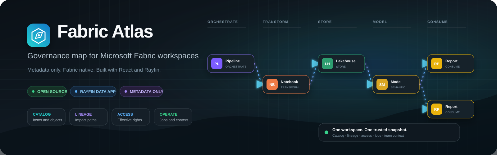
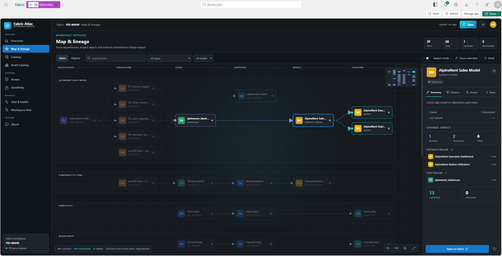
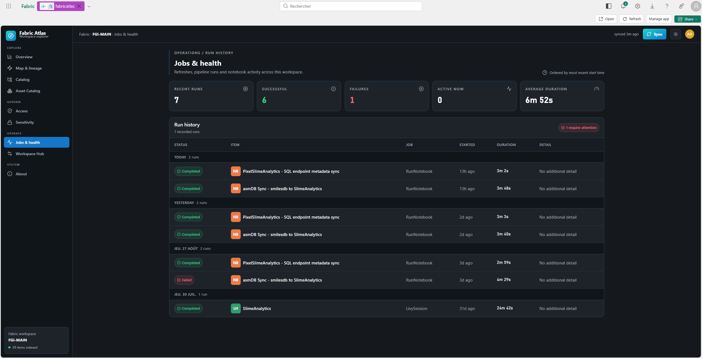
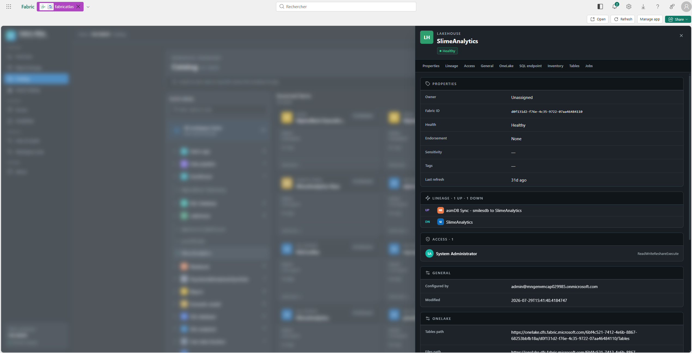
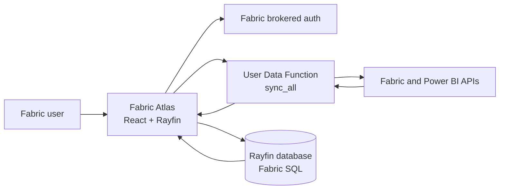

<div align="center">



Fabric Atlas indexes a Fabric workspace and gives teams one place to inspect
items, lineage, access, sensitivity, jobs, configuration and shared notes.

[](https://github.com/fredgis/FabricAtlas/releases/latest)
[](LICENSE)
[](https://react.dev/)
[](https://github.com/microsoft/rayfin)
[](https://www.microsoft.com/microsoft-fabric)

[Install](docs/installation.md) ·
[Architecture](docs/architecture.md) ·
[Changelog](CHANGELOG.md) ·
[Contribute](.github/CONTRIBUTING.md)

</div>

## What it does

Fabric workspaces spread operational metadata across many portal pages and APIs.
Fabric Atlas collects that metadata without copying business data.

- Browse workspace items and their internal objects.
- Inspect Lakehouse, Warehouse and SQL Database tables or views, Semantic Model
  columns and measures, and Report pages when Fabric exposes them.
- Trace item and object lineage from source to report.
- Review effective access, direct shares and external principals.
- Check sensitivity coverage and confidential assets.
- Inspect jobs, configuration and team notes in one workspace hub.
- Refresh the catalog through a guided synchronization flow.

## Product screenshots

### Guided deployment sync

Each deployed build starts with one controlled metadata refresh. The screen
shows scan progress before the validated snapshot becomes visible to the team.


### Item lineage

The item map separates independent data products and follows the Fabric path
from orchestration to reports. Select a node to inspect its impact without
moving the current layout.



### Object lineage

Object mode expands the path into source tables, model tables, fields and
consumers. Nodes support selection, group movement and the same animated
upstream or downstream tracing as item mode.


### Jobs and health

Recent Fabric activity is grouped by date with status, duration and failure
signals kept in one table.



### Item details

The catalog drawer keeps properties, lineage, access, inventory, configuration
and jobs beside the selected Fabric item.



## How it works


```mermaid
flowchart LR
  U["Fabric user"] --> APP["Fabric Atlas<br/>React + Rayfin"]
  APP --> AUTH["Fabric brokered auth"]
  APP --> UDF["User Data Function<br/>sync_all"]
  UDF --> API["Fabric and Power BI APIs"]
  API --> UDF
  UDF --> APP
  APP --> DB[("Rayfin database<br/>Fabric SQL")]
  DB --> APP
```

The browser cannot call Fabric management APIs directly. A published User Data
Function performs the metadata scan server-side with the signed-in user's
delegated token. The app validates the result, stores a workspace-scoped
snapshot through Rayfin, and keeps the previous valid snapshot if a refresh
fails.

See [Architecture](docs/architecture.md) for the full data flow.

## Quickstart

### Local preview

```powershell
git clone https://github.com/fredgis/FabricAtlas.git
Set-Location FabricAtlas
npm install
npm run dev
```

The local app uses the included AlpineRent preview estate.

### Deploy to Fabric

```powershell
npx rayfin login --tenant <tenant-id> --select
npx rayfin up --workspace "<workspace-name>"
```

Publish the function in
[`fabric/udf/atlas_sync_functions/`](fabric/udf/atlas_sync_functions/), then add
these public values to the git-ignored `rayfin/.env` file:

```dotenv
RAYFIN_PUBLIC_ATLAS_SPA_CLIENT_ID=<entra-client-id>
RAYFIN_PUBLIC_ATLAS_UDF_URL=https://<host>/functions/sync_all/invoke
RAYFIN_PUBLIC_ATLAS_WORKSPACE_NAME=<workspace-display-name>
RAYFIN_PUBLIC_ATLAS_SYNC_ADMIN_EMAIL=<authorized-sync-user>
```

Run `npx rayfin up` again. The app opens on a guided synchronization screen.

The complete Entra, UDF and deployment steps are in
[docs/installation.md](docs/installation.md).

## Development

```powershell
npm test
npm run lint
npm run build
```

| Path | Purpose |
|---|---|
| `src/atlas/views/` | Application pages |
| `src/atlas/store.tsx` | Hydration, synchronization and comments |
| `src/atlas/lineage.ts` | Lineage normalization, traversal and layout |
| `src/atlas/backend.ts` | Workspace snapshots and Rayfin persistence |
| `src/atlas/live-sync.ts` | UDF invocation and response mapping |
| `rayfin/data/` | Persisted entity model |
| `fabric/udf/atlas_sync_functions/` | Server-side Fabric metadata scan |

## Security

Fabric Atlas stores workspace metadata and team notes. It does not persist
workspace business data. Tokens and deployment values stay outside Git in
`rayfin/.env`.

The project has been reviewed against OWASP Top 10:2025 and ASVS 5.0. Security
hardening is part of the release process.

Report vulnerabilities through
[GitHub private vulnerability reporting](https://github.com/fredgis/FabricAtlas/security/advisories/new).

## Contributing

Found a bug, a missing Fabric object type or a useful governance workflow?
[Open an issue](https://github.com/fredgis/FabricAtlas/issues/new/choose).

Pull requests are welcome. Read
[the contribution guide](.github/CONTRIBUTING.md) before starting.

## Project links

- [Releases](https://github.com/fredgis/FabricAtlas/releases)
- [Changelog](CHANGELOG.md)
- [Installation](docs/installation.md)
- [Architecture](docs/architecture.md)
- [Data model](docs/data-model.md)
- [Security policy](.github/SECURITY.md)
- [Code of conduct](.github/CODE_OF_CONDUCT.md)

<div align="center">

MIT licensed. Built with React, Rayfin and Microsoft Fabric.

</div>
