<div align="center">

# 🧭 Fabric Atlas

[](https://github.com/fredgis/FabricAtlas/releases/latest)

### Everything in your Microsoft Fabric workspace, in one place.

Items, impact-aware lineage, catalog, access, jobs, config — plus team comments and built-in release information.
Built as a [Rayfin](https://github.com/microsoft/rayfin) Data App and deployed straight into Fabric.

</div>

## Overview in less than one minute

https://github.com/user-attachments/assets/21b1d273-da69-4869-a96c-26d4b6003aa7

https://github.com/user-attachments/assets/52052323-f1f2-479b-8d39-18f7400fba24

---

## What is Fabric Atlas?

A Fabric workspace grows fast: lakehouses, notebooks, pipelines, semantic models, reports. Nobody has
the full picture — what depends on what, who can see what, what just failed, who owns it.

Fabric Atlas gives you that picture. Click **Sync** and it reads your workspace from the Fabric APIs
and stores everything in its own data model. Then it draws it: a living map of your items and their
lineage, a catalog you can browse as a tree or as cards, an access matrix down to each object, a jobs
board, an exhaustive config tree per item, and a comment thread your whole team shares.

No business data required. Fabric Atlas only reads your workspace metadata, so you can point it at any
workspace and get value on the first Sync.

## A tour

### Overview
A governance command center: a workspace banner, health pulse, priority risks, recent activity and
direct jump-off points into lineage, catalog and access.

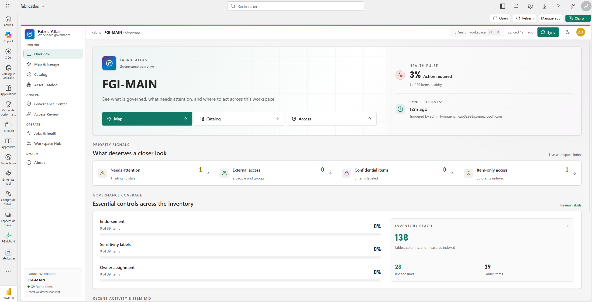

### Map & lineage
A staged map of every item and how they connect. Directional arrows and relationship labels show the
flow from **orchestration** through **transformation**, **storage**, **endpoints**, **models** and
**consumption**. Select an item
to isolate its full transitive **upstream (violet)** and **downstream (teal)** impact path, or switch
to direct-neighbor mode. Disconnected data products are placed in separate visual bands when the
full workspace is shown, so unrelated estates no longer cross through one another.

The map includes search and type/health filters, drag positioning, minimap, zoom and fit controls.
Switch from **Items** to **Objects** to move inside semantic models and lakehouses: tables, columns,
measures and item-level consumers. The inspector keeps summary, schema, effective access and recent
runs together, and every selection can be shared as a deep link.

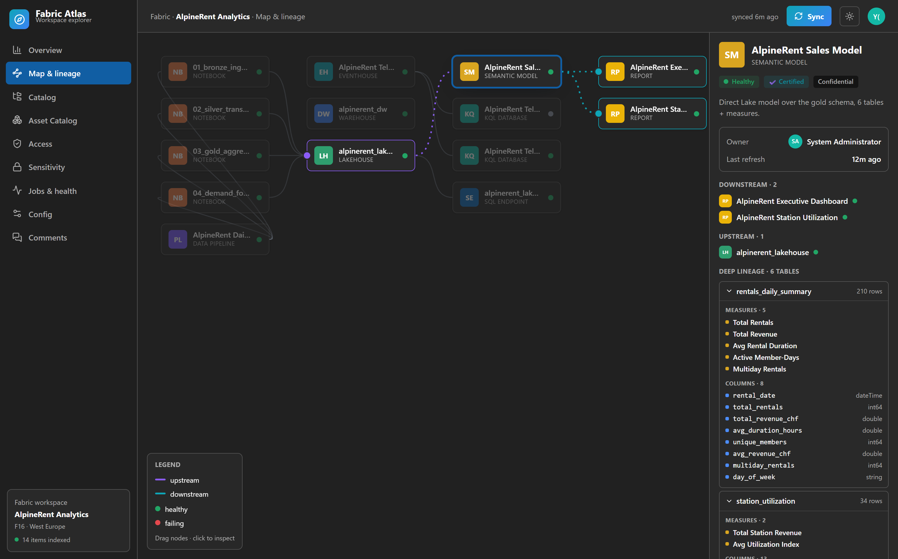

### Catalog
Every item as a collapsible tree and as rich cards — owner, health, endorsement, tags, freshness.
Use the compact command header and grouped type navigator to narrow the inventory, then click any
card to open a structured, keyboard-accessible panel with identity, lineage, access, config and jobs.

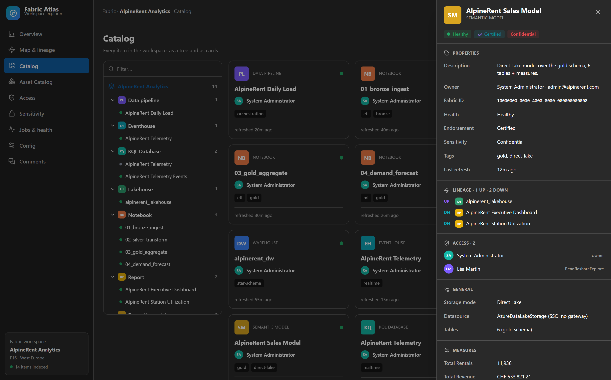

### Asset Catalog
Goes _inside_ the items: every table, column, measure and KPI across the workspace, searchable and
grouped into collapsed item accordions. Pick an object to inspect its parent context, datatype and
exact effective access — including inherited versus direct permissions.

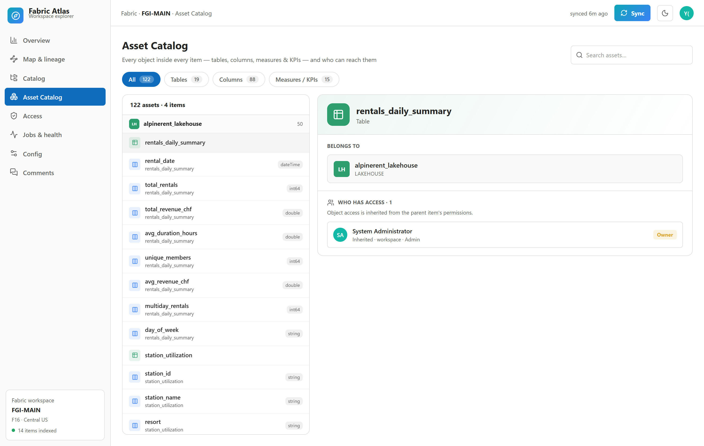

### Access
Who can reach what. Toggle **By principal** or **By object**. The matrix computes **real effective
access** from the actual grants; click a principal to expand every **item and asset** they can reach.
Item-level shares are surfaced too: someone given a single report or model, without workspace
membership, shows up as **item-only**, and the risk panel calls out external guests and service
principals in priority order.

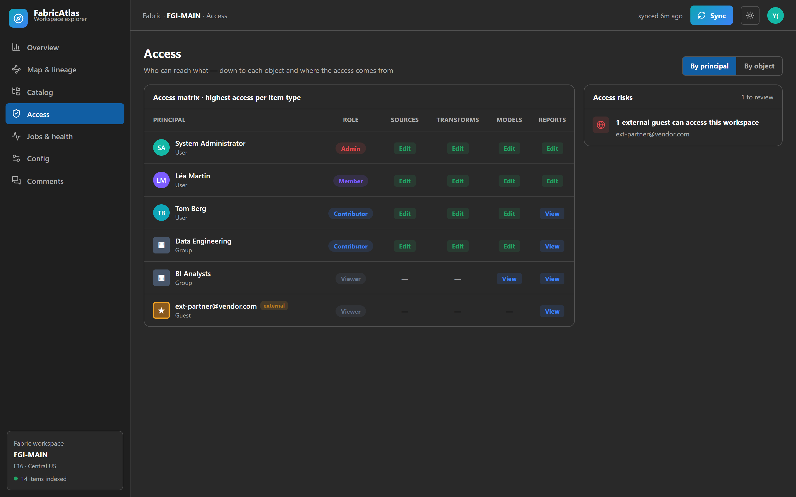

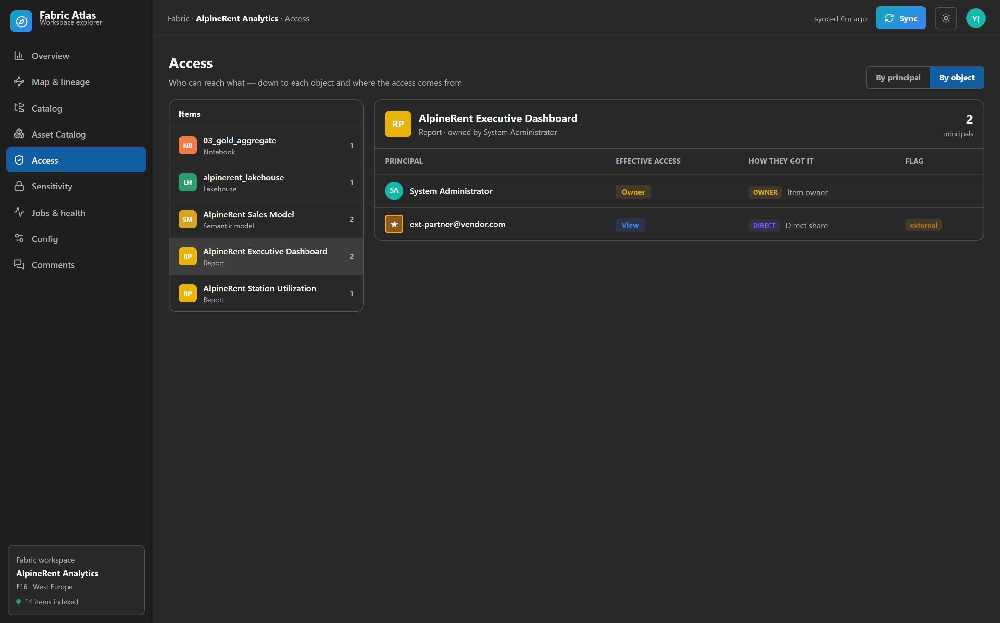

### Sensitivity
Every Microsoft Information Protection label in the workspace, with confidential and
highly-confidential items spotlighted for review.

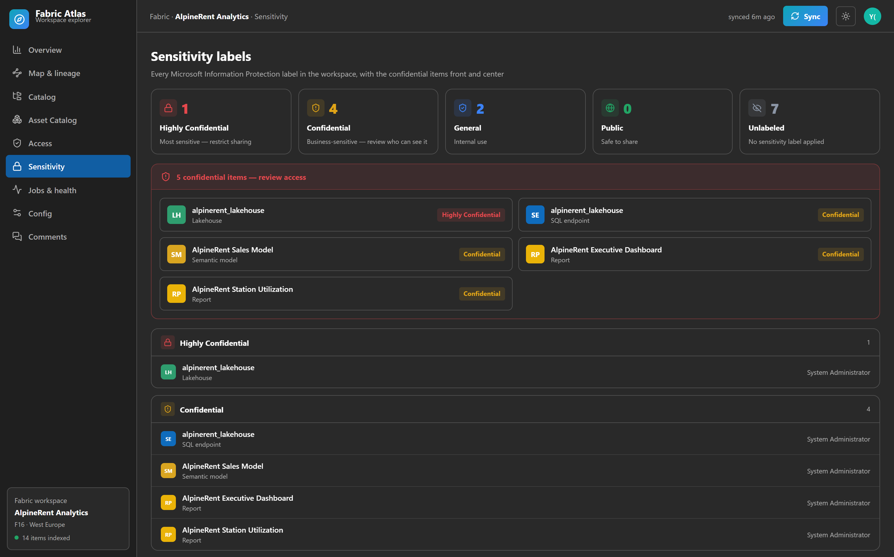

### Jobs & health
Recent refreshes, notebook runs and pipeline runs, with status, duration and details in one responsive
operational view grouped by date.

### Config
Everything retrievable about an item — storage mode, OneLake paths, SQL endpoint, tables and measures —
as an expandable tree. When a detail can't be read (for example a warehouse's tables need a SQL
connection), it says so.

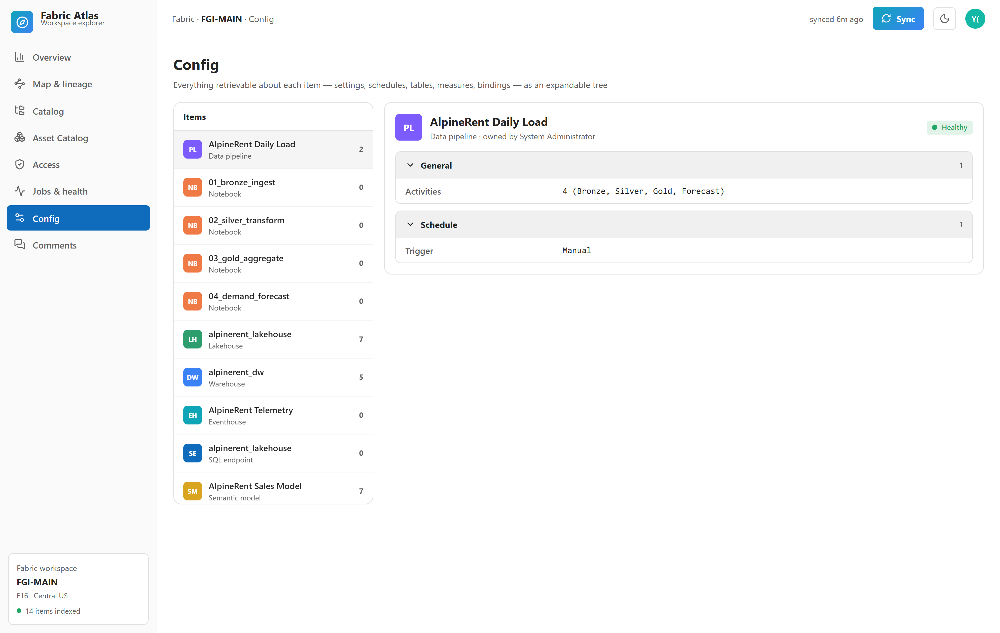

### Comments
Team notes on the workspace or any item, stored in the Fabric-backed database so they persist and
everyone sees them.

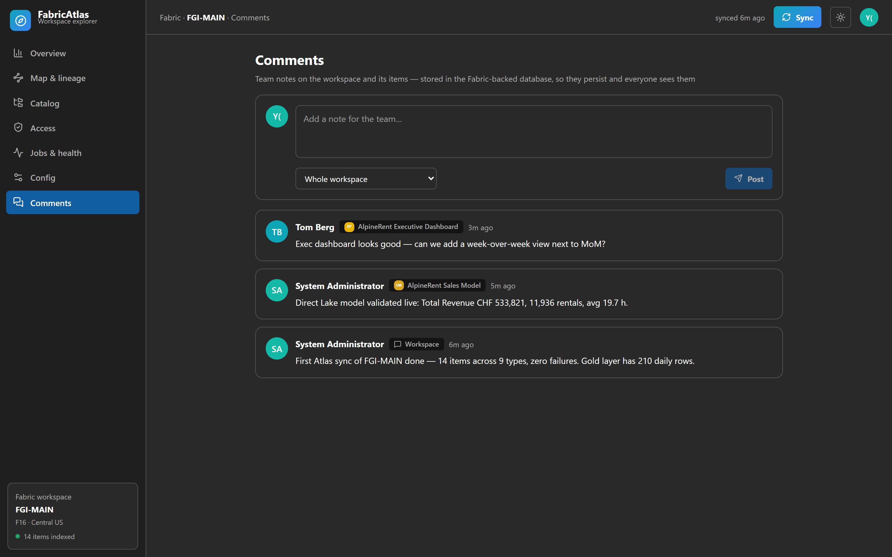

### About
A compact open-source project page with MIT license context, clone command, source repository,
current release, deployment details and changelog.

### Light and dark
Dark by default, with a one-click persistent light theme when preferred.

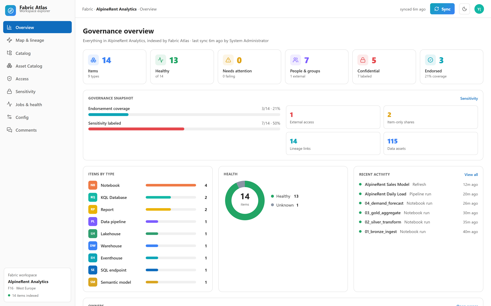

## Why Rayfin

Fabric Atlas is a Rayfin Data App, so the whole backend is described in TypeScript and provisioned by
Rayfin on Fabric:

- The **data model** is nine decorator classes in `rayfin/data/`. Rayfin turns them into a governed
  Fabric SQL database with a typed Data API — that is where the synced metadata and the comments live.
- **Auth** is Fabric brokered (Entra ID). **Hosting** is Rayfin static hosting. **Storage** is ready
  for attachments.
- One command deploys everything and applies schema changes: `rayfin up`.

And because it is declarative, you can grow it by prompting an AI agent. See
[docs/evolving-with-rayfin.md](docs/evolving-with-rayfin.md).

> ### ℹ️ Why a Fabric User Data Function?
>
> A deployed Rayfin app is a browser SPA with a Fabric SSO session, but Rayfin never
> exposes a Fabric access token to app code, and the Fabric REST APIs don't allow browser
> CORS. So the app cannot call the Fabric management APIs (list items, lineage,
> permissions, jobs) directly from the browser. Fabric Atlas therefore ships a small Fabric
> User Data Function (`atlas_sync_functions`, Python) that runs server-side, receives the
> user's token, calls the Fabric REST APIs on their behalf, and returns the results, which
> the Sync button writes into the Atlas database. The semantic-model deep lineage (tables,
> columns, measures) is read in-app through the Fabric embed proxy (DAX `INFO` functions),
> which is the one Fabric data path a browser app is allowed to use. Fabric does not expose
> a REST API to publish a User Data Function, so that one step is done once in the Fabric
> portal (Publish), after which the app invokes it. The function's source and the publish
> steps live in [`fabric/udf/atlas_sync_functions/`](fabric/udf/atlas_sync_functions/).

## How it works

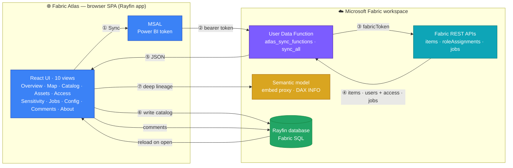
```mermaid
flowchart LR
  subgraph B["🌐 Fabric Atlas — browser SPA (Rayfin app)"]
    UI["React UI · 10 views<br/>Overview · Map · Catalog · Assets · Access<br/>Sensitivity · Jobs · Config · Comments · About"]
    MSAL["MSAL<br/>Power BI token"]
  end

  subgraph F["☁️ Microsoft Fabric workspace"]
    UDF["User Data Function<br/>atlas_sync_functions · sync_all"]
    REST["Fabric REST APIs<br/>items · roleAssignments · jobs"]
    SM["Semantic model<br/>embed proxy · DAX INFO"]
    DB[("Rayfin database<br/>Fabric SQL")]
  end

  UI -- "① Sync" --> MSAL
  MSAL -- "② bearer token" --> UDF
  UDF -- "③ fabricToken" --> REST
  REST -- "④ items · users + access · jobs" --> UDF
  UDF -- "⑤ JSON" --> UI
  UI -- "⑥ write catalog" --> DB
  UI -- "⑦ deep lineage" --> SM
  UI -- "comments" --> DB
  DB -- "reload on open" --> UI

  classDef browser fill:#3b82f6,stroke:#1e40af,color:#fff;
  classDef udf fill:#7c5cff,stroke:#4c1d95,color:#fff;
  classDef rest fill:#0ea5b7,stroke:#0f766e,color:#fff;
  classDef db fill:#22a565,stroke:#15803d,color:#fff;
  classDef sm fill:#d9a520,stroke:#a16207,color:#fff;

  class UI,MSAL browser;
  class UDF udf;
  class REST rest;
  class DB db;
  class SM sm;
```

The **Sync** button acquires a Power BI token (MSAL), the `sync_all` User Data
Function reads the workspace with it, and the result — items, the list of
workspace **users and their access**, and jobs — is written into the Rayfin
database and rendered. Comments and the last sync are read back on open.

> ### 💡 What would make this simpler — Rayfin vs Fabric
>
> Building Fabric Atlas surfaced a few gaps. Some are for **Rayfin** (the Data App
> framework); the rest need a **new or extended Fabric platform API**.
>
> **Rayfin (the Data App framework):**
> - Expose a scoped, opt-in brokered Fabric token to app code, so the app can call
>   Fabric REST without a separate User Data Function and app registration.
> - Add first-class server functions to the Data App template — a place to run
>   trusted server-side code (like `sync_all`) without provisioning a separate UDF.
> - Support bulk `upsert` and CLI seeding for `@authenticated` entities, so a first
>   dataset can load at deploy time, not only from the signed-in app.
>
> **Fabric platform (a new or extended API):**
> - A REST/CLI way to publish a User Data Function and read its invoke URL, so
>   deployment is fully scriptable instead of a manual portal click.
> - A native Fabric lineage API (item level and intra-item: tables, columns,
>   measures), so lineage isn't stitched from the admin scanner and DAX `INFO`.
> - CORS on the Fabric management endpoints, for delegated browser calls.

## Quickstart

```bash
git clone https://github.com/fredgis/FabricAtlas.git
cd FabricAtlas
npm install

# explore locally with sample data (no Fabric needed)
npm run dev            # http://localhost:5173

# deploy into your Fabric workspace
npx rayfin login --tenant <your-tenant-id> --select
npx rayfin up --workspace "<workspace-name>"
```

For live workspace Sync, publish `atlas_sync_functions`, then add the public Entra client ID and
the copied `sync_all` URL to the git-ignored `rayfin/.env` file:

```bash
RAYFIN_PUBLIC_ATLAS_SPA_CLIENT_ID=<client-id>
RAYFIN_PUBLIC_ATLAS_UDF_URL=https://<...>/functions/sync_all/invoke
RAYFIN_PUBLIC_ATLAS_WORKSPACE_NAME=<workspace-display-name>
```

Redeploy with `npx rayfin up`. A new deployment opens on a dedicated first-sync screen with staged
progress. After the first successful index, subsequent visits open the governance overview directly;
later refreshes use the compact Sync action and progress bar in the app header.

Full steps in [docs/installation.md](docs/installation.md).

## Releases and changelog

Fabric Atlas follows [Semantic Versioning](https://semver.org/). Release notes are available in two places:

- [`CHANGELOG.md`](CHANGELOG.md) — complete version history in the repository.
- [GitHub Releases](https://github.com/fredgis/FabricAtlas/releases) — tagged releases and source archives.

The running app exposes the same information under **About**. The current release is
[v1.2.0](https://github.com/fredgis/FabricAtlas/releases/tag/v1.2.0).

## Reuse it as a Rayfin template

Fabric Atlas is a standard Rayfin Data App, so you can hand it to the rest of the
org as a Rayfin template: teammates scaffold their own copy, wired to *their*
workspace, in one command. The [`rayfin-template.yml`](rayfin-template.yml)
manifest at the repo root already marks it as one.

**Scaffold a fresh app from the repo** — no setup, nothing to publish first:

```bash
rayfin init my-atlas -t https://github.com/fredgis/FabricAtlas
cd my-atlas && npm install
```

`rayfin init -t <git-url>` clones the template, renames the project, and leaves you
with a fresh, deployable app. Pin a version with `...FabricAtlas#v1.2.0` if you want.

**Publish it to an internal template gallery** so it appears in the interactive
`rayfin init` picker for everyone. Add one entry to a shared registry file —
registries merge in tier order: bundled, then user-global
`~/.rayfin/template-registries.yml`, then project-local `.rayfin/template-registries.yml`:

```yaml
# ~/.rayfin/template-registries.yml
registries:
  - name: fabric-atlas
    displayName: Fabric Atlas
    description: Workspace governance explorer
    url: https://github.com/fredgis/FabricAtlas   # or your internal GitHub / Azure DevOps mirror
    ref: main                                     # a tag or commit SHA is safer for a shared registry
    templateName: fabric-atlas
```

Because every id is env-driven (the privacy scrub in this repo), the template ships
code only: no tenant, workspace, or client id travels with it. Each team supplies
its own `.env`, publishes its own Sync function and app registration
([docs/installation.md](docs/installation.md)), then runs `rayfin up`.

## Docs

| Doc | About |
| --- | --- |
| [Installation & deployment](docs/installation.md) | Prerequisites, local preview, deploy to Fabric |
| [Architecture](docs/architecture.md) | How the SPA, Rayfin data layer and Sync fit together |
| [Data model](docs/data-model.md) | The nine entities and their fields |
| [Evolving with Rayfin](docs/evolving-with-rayfin.md) | Grow the app with prompts and `rayfin up` |
| [Changelog](CHANGELOG.md) | Version history and release notes |

## Repo layout

```
rayfin/
  rayfin.yml            # services: auth, data (mssql), storage, static hosting
  data/                 # 9 entity classes + schema.ts
src/
  App.tsx               # shell: sidebar, top bar, theme, sync, tab routing
  atlas/
    model.ts            # types, item-type metadata, sample dataset
    lineage.ts          # transitive impact traversal + staged layout
    release.ts          # version, build and changelog metadata
    store.tsx           # data + sync + comments (preview / Rayfin backed)
    backend.ts          # persistence + Fabric sync boundary
    ui.tsx              # avatars, glyphs, health chips, cards
    views/              # Overview, Map, Catalog, Assets, Access, Sensitivity, Jobs, Config, Comments, About
docs/                   # this documentation + screenshots
CHANGELOG.md            # release history
```

---

A free sample, shared as-is. Built with [Rayfin](https://github.com/microsoft/rayfin) on Microsoft Fabric.
