<div align="center">

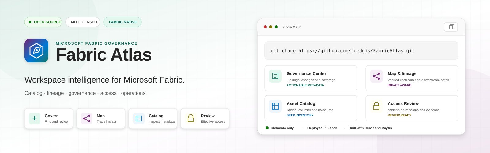

Fabric Atlas gives a team one readable map of its selected Fabric workspaces. It brings
together lineage, item metadata, access, sensitivity and run history, then keeps
the last validated snapshot in Fabric so everyone sees the same state.

[](https://github.com/fredgis/FabricAtlas/releases/latest)
[](LICENSE)
[](https://react.dev/)
[](https://github.com/microsoft/rayfin)
[](https://www.microsoft.com/microsoft-fabric)

[Install](docs/installation.md) ·
[Architecture](docs/architecture.md) ·
[Whitepaper](docs/fabric-atlas-whitepaper.pdf) ·
[Technical presentation](prez/Fabric-Atlas-Dev-Architecture.pdf) ·
[Functionalities](#functionalities) ·
[Roadmap](#roadmap) ·
[Changelog](CHANGELOG.md) ·
[Contribute](.github/CONTRIBUTING.md)

</div>

## Quick look

https://github.com/user-attachments/assets/9b7162a0-fefc-432b-8c01-e90dacb8f1db

[Watch the Full HD version on YouTube](https://youtu.be/cgkhUFTEPeI)

## Whitepaper

The [Fabric Atlas whitepaper](docs/fabric-atlas-whitepaper.pdf) explains how
the product collects and validates metadata, publishes immutable snapshots,
traces item and DAX dependencies, reviews effective access, and builds
principal-centred departure packs. It also covers governance, operations,
security boundaries, deployment and known API limits.

The screenshots use FGI-MAIN as one example deployment. Its counts and findings
are not product defaults or a reference architecture.

<a href="docs/fabric-atlas-whitepaper.pdf">
  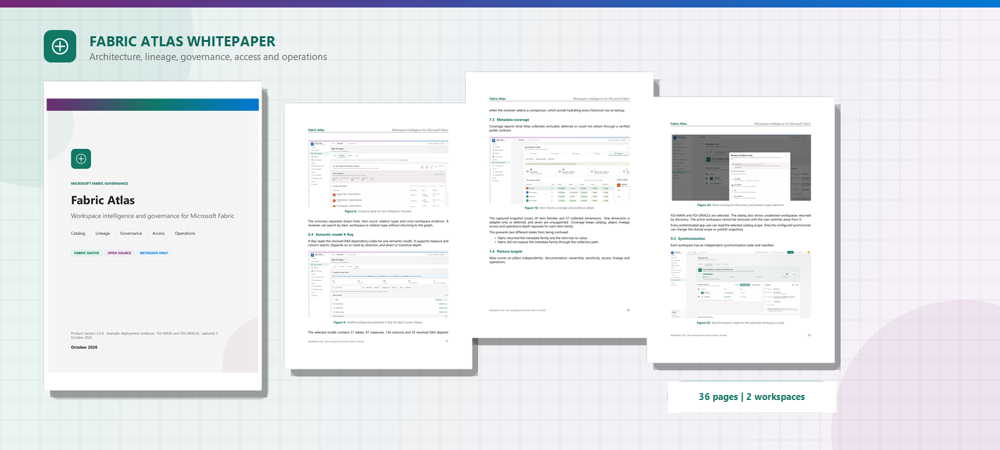
</a>

[Read the PDF](docs/fabric-atlas-whitepaper.pdf) ·
[Read the Markdown version](docs/fabric-atlas-whitepaper.md)

## Read-only Atlas MCP

Atlas includes an optional local stdio MCP server for deterministic, read-only
access to validated catalog, lineage, access, incident and snapshot evidence.
It runs on the MCP client machine and reads the same validated Rayfin
snapshots as the app. It does not run as a Rayfin Function or a permanent cloud
service.

Build it after generating the deployed Rayfin environment:

```powershell
npx rayfin env --framework vite
npm run build:mcp
```

Example `.vscode/mcp.json` configuration:

```json
{
  "servers": {
    "fabric-atlas": {
      "type": "stdio",
      "command": "node",
      "args": ["${workspaceFolder}/dist-mcp/atlas-mcp.mjs"],
      "env": {
        "ATLAS_MCP_ENABLED": "true",
        "ATLAS_MCP_CLIENT_ID": "<public-client-id>",
        "ATLAS_MCP_TENANT_ID": "<tenant-id>"
      }
    }
  }
}
```

The server is disabled by default. Activation requires a dedicated
single-tenant public client, delegated `Item.Execute.All`, a reviewed
`externalEntraExchange` setting and Conditional Access support for device code.
The signed-in user must belong to the Fabric app audience, and tools can read
only the administrator-selected Atlas workspace scope. No tool changes Fabric,
permissions or Atlas data. See [Atlas MCP](docs/atlas-mcp.md) for the remaining
identity gates, tool contracts and limitations.

## Technical presentation

The [Fabric Atlas development and architecture presentation](prez/Fabric-Atlas-Dev-Architecture.pdf)
documents the original UDF-based architecture, immutable snapshot publication,
Rayfin entity model and physical MSSQL model. The current Rayfin-first
architecture and 2.0 product evidence are documented in
[Architecture](docs/architecture.md) and the
[whitepaper](docs/fabric-atlas-whitepaper.pdf). The editable deck and PlantUML
sources remain in [`prez/`](prez/).

## What it does

Fabric workspaces spread operational metadata across many portal pages and APIs.
Fabric Atlas collects that metadata without copying business data.

- Select the workspaces Atlas is allowed to index, synchronize them
  independently and switch the active workspace without mixing snapshots.
- Browse Fabric items as cards or a sortable table, then inspect their internal
  objects in an alphabetized Asset Catalog.
- Inspect Lakehouse, Warehouse, SQL Database, Mirrored Database and KQL
  tables, views, columns, functions and materialized views when the required
  metadata access is available.
- Explore Ontology entities, properties, relationships and bindings, Graph Model
  node and edge types, and Data Agent source selections.
- Trace item and verified object lineage from physical sources through models,
  ontologies, graphs, agents and reports. Item Relations Preview can replace
  the Atlas graph temporarily and keeps the raw API relation types visible.
- Review effective access, direct shares and external principals.
- Check sensitivity coverage and confidential assets.
- Compare validated snapshots and review governance findings.
- Expand stored cross-workspace lineage evidence, inspect semantic-model
  dependencies and compare historical lineage snapshots.
- Review Policies & AI evidence without inferring exposure or compliance.
- Focus on newly introduced risks with Governance Radar and personal acknowledgements.
- Track six posture pillars against explicit governance targets.
- Generate departure packs with ownership, blast radius and reassignment evidence.
- Trace resolved DAX dependencies between measures and synchronized schema objects.
- Search the whole workspace with `Ctrl+K` and save useful filter views.
- Export access reviews and verified lineage impact reports.
- Inspect failures, inferred downstream impact, monitoring boundaries,
  configuration and team notes without mixing observed and inferred evidence.
- Refresh the catalog through a guided synchronization flow.

## Validation snapshot

The final FabCon comparison used clean deployments and fresh FGI-MAIN
snapshots on 3 October 2026. These figures describe that test workspace only.

| Metric | Stable `main` | FabCon candidate |
|---|---:|---:|
| Fabric items | 78 | 79 |
| Assets | 623 | 2,436 |
| Tables / schema objects | 75 | 217 |
| Columns | 486 | 2,157 |
| Measures | 62 | 62 |
| Atlas lineage links | 66 | 67 |
| Principals | 2 | 2 |
| Access grants | 144 | 146 |
| Jobs | 28 | 28 |

No product inventory metric decreased. The candidate adds SQL Database,
Warehouse, schema-enabled Lakehouse and Mirrored Database structure. Detailed
baselines and the comparison are saved outside the repository during release
validation.

## Functionalities

<details>
<summary><strong>Workspace synchronization and reliability</strong></summary>

| Functionality | What it provides |
|---|---|
| Guided first synchronization | A dedicated deployment screen with staged progress before the first catalog becomes visible |
| Header synchronization | Reuses the same progress model and atomically refreshes every view against the new snapshot |
| Progress donut | Replaces the initial topology illustration with an accessible percentage and stage-driven donut |
| Immutable snapshots | Writes catalog rows first and publishes the workspace manifest only after every write succeeds |
| Last-known-good fallback | Ignores incomplete snapshots and loads the newest valid workspace state |
| Trusted snapshot retention | Keeps 2 to 50 validated snapshots, supports explicit writer rotation and removes stale rows only after a new manifest is published |
| Lightweight history | Stores versioned trend summaries in manifests and loads detailed comparisons only when selected |
| Versioned sync contract | Records required, optional and metadata-capability status for every synchronized snapshot |
| Multi-workspace scope | Stores an administrator-selected workspace list and publishes one independent manifest per workspace |
| Rayfin-first collection | Uses typed Functions for core inventory, definitions, Item Relations, KQL, SQL, Power BI structure, provenance and policy evidence |
| Exact compatibility plan | Calls the Python UDF only for Power BI admin scanner evidence, PBIR-Legacy pages, Kusto live metadata and explicit rollback |
| Bounded collector execution | Applies per-request deadlines, pagination, retry, cancellation, SQL operation and response-size limits |
| Per-item failure isolation | Keeps valid schemas from successful items when another item or optional metadata source fails |
| Accessible sync feedback | Shows five real phases, the active stage and elapsed time during both initial synchronization and later refreshes |
| Deployment gate | Requires synchronization for the first deployment or a new major/minor snapshot contract, while compatible patch releases reuse validated history |
| Trusted synchronizer | Restricts snapshot publication to the configured synchronization account |
| Snapshot history | Loads previous validated snapshots for comparisons and governance trends |

</details>

<details>
<summary><strong>Governance Center</strong></summary>

| Functionality | What it provides |
|---|---|
| Findings | Actionable access, metadata, operations and lineage checks based on synchronized evidence |
| Governance Radar | Establishes a visible first-snapshot baseline, shows new priority risks, and keeps the no-new-risk state compact with a link to the exact latest comparison |
| Personal Radar state | Acknowledges one occurrence or mutes a stable finding for the signed-in user |
| Change Center | Compares any two validated snapshots across items, schema, access, sensitivity, lineage and jobs |
| Full change evidence | Shows complete before/after values and DAX expressions, with impact computed from the selected historical snapshot, including removed objects |
| Shareable comparisons | Preserves both selected snapshots, section and filters in the URL |
| Governance history | Tracks items, labels, external principals, failures, lineage and schema inventory over time |
| Lazy Change Center evidence | Keeps the ledger immediate and hydrates older detailed catalogs only for the selected comparison |
| Metadata coverage | Separates collected gaps from metadata that Fabric did not expose, using explicit `N/A` states |
| Posture targets | Scores six reproducible pillars against shared, configurable workspace targets, all set to 70% by default |
| Radar-led Overview | Reuses the six posture pillars as the Overview focal point, beside current health and priority signals |
| Policies & AI | Reviews policy evidence, Data Agent sources and protection coverage without inferring compliance or AI exposure |
| Governance exceptions | Records an administrator's justification and expiry beside a finding without hiding the finding or changing its raw score |
| Sensitivity posture | Groups protected and unlabeled items and surfaces confidential assets |
| Saved governance views | Persists personal filters such as metadata gaps, external access or failed operations |

</details>

<details>
<summary><strong>Catalog and object inventory</strong></summary>

| Functionality | What it provides |
|---|---|
| Workspace catalog | Groups Fabric items by type with search, health, ownership, labels, tags and detail drawers |
| Catalog table | Keeps cards available and adds sorting by name, health, documented owner or last refresh within collapsed item-type groups |
| Asset Catalog | Lists relational, KQL, ontology, graph and Data Agent objects alphabetically under their parent Fabric item, while keeping synchronized schema-capable items visible when no objects are exposed |
| Deep metadata | Shows data types, descriptions, visibility, sources, row counts, measure expressions and collection provenance when available |
| DAX dependency evidence | Resolves measure references only to real synchronized columns or measures and labels inferred source hops |
| KQL inventory | Discovers databases, tables, columns, stored functions and materialized views through read-only Kusto metadata |
| SQL Database inventory | Discovers schemas, tables, views and columns through read-only system catalogs |
| Storage SQL inventory | Reads Warehouse, schema-enabled Lakehouse and Mirrored Database tables, views and columns through their SQL endpoint IDs |
| Source provenance | Keeps OneLake shortcut targets, mirroring provider and selection context, replication state and materialized lake view references without retaining source URLs or rows |
| Ontology inventory | Decodes entity types, properties, time-series properties, source bindings, relationship types and contextualizations |
| Graph Model inventory | Shows node and edge types plus source and property mappings without reading graph instances |
| Data Agent inventory | Shows draft/published sources and selected tables, columns, measures, KQL objects, ontology entities and graph types without retaining prompts |
| Item context | Keeps properties, lineage, access, configuration and job history beside the selected item |
| Collapsed groups | Starts inventory lists grouped and collapsed for faster scanning |
| Ownership labels | Distinguishes documented item ownership from an Owner permission in the access evidence |

</details>

<details>
<summary><strong>Lineage and impact</strong></summary>

| Functionality | What it provides |
|---|---|
| Item lineage | Places Fabric items in a stable source-to-consumer layout with no backward edges in the initial graph |
| Item Relations Preview | Replaces Atlas links while enabled, labels every line with the raw API `relationType`, and keeps Beta evidence out of authoritative snapshots |
| Cross-workspace exploration | Expands stored Preview neighbours by composite workspace and item identity without querying unselected workspaces live |
| Evidence desk | Explains the relation type, active source, observation time, workspace boundary and coverage for the lines currently drawn |
| Object mode | Expands relational, KQL, semantic, ontology, graph and Data Agent objects using verified snapshot relationships |
| Impact tracing | Hides unrelated graph components and keeps only the selected upstream and downstream subgraph |
| Indexed graph engine | Reuses adjacency indexes for traversal, impact, connected groups and staged layout |
| Accessible relationships | Exposes item and object edges as text and distinguishes upstream paths with a dashed pattern |
| Graph editing | Moves Atlas and Preview boxes freely, including cross-workspace nodes, with guarded pointer release |
| Layout controls | Provides zoom, fit, filters, minimap and persistent deep links; Reset clears focus, Impact, drag state and Preview expansion |
| Readable map and inspector | Wraps node labels, keeps inactive context readable and supports pointer or keyboard resizing of the details inspector |
| Impact reports | Exports verified dependency evidence as Markdown for an item or schema object |
| Object-level impact | Switches to DAX-resolved object granularity when evidence exists and preserves item fallback otherwise |
| Ontology and graph lineage | Connects physical objects to ontology properties and entities, then follows verified entity relationships and graph mappings |
| Data Agent lineage | Connects selected source objects to their Data Agent source and element nodes for downstream impact analysis |

</details>

<details>
<summary><strong>Access and information protection</strong></summary>

| Functionality | What it provides |
|---|---|
| Additive effective access | Combines workspace and item grants so a direct share never reduces inherited access |
| Stable principal identity | Uses Fabric principal IDs and safely correlates legacy name or email references across snapshots |
| Access Review matrix | Reviews every reachable principal and item pair with permission, source and evidence |
| Evidence coverage | Separates recorded grants from OneLake security, Purview DLP and Fabric Policies layers that are unavailable, unsupported or not evaluated |
| Read-only What-if | Removes recorded grant paths in memory and explains which layers were modeled without changing Fabric permissions |
| Policy context | Stores bounded Fabric Policies evaluation evidence separately from recorded grants |
| Responsive access ledger | Uses one keyboard-navigable representation across mobile and desktop without hidden duplicate rows |
| Principal review | Groups all reachable items under collapsible principal sections |
| Review decisions | Appends personal Reviewed, Accepted, Needs action and clear events with retained notes and history |
| Evidence revalidation | Marks a decision Needs review when its permission evidence changes, including changed underlying grants that leave the strongest permission unchanged |
| CSV export | Downloads the currently filtered access evidence |
| Risk filters | Isolates external, broad, service-principal, admin and unresolved access |
| Departure packs | Finds sole ownership, urgent orphan risk, downstream blast radius and deterministic reassignment candidates |
| Offboarding exports | Downloads reassignment CSV, effective-access CSV and a complete Markdown handover pack |

</details>

<details>
<summary><strong>Operations and collaboration</strong></summary>

| Functionality | What it provides |
|---|---|
| Jobs and health | Groups refresh, pipeline and notebook activity with status, duration and errors |
| Health and coverage | Calculates observed health from assessed items and separately shows how much of the workspace has a known health status |
| Responsive job timeline | Shows compact mobile cards and an aligned desktop grid without horizontal table scrolling |
| Job filters | Searches run history, isolates failures and saves recurring operational views |
| Active filter chips | Removes search, status, focused item or focused run constraints independently |
| Operational evidence | Keeps observed failed runs separate from downstream items inferred through snapshot lineage |
| Monitoring boundaries | States which evidence Atlas collects and links to Monitor Hub or app metrics for portal-only sources |
| Workspace Hub | Keeps synchronized configuration and shared team notes in one grouped interface |
| Item notes | Adds append-only team context to the workspace or a specific Fabric item |
| Sync audit | Records who synchronized the workspace, when it ran and how much metadata was indexed |

</details>

<details>
<summary><strong>Search, navigation and personalization</strong></summary>

| Functionality | What it provides |
|---|---|
| Global `Ctrl+K` search | Searches items, relational/KQL objects, ontology and graph types, Data Agent selections, principals, jobs, configuration and notes |
| Debounced workspace index | Reuses one index per snapshot and never activates results from an earlier query |
| Optional OneLake catalog discovery | Default-off Preview source for the synchronizer that appends labelled Catalog Search results after, never instead of, snapshot results |
| Targeted navigation | Opens the matching drawer, asset, review, job or Workspace Hub section |
| Shareable view state | Keeps active sections, filters, searches, selected assets and focused runs in namespaced URL parameters |
| Personal saved views | Stores user-scoped filter presets in the Fabric-backed Rayfin database |
| Display density | Switches between comfortable and compact spacing without reducing the text size |
| Browser-local display preferences | Remembers density, catalog layout and inspector width separately for each signed-in user and workspace on this browser |
| Light and dark themes | Uses a Fabric-aligned light mode by default with an optional persistent dark mode |
| Responsive navigation | Keeps grouped Explore, Govern, Operate and System sections usable on smaller screens |
| Keyboard-first controls | Adds managed dialogs, focus restoration, skip navigation and Arrow/Home/End tab navigation |
| Large-list containment | Lets Chromium skip off-screen rendering work for dense Access, Asset Catalog and Jobs blocks |

</details>

<details>
<summary><strong>Security, deployment and open source</strong></summary>

| Functionality | What it provides |
|---|---|
| Fabric brokered authentication | Runs inside the Fabric portal with the signed-in Entra identity |
| Bound token selection | Matches every Fabric, Kusto and SQL token account and tenant to the current signed-in Fabric user |
| Rayfin Functions | Runs typed metadata collectors with application identity and synchronizer-only invocation policies |
| Minimal Python compatibility | Retains delegated Power BI scanner, PBIR-Legacy page and Kusto live metadata only where Rayfin lacks a supported audience |
| Metadata-only storage | Allowlists governance metadata and excludes rows, datasource details, connections and Power Query or source expressions |
| Definition sanitization | Excludes Data Agent instructions and few-shots, graph filter values, ontology documents/resource links, KQL function bodies and SQL module definitions |
| Scoped enrichment | Keeps advanced KQL, SQL and definition scans optional and reports missing token, permission or encrypted-label capability explicitly |
| User-scoped preferences | Protects saved views and access-review decisions with Rayfin row policies |
| User-scoped Radar actions | Protects acknowledgements and mutes through the authenticated subject claim |
| Fabric deployment | Builds, migrates the schema and deploys the app through `npx rayfin up` |
| Fail-closed durable probe | Exercises persisted commands and checkpoints without claiming unattended scheduling or distributed task ownership |
| Open-source project | Includes MIT licensing, contribution guidance, security reporting and release history |

</details>

## Product screenshots

These screens come from the deployed FabCon candidate and a live FGI-MAIN
metadata snapshot. Counts change when the workspace is synchronized again.

### Workspace overview

The overview uses the governance radar as its visual anchor, with current
health, priority signals, freshness and inventory reach beside it.

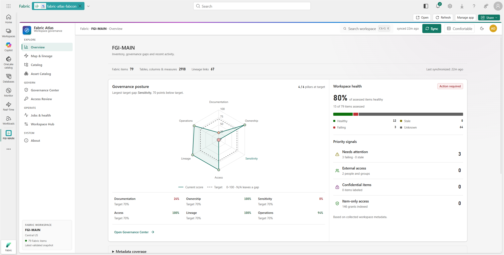

### Catalog

The Catalog keeps every Fabric item visible, grouped by type and available as
cards or a sortable table. Search, ownership, health and tags narrow the view.

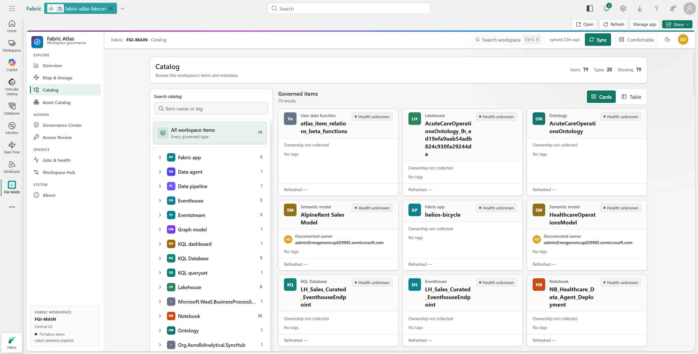

### Asset Catalog

Items and their tables, views, columns, measures and metadata objects are sorted
alphabetically. Selecting an asset exposes its source, model context and
additive effective access.

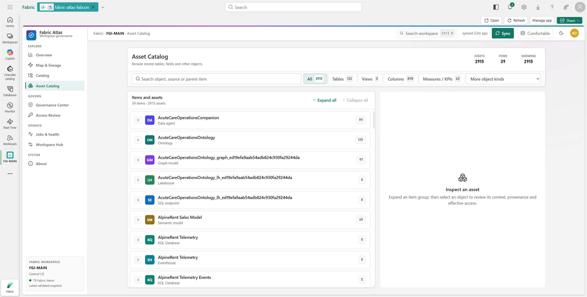

### Interactive lineage

The Atlas graph follows verified snapshot relationships from orchestration to
consumption. Impact mode removes unrelated components while the inspector keeps
upstream, downstream, schema, access and run evidence in view.

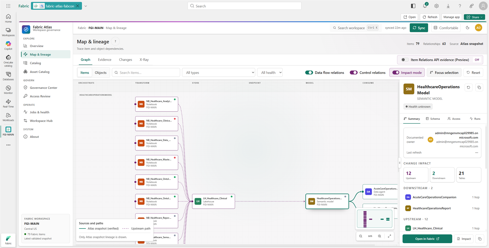

### Item Relations Preview

Preview replaces the Atlas graph while enabled. It labels each line with the
raw API `relationType`, reports cross-workspace evidence and remains clearly
marked as Beta rather than authoritative lineage.

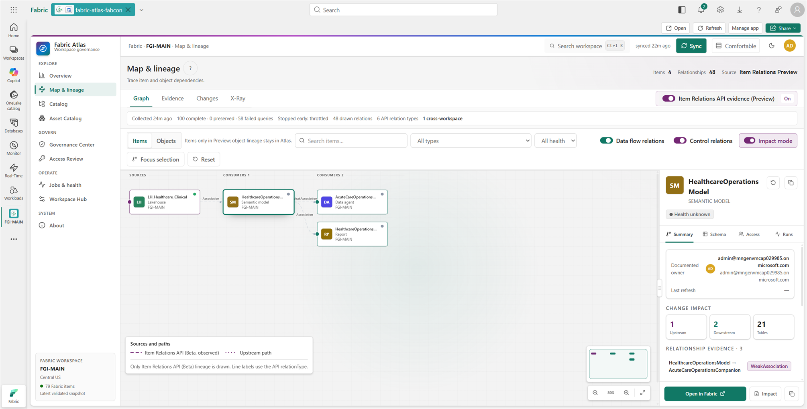

### Object lineage

Object mode expands a synchronized table into its columns and connected Fabric
items. The inspector keeps ownership, impact and related metadata visible while
objects are selected or rearranged. Selecting an object from another Fabric item
switches the active item and rebuilds the object graph. Deep-lineage tables can
be expanded or collapsed together. Connected Fabric items are grouped into
collapsible summary nodes. Hold the left mouse button on the canvas background
to pan. Item and Preview boxes can be moved freely, and Reset returns the graph
to its computed source-to-consumer layout.

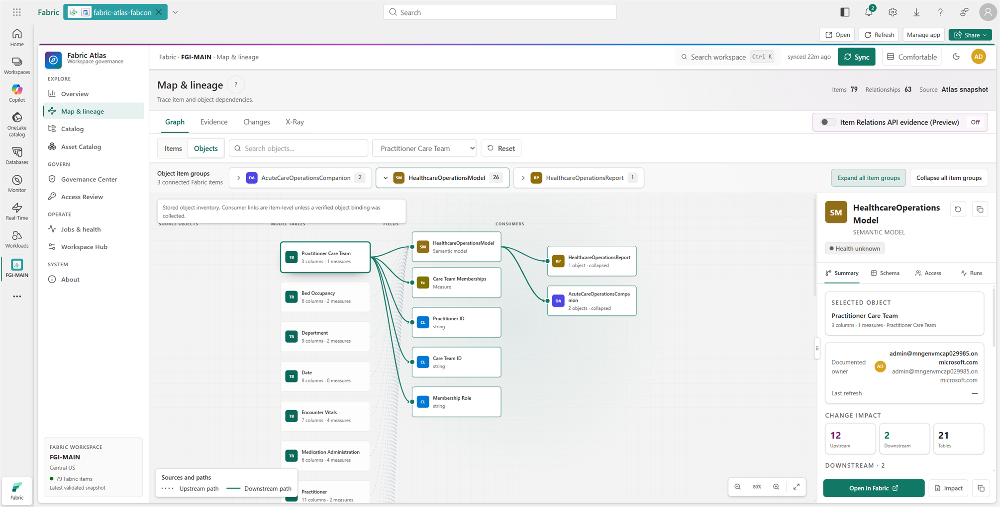

### Governance Center

Governance Radar, findings, snapshot changes, history, coverage, posture and
Policies & AI evidence are grouped into one governance workspace.

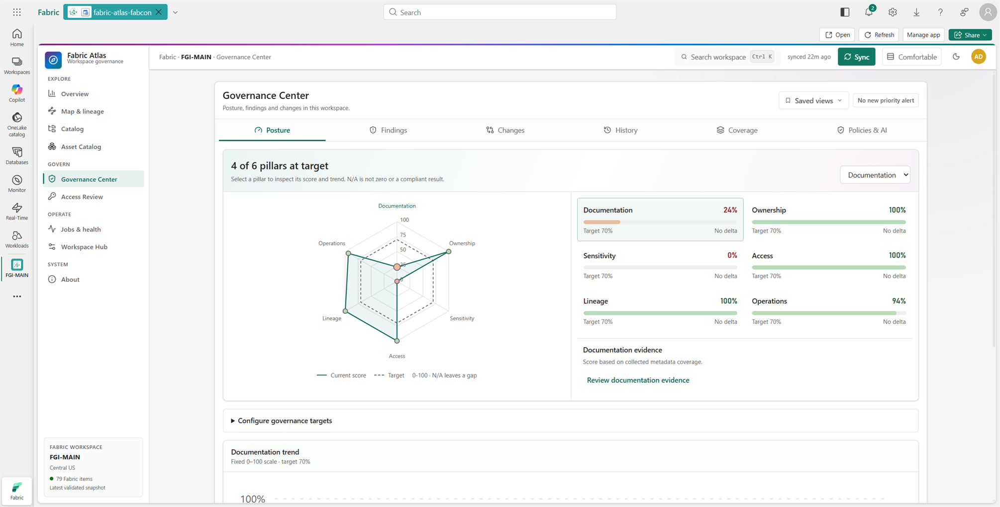

### Policies & AI

Policies & AI lists semantic models, Data Agents, configured sources and
protection evidence. Unknown exposure and unavailable controls stay explicit
instead of being presented as compliant.

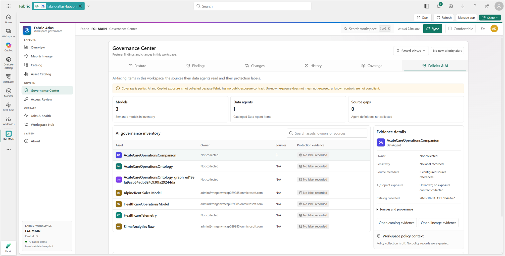

### Access Review

The review matrix combines inherited and direct permissions, shows which
restriction layers were evaluated, and includes a read-only What-if simulator.

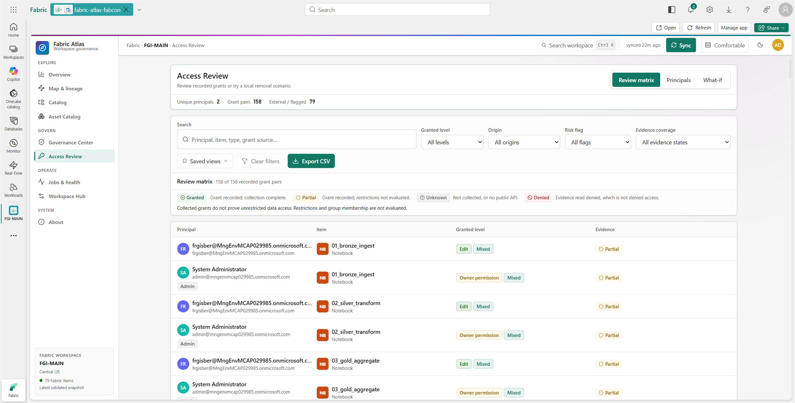

### Jobs & health

Jobs & health separates observed failures from inferred downstream reach. The
monitoring panel also states which signals Atlas collected and which remain in
the Fabric portal.

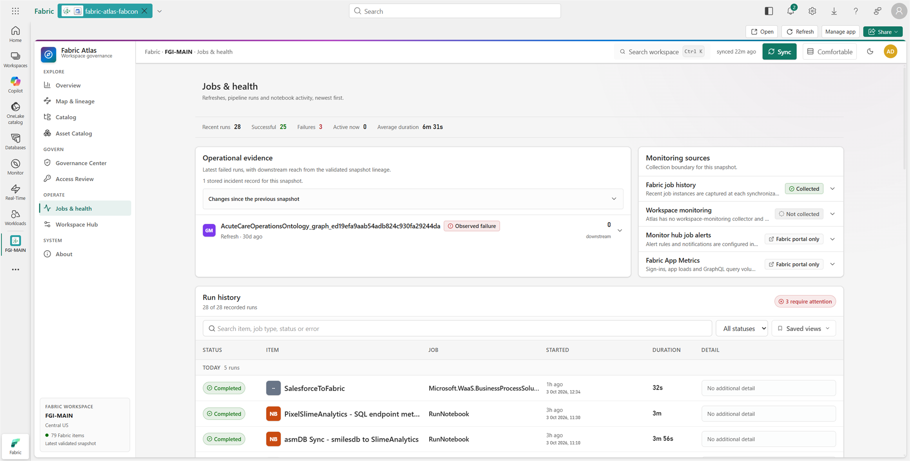

### Multi-workspace synchronization

The synchronizer can run one selected workspace while another workspace keeps
its last validated snapshot. Here FGI-ORACLE is in discovery at 12%, FGI-MAIN
remains the active catalog, and workspace switching is paused until the browser
run finishes or is cancelled.

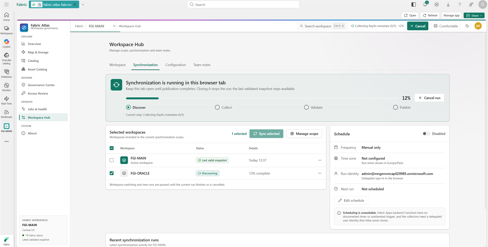

### Workspace Hub

Workspace Hub shows the selected synchronization scope, latest validated
snapshot and manual run history. Scheduling remains visibly disabled until
Fabric exposes a supported unattended trigger and identity contract.

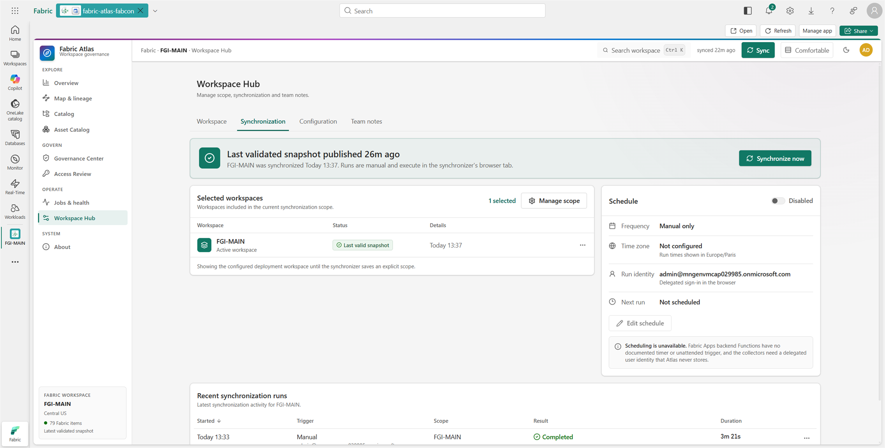

### Impact reports

An item or schema object can produce an exportable report with verified
upstream, downstream and relationship evidence.

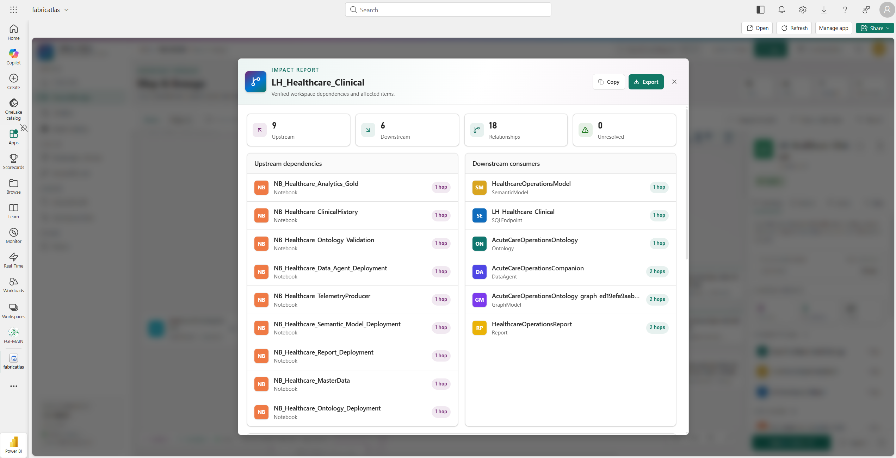

## How it works

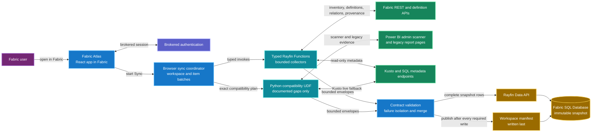
```mermaid
flowchart LR
  U["Fabric user"]
  APP["Fabric Atlas<br/>React app in Fabric"]
  AUTH["Brokered authentication"]
  PLAN["Browser sync coordinator<br/>workspace and item batches"]
  FN["Typed Rayfin Functions<br/>bounded collectors"]
  PY["Python compatibility UDF<br/>documented gaps only"]
  FABRIC["Fabric REST and definition APIs"]
  PBI["Power BI admin scanner<br/>and legacy report pages"]
  DATA["Kusto and SQL metadata endpoints"]
  VALIDATE["Contract validation<br/>failure isolation and merge"]
  API["Rayfin Data API"]
  DB[("Fabric SQL Database<br/>immutable snapshot")]
  MANIFEST["Workspace manifest<br/>written last"]

  U -->|"open in Fabric"| APP
  APP <-->|"brokered session"| AUTH
  APP -->|"start Sync"| PLAN
  PLAN -->|"typed invokes"| FN
  PLAN -->|"exact compatibility plan"| PY
  FN <-->|"inventory, definitions, relations, provenance"| FABRIC
  FN <-->|"read-only metadata"| DATA
  PY <-->|"scanner and legacy evidence"| PBI
  PY <-->|"Kusto live fallback"| DATA
  FN -->|"bounded envelopes"| VALIDATE
  PY -->|"bounded envelopes"| VALIDATE
  VALIDATE -->|"complete snapshot rows"| API
  API --> DB
  VALIDATE -->|"publish after every required write"| MANIFEST
  MANIFEST --> DB

  classDef user fill:#742774,stroke:#a66dd4,color:#ffffff,stroke-width:2px;
  classDef app fill:#1677c8,stroke:#6fc7ff,color:#ffffff,stroke-width:2px;
  classDef auth fill:#5b5fc7,stroke:#a7a9ff,color:#ffffff,stroke-width:2px;
  classDef collector fill:#0e8a99,stroke:#67e8e2,color:#ffffff,stroke-width:2px;
  classDef source fill:#16855b,stroke:#6ee7a8,color:#ffffff,stroke-width:2px;
  classDef database fill:#9a6b00,stroke:#f2c94c,color:#ffffff,stroke-width:2px;

  class U user;
  class APP,PLAN,VALIDATE app;
  class AUTH auth;
  class FN,PY collector;
  class FABRIC,PBI,DATA source;
  class API,DB,MANIFEST database;
```

### Collector ownership

| Evidence | Primary path | Compatibility path |
|---|---|---|
| Workspaces, items, roles and jobs | `workspaceCollectCore` | Explicit Python rollback only |
| Definitions and structural metadata | Rayfin definition, Power BI, KQL and SQL collectors | Semantic-model scanner fallback when a definition is unavailable |
| Lakehouse, Warehouse, SQL Database and Mirrored Database objects | `workspaceCollectSqlMetadata` plus Lakehouse REST | None; unavailable application-identity coverage stays explicit |
| Shortcuts, mirroring and MLV provenance | `workspaceCollectSourceProvenance` | None |
| Item Relations evidence | `workspaceCollectItemRelations` | None; the API remains Beta and non-authoritative |
| Access-policy context | `workspaceCollectAccessPolicyEvidence` | Portal-only layers remain marked unavailable |
| Power BI admin scanner and authoritative scanner lineage | Python UDF | Retained because Rayfin Functions have no documented Power BI audience |
| Kusto live schema | Python UDF | Retained because Rayfin Functions have no documented Kusto audience |

### Why synchronization can take several minutes

Atlas splits one synchronization into bounded calls. Rayfin Functions keep
headroom below the Fabric runtime limit, and the Python compatibility UDF uses
a 180-second budget. The browser sends small item batches, validates every
response and continues only the remaining work.

The browser publishes nothing until every required collector has completed.
One optional failure can leave an item partially covered, but it cannot erase a
valid schema from another item or replace the last validated snapshot. The
manifest is written after all snapshot rows.

The current flow still needs an open browser because Fabric Apps Functions do
not expose a supported unattended trigger or distributed task-claim primitive.
Scheduled refresh stays disabled rather than storing or replaying a user's
access token.

See [Architecture](docs/architecture.md) for the full data flow.

## Current limits and roadmap

The multi-workspace catalog, independent snapshots and stored cross-workspace
Preview evidence are implemented. The remaining work is tied to platform
contracts or a separate product decision.

| Area | Current state | Next gate |
|---|---|---|
| Scheduled synchronization | Disabled. Sync still needs a browser-held delegated identity | A supported unattended trigger and identity for every required API |
| Durable server execution | Additive commands and checkpoints are implemented as a fail-closed probe | Distributed claim or transaction primitive plus live browser-closure recovery |
| Python compatibility | Limited to Power BI scanner, PBIR-Legacy pages, Kusto live metadata and rollback | Documented Power BI and Kusto audiences for Rayfin Functions |
| Atlas MCP | Read-only stdio server implemented and disabled by default | Public client, `Item.Execute.All`, reviewed token exchange and live validation |
| OneLake security and Purview DLP | Portal links and explicit unavailable states | Public read APIs for role membership and restriction evidence |
| Report visual usage | Not collected | A supported report definition path with sensitivity and permission handling |
| Shared action plans and notifications | Not implemented | Reviewed team workflow, ownership model and delivery channel |
| 2.0 maintenance | Version 2.0.0 is the current release line | Patch releases for verified fixes; larger workflows depend on the contracts above |

## Quickstart

### Local preview

Clone directly, or scaffold a reusable copy with
`npx rayfin init my-atlas -t https://github.com/fredgis/FabricAtlas`.

```powershell
git clone https://github.com/fredgis/FabricAtlas.git
Set-Location FabricAtlas
$env:VITE_RAYFIN_ATLAS_DEMO_MODE = "true"
npm ci
npm run dev
```

The local app uses the included AlpineRent preview estate.

### Deploy to Fabric

```powershell
npx rayfin login --tenant <tenant-id> --select
$env:RAYFIN_PUBLIC_ATLAS_SYNC_ADMIN_EMAIL = "<authorized-sync-user>"
$env:RAYFIN_PUBLIC_ATLAS_SYNC_ADMIN_SUBJECT = "<authorized-sync-subject>"
npx rayfin up --tenant <tenant-id> --workspace-id <workspace-id> --item-name fabric-atlas --yes
```

`rayfin up` applies the MSSQL schema, static app, runtime settings and typed
Functions. Publish the compatibility UDF in
[`fabric/udf/atlas_sync_functions/`](fabric/udf/atlas_sync_functions/) by
round-tripping its complete Fabric definition, then add these public values to
the git-ignored `rayfin/.env` file:

```dotenv
RAYFIN_PUBLIC_ATLAS_SPA_CLIENT_ID=<entra-client-id>
RAYFIN_PUBLIC_ATLAS_UDF_URL=https://<host>/functions/sync_all/invoke
RAYFIN_PUBLIC_ATLAS_WORKSPACE_NAME=<workspace-display-name>
RAYFIN_PUBLIC_ATLAS_SYNC_ADMIN_EMAIL=<authorized-sync-user>
RAYFIN_PUBLIC_ATLAS_SYNC_ADMIN_SUBJECT=<authorized-sync-subject>
RAYFIN_PUBLIC_ATLAS_SNAPSHOT_RETENTION_COUNT=12
# Optional collector rollback during incident recovery:
VITE_ATLAS_COLLECTOR_ROLLBACK=false
# Optional during synchronizer rotation:
RAYFIN_PUBLIC_ATLAS_PREVIOUS_SYNC_WRITERS=<former-user@example.com>
RAYFIN_PUBLIC_ATLAS_SENSITIVITY_RANKS='{"<label-id>":3,"<lower-label-id>":1}'
```

Keep the configured synchronizer available in the CLI process environment when
running `npx rayfin up`: its immutable Rayfin subject is needed to compile the
database policies, while the email remains the visible contact and historical
snapshot identifier. A new deployment opens on the guided synchronization
screen. After the first snapshot, the synchronizer can add other workspaces in
Workspace Hub and refresh each workspace independently.

The complete Entra, UDF and deployment steps are in
[docs/installation.md](docs/installation.md).

## Development

```powershell
npm test
npm run lint
npm run build
```

`npm run typecheck` runs `tsc -b --force` with strict checking and `noEmit`.
The project does not enable TypeScript's `noCheck` option.

The production build still reports large application and radar chunks. Vite
also reports that the dynamic Rayfin client import cannot form a separate chunk
because several persistence modules import the same client statically. The
candidate accepts those warnings for now; bundle splitting remains a measured
performance task, not a release claim.

| Path | Purpose |
|---|---|
| `src/atlas/views/` | Application pages |
| `src/atlas/store.tsx` | Hydration, synchronization and comments |
| `src/atlas/history.ts` | Validated snapshot comparison and governance trends |
| `src/atlas/governance.ts` | Effective access, findings and metadata coverage |
| `src/atlas/search.ts` | Global workspace search index |
| `src/atlas/lineage.ts` | Lineage normalization, traversal and layout |
| `src/atlas/backend.ts` | Workspace snapshots and Rayfin persistence |
| `src/atlas/browser-collector-sync.ts` | Browser-serialized Rayfin collector composition and exact compatibility planning |
| `src/atlas/live-sync.ts` | Snapshot contracts, compatibility UDF invocation and merge logic |
| `src/atlas/item-relations-evidence.ts` | Item Relations API contract, relation semantics and stored Beta graph |
| `src/atlas/source-provenance-snapshot.ts` | Shortcut, mirroring and MLV projection into snapshot metadata |
| `src/mcp/` and `src/atlas/mcp/` | Local read-only Atlas MCP transport and evidence tools |
| `rayfin/data/` | Persisted entity model |
| `rayfin/functions/` | Typed Rayfin collectors, search and durable-execution probes |
| `fabric/udf/atlas_sync_functions/` | Minimal Python compatibility collector and rollback path |

## Access and collaboration scope

Fabric Atlas stores an administrator-selected workspace scope with an
independent validated manifest for each synchronized workspace. One workspace
is active in the UI at a time. Every authenticated user who can open the
deployed app can read the complete synchronized metadata graph for every
selected workspace, including items, object inventory, lineage, principals,
access grants, jobs, configuration, snapshot history and team notes. Catalog
reads are not filtered per user. Control this audience through the Fabric app
and workspace access settings.

Saved views, access-review decisions and Governance Radar acknowledgements are
different: Rayfin policies bind those records to the authenticated subject, so
each user sees only their own personal state.

Access decisions are now append-only events. Older decisions remain in the
history but require a new review because they do not contain a permission
fingerprint. Clearing a decision appends an event rather than deleting history.

Governance targets and exceptions are shared workspace settings. Only the
configured synchronization administrator can change them. All six targets
default to 70%; the same current targets apply to Overview and historical
posture comparisons. Historical versions of the target policy are not stored.
An exception needs a reason and a future expiry. It annotates the finding
without hiding it or improving the underlying score, and it remains separate
from a user's personal mute.

Team notes are append-only. Creation is bound to the authenticated
email and subject. Atlas stores the authenticated session email as the author
label, and that label remains stable after reload. Client-selected catalog
labels cannot impersonate another note author. Notes cannot currently be edited
or deleted.

Only the configured synchronization administrator can publish or prune
snapshots. When another user reaches the first-sync gate, Atlas displays the
configured account to contact.

## Security

Fabric Atlas stores workspace metadata and team notes. It does not persist
workspace business data. Tokens and deployment values stay outside Git in
`rayfin/.env`.

The synchronization boundary excludes scanner rows, datasource and connection
details, and Power Query or source expressions. Measure DAX is retained only as
explicit Semantic Model metadata.

The project has been reviewed against OWASP Top 10:2025 and ASVS 5.0. Security
hardening is part of the release process.

The shared authenticated read scope and append-only note behavior are described
above so deployments can set the app audience deliberately.

Report vulnerabilities through
[GitHub private vulnerability reporting](https://github.com/fredgis/FabricAtlas/security/advisories/new).

## Contributing

Found a bug, a missing Fabric object type or a useful governance workflow?
[Open an issue](https://github.com/fredgis/FabricAtlas/issues/new/choose).

Pull requests are welcome. Read
[the contribution guide](.github/CONTRIBUTING.md) before starting.

## Project links

- [Releases](https://github.com/fredgis/FabricAtlas/releases)
- [Changelog](CHANGELOG.md)
- [Installation](docs/installation.md)
- [Architecture](docs/architecture.md)
- [Data model](docs/data-model.md)
- [Metadata coverage audit](docs/fabric-metadata-coverage-audit.md)
- [Phase 4 Power BI metadata replacement and blocker](docs/powerbi-scanner-replacement.md)
- [Optional Power BI scanner Secret Store setup](docs/powerbi-scanner-secret-store.md)
- [Security policy](.github/SECURITY.md)
- [Code of conduct](.github/CODE_OF_CONDUCT.md)

## Scan coverage matrix

<sub>Atlas always indexes top-level items from the Fabric Items API. Deeper
inventory, lineage and item-level access depend on what the Fabric and Power BI
APIs expose for each type and on the required tenant settings. `N/A` means a
metadata capability was not collected; it is not treated as a missing value.</sub>

| <sub>Fabric element</sub> | <sub>Catalog and configuration</sub> | <sub>Internal inventory</sub> | <sub>Lineage</sub> | <sub>Access</sub> | <sub>Recent jobs</sub> | <sub>Known boundary</sub> |
|---|---|---|---|---|---|---|
| <sub>Workspace</sub> | <sub>Name, ID, capacity and region</sub> | <sub>Not applicable</sub> | <sub>Not applicable</sub> | <sub>Workspace role assignments</sub> | <sub>Not applicable</sub> | <sub>Administrator-selected shared scope; one active workspace view at a time</sub> |
| <sub>Lakehouse</sub> | <sub>Description, OneLake paths, default schema and SQL endpoint status</sub> | <sub>Table identities from Lakehouse REST, merged with columns from the SQL analytics endpoint when available</sub> | <sub>Scanner relations and SQL endpoint path</sub> | <sub>Workspace roles and item users</sub> | <sub>When supported</sub> | <sub>Application-identity permission gaps remain explicit partial coverage; no business rows are read</sub> |
| <sub>Warehouse</sub> | <sub>Description, collation, created and updated dates</sub> | <sub>Tables, views and columns from the read-only SQL system catalog</sub> | <sub>Scanner relations</sub> | <sub>Workspace roles and item users</sub> | <sub>When supported</sub> | <sub>Complete inventory requires SQL catalog visibility for the Rayfin Function identity</sub> |
| <sub>SQL Database</sub> | <sub>Database identity, endpoint, collation and backup metadata</sub> | <sub>Schemas, tables, views and columns from a constant read-only system-catalog query</sub> | <sub>Scanner relations and verified downstream bindings</sub> | <sub>Workspace roles, item users and SQL metadata visibility</sub> | <sub>When supported</sub> | <sub>Requires the Rayfin SQL audience; no rows or module definitions are read</sub> |
| <sub>SQL endpoint</sub> | <sub>Item identity and scanner metadata</sub> | <sub>No dedicated internal-object scan</sub> | <sub>Storage-to-endpoint-to-model relations</sub> | <sub>Workspace roles and item users</sub> | <sub>When supported</sub> | <sub>Used primarily as a lineage bridge</sub> |
| <sub>Semantic Model</sub> | <sub>Description, storage mode, provider and documented `configuredBy` owner</sub> | <sub>Tables, columns, measures, descriptions, hidden flags, measure DAX and resolved object dependencies</sub> | <sub>Scanner item relations plus DAX-verified measure dependencies and explicitly inferred unique source hops</sub> | <sub>Workspace roles and item users</sub> | <sub>When supported</sub> | <sub>Requires scanner schema and expression options; unresolved/ambiguous references and source or Power Query expressions are discarded</sub> |
| <sub>Report</sub> | <sub>Report type, bound Semantic Model, documented `createdBy` owner and page inventory</sub> | <sub>Pages and order</sub> | <sub>Model binding plus scanner relations</sub> | <sub>Workspace roles and item users</sub> | <sub>When supported</sub> | <sub>Visuals and field bindings are not exposed by this flow</sub> |
| <sub>Dashboard</sub> | <sub>Item and scanner metadata</sub> | <sub>No deep object inventory</sub> | <sub>Scanner relations when returned</sub> | <sub>Workspace roles and item users</sub> | <sub>When supported</sub> | <sub>Tile and visual bindings are not expanded</sub> |
| <sub>Notebook</sub> | <sub>Item description and modified metadata when returned</sub> | <sub>Source code and cells are not read</sub> | <sub>Scanner relations</sub> | <sub>Workspace roles and item users</sub> | <sub>Up to 3 returned instances</sub> | <sub>No owner is inferred without a documented owner field</sub> |
| <sub>Data Pipeline</sub> | <sub>Item description and modified metadata when returned</sub> | <sub>Activities and expressions are not expanded</sub> | <sub>Scanner relations</sub> | <sub>Workspace roles and item users</sub> | <sub>Up to 3 returned instances</sub> | <sub>No owner is inferred and pipeline definitions are not copied</sub> |
| <sub>Dataflow</sub> | <sub>Item metadata and documented `configuredBy` owner</sub> | <sub>Entities and Power Query definitions are not expanded</sub> | <sub>Official upstream Dataflow/Datamart IDs plus scanner relations</sub> | <sub>Workspace roles and item users</sub> | <sub>When supported</sub> | <sub>Cross-workspace dependencies are omitted; query content is not copied</sub> |
| <sub>Datamart</sub> | <sub>Item metadata and documented `configuredBy` owner</sub> | <sub>No deep object inventory</sub> | <sub>Official upstream Dataflow/Datamart IDs plus scanner relations</sub> | <sub>Workspace roles and item users</sub> | <sub>When supported</sub> | <sub>Cross-workspace dependencies are omitted</sub> |
| <sub>Eventhouse</sub> | <sub>Item metadata and contained KQL Database IDs</sub> | <sub>Databases remain separate catalog items</sub> | <sub>Verified Eventhouse-to-database relations</sub> | <sub>Workspace roles and item users</sub> | <sub>When supported</sub> | <sub>Eventhouse hosts databases; tables belong to each KQL Database</sub> |
| <sub>KQL Database</sub> | <sub>Parent Eventhouse, query endpoint and database type</sub> | <sub>Tables, columns, functions and materialized views from read-only Kusto metadata</sub> | <sub>Parent, materialization and verified consumer relations</sub> | <sub>Workspace roles, item users and KQL database reader access</sub> | <sub>When supported</sub> | <sub>Requires a separate Kusto delegated token; function bodies and rows are excluded</sub> |
| <sub>KQL Queryset / Dashboard</sub> | <sub>Top-level item metadata</sub> | <sub>No saved query text or dashboard payload</sub> | <sub>Scanner or explicit source relations when returned</sub> | <sub>Workspace roles and item users</sub> | <sub>When supported</sub> | <sub>Query text and visual definitions remain outside the metadata boundary</sub> |
| <sub>Ontology</sub> | <sub>Item metadata and definition capability</sub> | <sub>Entity types, properties, time-series properties, bindings, relationship types and contextualizations</sub> | <sub>Physical source-to-property bindings and entity-relationship-entity paths</sub> | <sub>Workspace/item access; definition enrichment requires read-write item permission</sub> | <sub>Not applicable</sub> | <sub>Preview; encrypted labels can block definition retrieval; documents, resource links and instances are excluded</sub> |
| <sub>Graph Model</sub> | <sub>Item metadata and definition capability</sub> | <sub>Node types, edge types, properties and source mappings</sub> | <sub>Physical source-to-node/edge/property mappings</sub> | <sub>Workspace/item access; definition enrichment requires read-write item permission</sub> | <sub>Not applicable</sub> | <sub>Preview; filter literals and graph instances are excluded</sub> |
| <sub>Data Agent</sub> | <sub>Published state and description when exposed</sub> | <sub>Configured source items and selected tables, columns, measures, KQL objects, ontology entities and graph types</sub> | <sub>Selected source objects feed Data Agent source and element nodes</sub> | <sub>Workspace/item access; definition enrichment requires read-write item permission</sub> | <sub>Not applicable</sub> | <sub>AI instructions, data-source instructions, few-shot questions/queries and answers are excluded</sub> |
| <sub>Eventstream</sub> | <sub>Item and scanner metadata</sub> | <sub>Internal stream topology is not expanded</sub> | <sub>Scanner relations</sub> | <sub>Workspace roles and item users</sub> | <sub>When supported</sub> | <sub>Event payloads are never read</sub> |
| <sub>Mirrored Database</sub> | <sub>Item metadata, default schema, SQL endpoint, provider and replication state</sub> | <sub>Tables, views and columns from the read-only SQL endpoint catalog; selected source tables from `mirroring.json` retain provenance</sub> | <sub>Scanner relations plus provider, connection and SQL endpoint bindings</sub> | <sub>Workspace roles and item users</sub> | <sub>When supported; replication state from the mirroring adapter</sub> | <sub>Requires SQL catalog visibility for columns; source rows, source database names and replication contents are never read</sub> |
| <sub>User Data Function</sub> | <sub>Item and scanner metadata</sub> | <sub>Function source and endpoints are not expanded</sub> | <sub>Scanner relations</sub> | <sub>Workspace roles and item users</sub> | <sub>When supported</sub> | <sub>Function code is not copied</sub> |
| <sub>Fabric App / AppBackend</sub> | <sub>Item identity from the Fabric Items API</sub> | <sub>No internal service inventory</sub> | <sub>Only when a Fabric API exposes a relation</sub> | <sub>Workspace roles</sub> | <sub>When supported</sub> | <sub>Not currently an admin-scanner artifact type</sub> |
| <sub>Materialized lake view</sub> | <sub>Not a top-level item; shown on its parent Lakehouse</sub> | <sub>Selected view names and refresh scope from MLV execution definitions</sub> | <sub>Included lakehouses by ID, treated as refresh scope rather than lineage</sub> | <sub>Inherits Lakehouse access</sub> | <sub>`RefreshMaterializedLakeViews` jobs on the Lakehouse</sub> | <sub>No documented API lists every view; distinct from KQL materialized views</sub> |
| <sub>OneLake shortcut</sub> | <sub>Not a top-level item</sub> | <sub>Name, path and target type stored under the parent item</sub> | <sub>OneLake targets by explicit IDs; external targets by connection ID only</sub> | <sub>Decided at the target; not collected</sub> | <sub>Not applicable</sub> | <sub>Target URLs, buckets and subpaths are never stored; the API does not expose target columns</sub> |
| <sub>Event Schema Set</sub> | <sub>Item identity from the Fabric Items API</sub> | <sub>Deferred: the documented definition supports user identity only</sub> | <sub>Only when a Fabric API exposes a relation</sub> | <sub>Workspace roles</sub> | <sub>When supported</sub> | <sub>Preview; event payloads are never read</sub> |
| <sub>Workload Hub item</sub> | <sub>ID, name and dotted `Publisher.Workload.ItemType`</sub> | <sub>No Fabric-documented structural contract</sub> | <sub>Only when the APIs expose a relation</sub> | <sub>Workspace roles; item users when exposed</sub> | <sub>The jobs endpoint is attempted</sub> | <sub>Kept visible with an explicit fallback label</sub> |
| <sub>Other or new Fabric item type</sub> | <sub>ID, name, type and description when returned</sub> | <sub>Top-level item only</sub> | <sub>Only when the APIs expose a relation</sub> | <sub>Workspace roles; item users when exposed</sub> | <sub>The jobs endpoint is attempted</sub> | <sub>Unknown types stay visible with a neutral item glyph</sub> |

<sub>The Catalog item drawer shows the same per-family coverage as **Atlas
coverage**, from the registry described in
[docs/item-families.md](docs/item-families.md). Shortcut and mirroring
provenance is described in [docs/source-provenance.md](docs/source-provenance.md).</sub>

<sub>Across these elements, Atlas also records configuration facts, up to three
recent job instances per supported item, scanner-reported relationships,
workspace principals, explicit item users, raw endorsement, sensitivity-label
IDs and tag IDs. It stores metadata only, never workspace business data.</sub>

<div align="center">

MIT licensed. Built with React, Rayfin and Microsoft Fabric.

Security and reliability findings were audited with Fable 5.1 and GPT-6 Astra,
then reviewed and prioritized for the accelerator scope.

</div>
