> This paper documents Fabric Atlas version 1.12.0. FGI-MAIN is used as one
> example deployment, captured on 6 September 2026. Its counts and findings
> describe that workspace at one point in time. They are not product defaults,
> limits or benchmarks.

## Executive summary

Microsoft Fabric puts data engineering, analytics, real-time processing and
business intelligence in one service. The workspace is the practical unit where
teams build and operate that estate, but the metadata needed to understand it is
spread across item pages, admin APIs, run history, permissions and semantic
models.

Fabric Atlas brings that metadata into one workspace application. It indexes
Fabric items, internal schema objects, lineage, access, sensitivity, recent
operations, configuration and team notes. The application runs inside the
Fabric portal and stores its validated metadata snapshots in Fabric through
Rayfin.

The product is deliberately narrow about data collection. It stores governance
metadata, not workspace business data. It does not copy table rows, notebook
code, pipeline definitions, Power Query expressions, connection details or
report visual bindings. Measure DAX is retained only when Fabric exposes it as
semantic model metadata, because Atlas uses those expressions to resolve
measure and column dependencies.

The example deployment used for the figures contained 76 Fabric items across
19 item types, 64 item-lineage links and 1,164 indexed assets. The fresh
version 1.12.0 deployment had one validated baseline snapshot. FGI-MAIN is
included to make the workflows concrete, not to define how an Atlas workspace
must look. Another supported Fabric workspace will have its own item mix,
metadata coverage and governance history.

### What Atlas provides

| Area | Practical outcome |
|---|---|
| Workspace inventory | One searchable list of Fabric items with type, ownership, health, labels, tags and context |
| Asset inventory | Relational, semantic, KQL, ontology, graph and data-agent objects grouped under their parent item |
| Lineage | Source-to-consumer paths across pipelines, notebooks, stores, endpoints, semantic models and reports |
| DAX dependencies | Verified measure-to-column and measure-to-measure references when names resolve uniquely |
| Governance | Findings, new-risk radar, snapshot comparison, metadata coverage and posture targets |
| Access review | Effective access that combines workspace inheritance and direct item grants |
| Operations | Recent refresh, pipeline and notebook activity with status, duration and error context |
| Collaboration | Shared, append-only notes attached to the workspace or a Fabric item |

## Why a workspace atlas is useful

Fabric already exposes rich metadata. The problem is not that the facts do not
exist. The problem is that a reviewer has to move between several experiences
to answer a basic question.

Consider a semantic model change. A reviewer may need to identify its upstream
Lakehouse, the notebooks that write to that Lakehouse, the reports bound to the
model, the measures that depend on a changed column, the people who can edit the
model and the most recent refresh result. Each fact can be found, but rarely in
one place and rarely with the same point in time.

Atlas treats the workspace as a connected metadata graph. The item catalog is
one view of that graph. Lineage, access, findings and run history are other
views over the same validated snapshot. This avoids a common review failure
where two portal pages describe different moments in the workspace lifecycle.

The snapshot model also changes the questions a team can ask. Instead of only
asking "what is here now?", a team can ask:

* Which items, grants, schema objects or lineage edges changed since the last
  accepted snapshot?
* Did a change create a new high-priority risk?
* Is a low score caused by a real gap, or did the API not expose the metadata?
* Which reports are downstream of a model?
* Which measures use a selected model column?
* Is access inherited from the workspace, granted directly on the item, or
  produced by both paths?

Atlas does not replace Fabric administration or deployment tooling. It is a
workspace reading and review layer that keeps evidence close to the people who
operate the assets.

## Example deployment: FGI-MAIN

The screenshots in this paper use FGI-MAIN as a practical case study. It is a
deployed Fabric App connected to one real workspace and had been synchronized
about nine hours before the capture. It is not a reference architecture or a
required workspace shape.

| Observed value | Example count |
|---|---:|
| Fabric items | 76 |
| Item types | 19 |
| Item-lineage links | 64 |
| Indexed assets | 1,164 |
| Tables | 144 |
| Columns | 376 |
| Measures and KPIs | 62 |
| Validated snapshots | 1 |
| Unique principals in Access Review | 2 |
| Reachable principal and item pairs | 78 |
| Recent job runs | 25 |
| Failed recent job runs | 3 |

The Overview page is designed for orientation rather than exhaustive detail.
It combines workspace identity, sync freshness, posture targets, priority
signals, metadata coverage and activity. Links on the page open the matching
filtered view, so the summary remains connected to evidence.

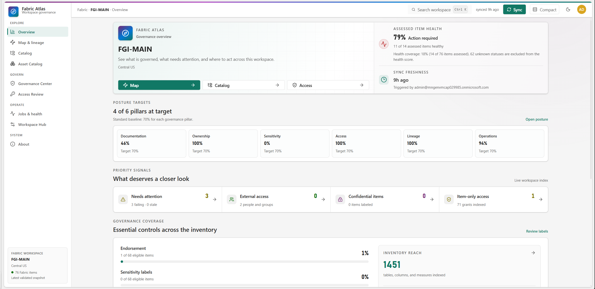{ width=100% }

The assessed-item health score in Figure 1 is 79 percent. Eleven of the 14
items with health evidence are healthy; the other 62 workspace items remain
unknown and are excluded from the score. Atlas does not turn missing evidence
into a failure. Missing evidence and negative evidence are different states.

The six posture pillars are evaluated independently. In this snapshot,
ownership, access, lineage and operations met their targets. Documentation and
sensitivity did not. That distinction gives the workspace team a concrete
starting point without blending unrelated controls into one opaque score.

## Catalog and internal asset inventory

### Workspace catalog

The Catalog lists every item returned by the Fabric Items API, including item
types that do not yet have a dedicated deep scanner. Unknown or newer types stay
visible with a neutral type treatment instead of disappearing.

Items can be filtered by type, searched by name or tag and opened in a detail
drawer. The drawer keeps ownership, description, lineage, effective access,
configuration and recent jobs next to the selected item. Groups remain
collapsed until the user searches or chooses to expand them.

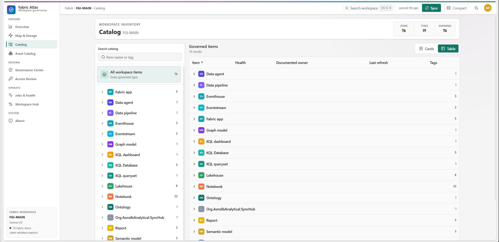{ width=100% }

This view answers "what exists?" without forcing every object into the same
shape. A Notebook, Semantic Model, Lakehouse and Fabric App remain distinct
types, but they can still participate in common workflows such as search,
lineage inspection, access review and change comparison.

### Asset Catalog

The Asset Catalog moves below the item boundary. It groups synchronized
relational, semantic, KQL, ontology, graph and data-agent objects under their
parent Fabric item. In the captured workspace, 39 items exposed at least one
asset. The inventory contained 1,164 assets, including 144 tables, 376 columns
and 62 measures or KPIs.

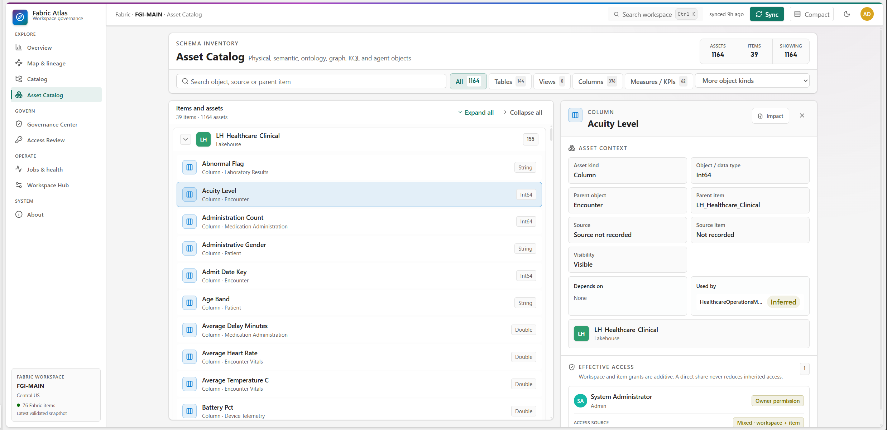{ width=100% }

Atlas records the provenance of an object where possible. A Lakehouse table may
come from the Fabric Tables REST API. A semantic model column or measure may
come from scanner metadata. Warehouse and SQL Database objects may come from
the scanner, with a labelled downstream model subset when complete SQL catalog
access is not available.

The object detail keeps four kinds of evidence together:

1. Object identity, parent table and parent item.
2. Data type, visibility, description and collection source when exposed.
3. DAX dependency evidence for semantic model columns and measures.
4. Effective access to the parent Fabric item.

### Measure metadata

Measure expressions are useful for more than documentation. Atlas parses the
DAX expression after removing comments and string literals, then resolves
qualified columns and measures against the synchronized schema. A dependency
is emitted only when the reference matches one real object unambiguously.

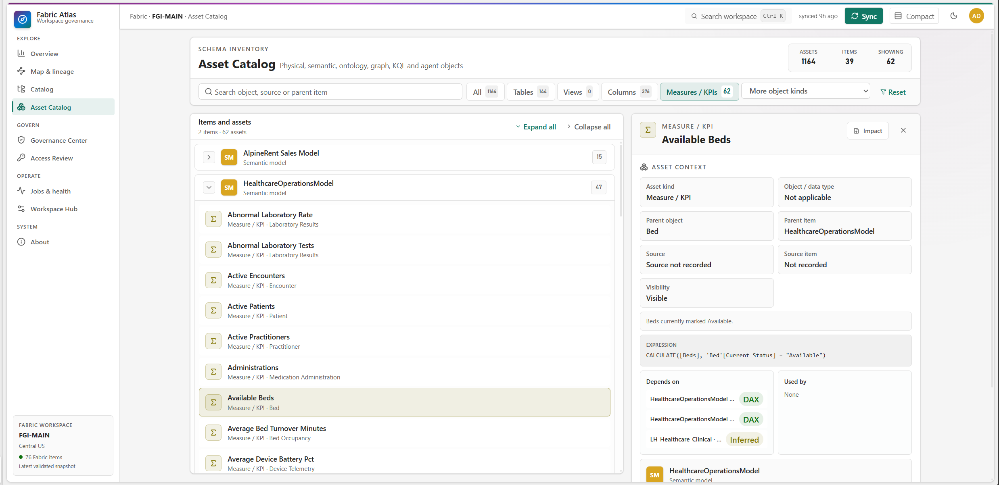{ width=100% }

Figure 4 shows the distinction between a DAX edge and an inferred source hop.
The `Available Beds` measure filters the `Bed[Current Status]` column and
reuses the `Beds` measure. Those same-model references receive verified DAX
labels. Atlas also connects the semantic object to the matching upstream
Lakehouse object when item lineage and the schema match are unambiguous. That
cross-item hop is labelled inferred.

Ambiguous references are discarded. Atlas does not guess which object the
author meant, and it does not create object lineage from name similarity alone.

## Lineage and impact analysis

### Item lineage

The item graph normalizes relationships from source to consumer and arranges
assets by lifecycle stage:

1. Orchestrate
2. Transform
3. Store
4. Endpoint
5. Model
6. Consume

Selecting an item highlights its upstream and downstream paths without moving
the graph. The inspector shows the same item context used elsewhere in the
application, plus impact counts and textual relationship summaries.

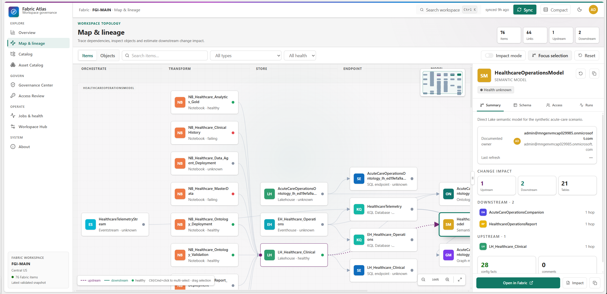{ width=100% }

In the captured graph, `HealthcareOperationsModel` has one direct upstream
Lakehouse and two direct consumers: a report and a data agent. Its complete
impact path contains ten upstream items, two downstream items and fourteen
relationships. Atlas traverses that reachable graph through indexed adjacency
maps, so selection does not require a full scan of every edge.

### Object lineage

Object mode expands synchronized tables, columns and measures while retaining
the surrounding item graph. Purple dashed paths indicate upstream movement.
Teal paths indicate downstream movement. The graph also exposes relationship
text, so direction is not encoded by colour alone.

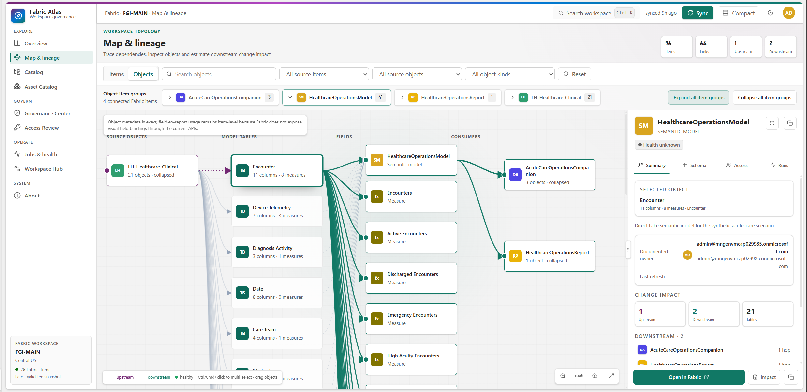{ width=100% }

The graph is precise about its boundary. Object metadata can be exact while
field-to-report usage remains item-level. The Fabric APIs used by this release
do not expose complete visual field bindings. Atlas can prove that a report is
bound to a semantic model, but it does not claim that a particular visual uses
a selected measure.

### Downstream impact at two levels

Atlas supports two related forms of impact analysis.

At item level, selecting a semantic model returns all reachable downstream
items. In the FGI-MAIN example, the `HealthcareOperationsModel` impact report
lists `HealthcareOperationsReport` and `AcuteCareOperationsCompanion` as
one-hop consumers. It also lists ten upstream dependencies and the relationship
evidence used to build the result.

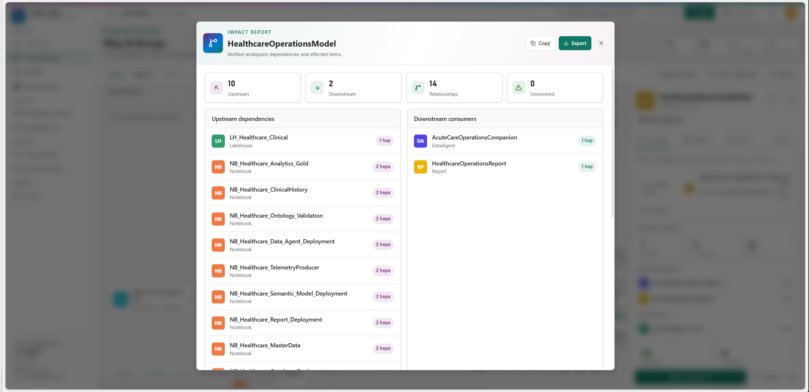{ width=100% }

At object level, Atlas builds a reverse dependency index from resolved DAX
references. Selecting a model column can therefore show which measures use it.
The captured `Bed[Current Status]` model column is used by three measures,
including `Available Beds`, and the selected object is also exposed to the
`AcuteCareOperationsCompanion` data agent.

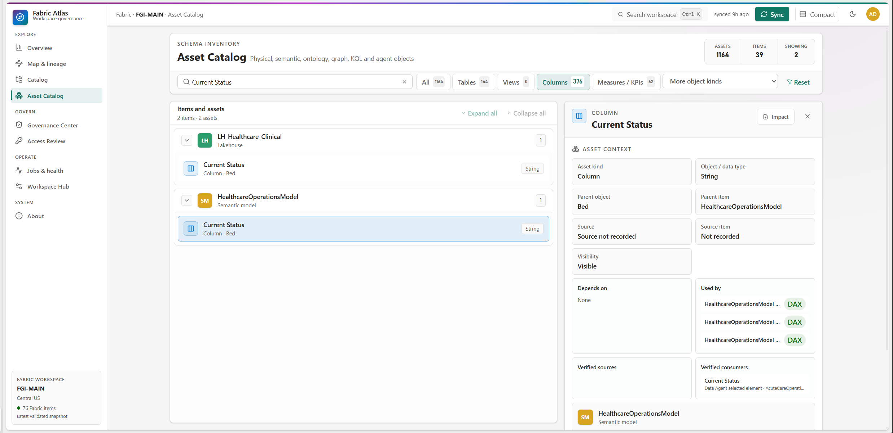{ width=100% }

The exportable impact report keeps the relationship type beside the object
evidence. Same-model DAX dependencies appear in the "Used by" list, while the
report in Figure 9 shows the verified data-agent selected-element relationship.

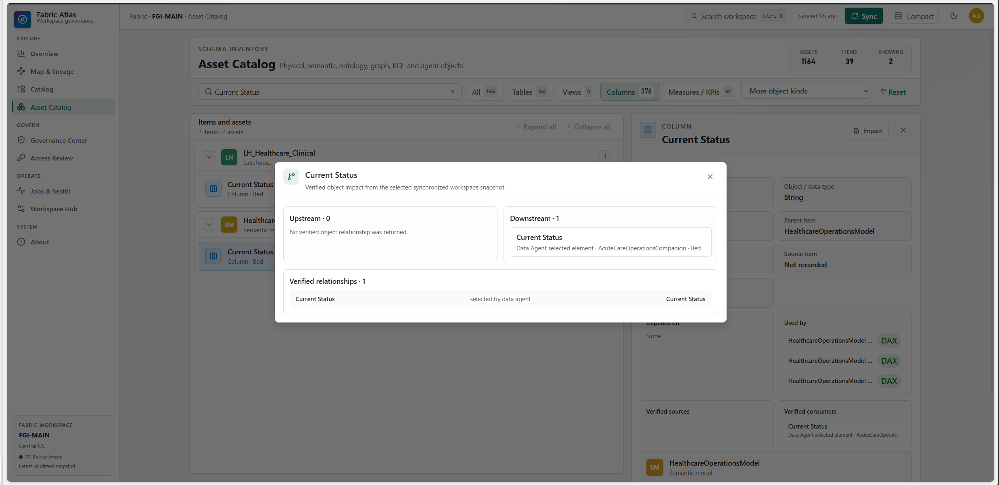{ width=100% }

This distinction prevents an overclaim. Atlas can identify reports that depend
on a semantic model and measures that depend on a column or another measure. It
cannot currently identify the exact report visual that uses that field.

## Governance Center

The Governance Center uses the same synchronized graph to support review over
time. It separates five jobs that are often mixed together in governance
dashboards: current findings, change comparison, history, collection coverage
and posture targets.

### Governance Radar and findings

Governance Radar compares the latest adjacent validated snapshots. It reports
new high or critical findings and risky changes involving access, sensitivity,
lineage or removals. Existing findings do not reappear as new every time a user
opens the page.

The captured deployment contains one validated baseline snapshot, so Radar has
no adjacent pair to compare yet. The Findings section contains 76 current
checks, including failed-operation evidence. The next successful sync will
produce the first before-and-after risk delta.

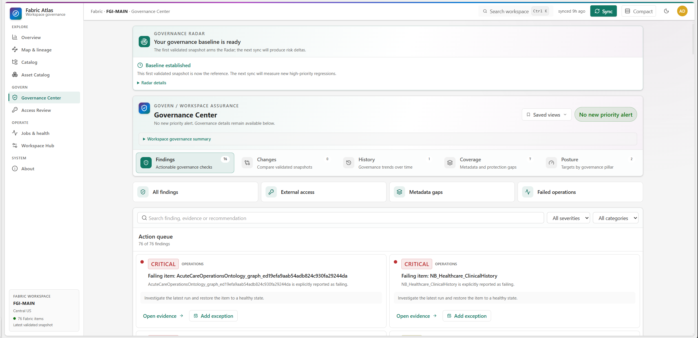{ width=100% }

Radar acknowledgements and mutes are personal. One user can acknowledge a
finding occurrence without changing another user's view or hiding the
underlying finding from the workspace.

### Change Center

Change Center compares any two validated snapshots. It covers item metadata,
schema objects, access grants, sensitivity, lineage and jobs. The selected
snapshot pair and filters are kept in the URL so a reviewer can share the exact
comparison.

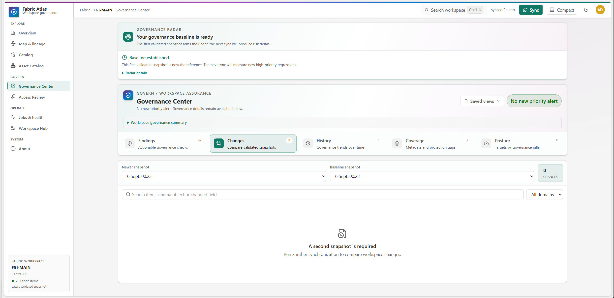{ width=100% }

Older detailed catalogs are loaded only when selected. Workspace manifests
carry compact trend summaries, which keeps the history ledger responsive
without hydrating every historical row during application startup.

### Metadata coverage

Coverage reports what the sync contract collected and what the APIs exposed. It
does not convert unsupported metadata into a governance defect.

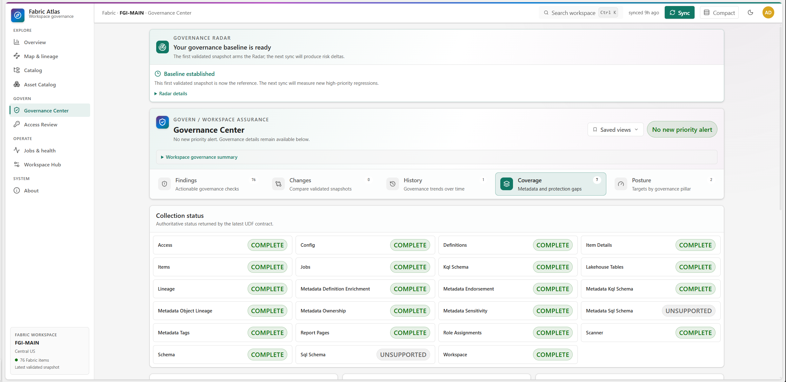{ width=100% }

The captured sync completed the required contract and most optional metadata
families. Direct SQL schema collection is marked unsupported in this snapshot,
while scanner schema, item details, definitions, KQL schema, report pages and
object lineage are complete. A complete collection state still does not mean
that every item has a value. Sensitivity metadata was collected, but none of
the 68 eligible items had a label.

This split between collection status and value coverage is important. It lets a
reviewer distinguish "the scanner did not provide this metadata" from "the
scanner provided the field and the item has no value."

### Posture targets

Atlas scores six reproducible pillars: documentation, ownership, sensitivity,
access, lineage and operations. Non-applicable evidence is excluded rather than
counted as zero.

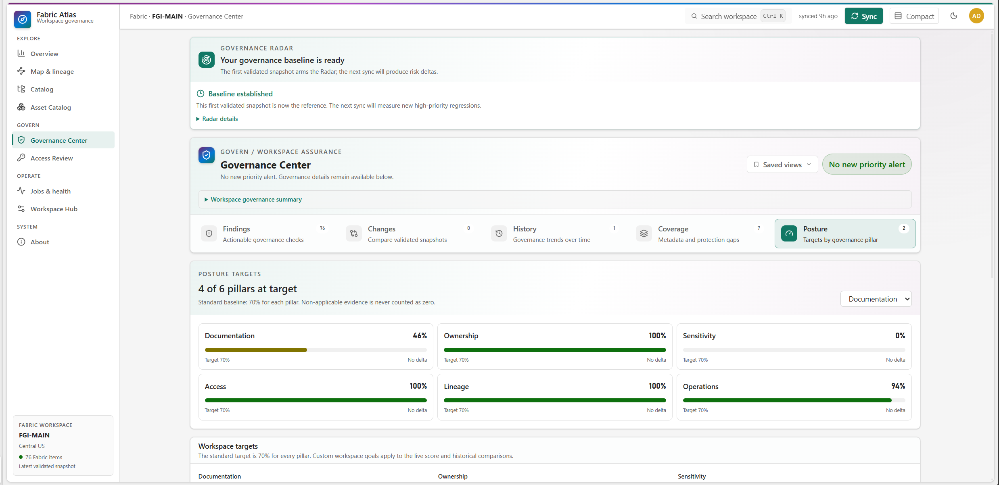{ width=100% }

Each pillar has a target and a drill-down path. A score is useful only when the
team can open the items behind it, so Atlas keeps the score connected to
Catalog, Access Review, Jobs or the matching governance evidence.

## Access review

Fabric permissions are additive. A workspace role may grant access to every
item, while an item-level share adds another path. A direct grant must never
reduce inherited access.

Atlas calculates the highest effective permission for every reachable
principal and item pair. It keeps the contributing grants and their origins,
then exposes filters for access level, source and risk flags.

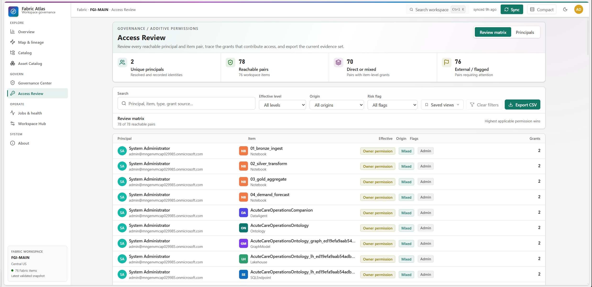{ width=100% }

The captured workspace contained two resolved principals and 78 reachable
principal and item pairs. Seventy pairs had direct or mixed item-level evidence.
The filtered matrix can be exported as CSV.

Review decisions are personal. A user can mark a pair as Reviewed, Accepted or
Needs action and add a note. Rayfin row policies bind those records to the
authenticated subject, so one user's decision is not presented as a team-wide
approval.

### Principal-centred review

The Principals mode groups the filtered access pairs by identity. Each group
shows the number of reachable items and the strongest effective access level.
Opening a group reveals the individual items, access origin and contributing
grant count.

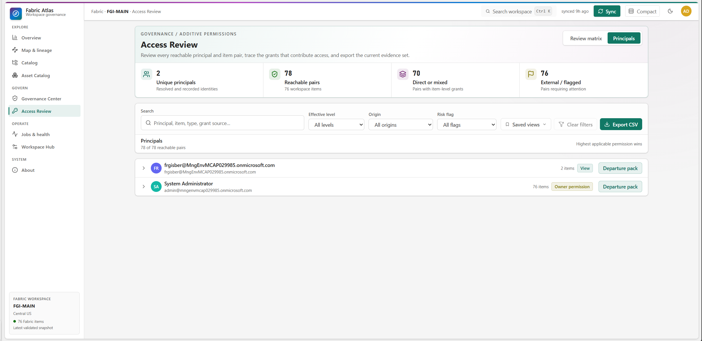{ width=100% }

The example contains two principals. One reaches two items with View access.
The System Administrator reaches all 76 items with Owner as its strongest
effective level. These are access results. Atlas does not treat the item count
or strongest access badge as proof of documented item ownership.

Each user or guest group has a Departure pack action. Other principal types use
the label Removal impact because group membership is not expanded and the
report evaluates the principal itself.

### Departure packs

A Departure pack is calculated from the active validated snapshot. For a
person, documented ownership requires the type-specific owner email exposed by
Fabric. A matching display name alone is not ownership evidence.

The report combines four result sets:

| Result | What it means |
|---|---|
| Owned or effective owner | Items supported by documented person ownership or effective Owner access for a non-person principal |
| Sole owned | Owned items with no other resolved owner and no uncertain owner reference |
| Urgent risks | Sole-owned items that have at least one downstream consumer |
| Blast radius | Unique downstream items reachable from the ownership roots |

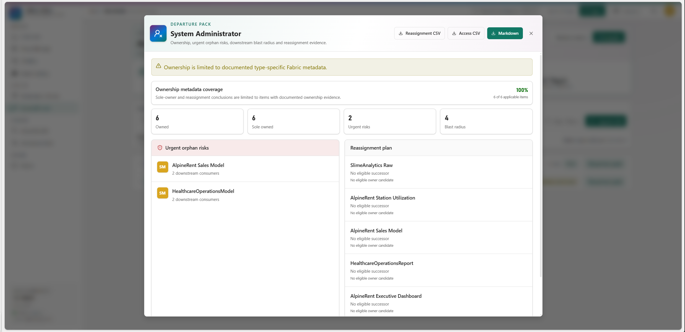{ width=100% }

In this example, ownership metadata is available for all six applicable items.
The pack reports six owned and sole-owned items, two urgent orphan risks and a
blast radius of four. The urgent roots are the AlpineRent and Healthcare
semantic models, each with two downstream consumers. The reassignment plan
states that no eligible successor was found. Atlas keeps that result explicit
instead of inventing a candidate.

When eligible owners exist, the reassignment logic first checks the nearest
upstream owners. If that produces no candidate, it considers the most frequent
eligible owner in the connected lineage component. If neither route produces a
resolved internal user, the result remains "No eligible successor."

The dialog exports a reassignment CSV, the principal's effective-access CSV and
a complete Markdown departure pack. If the selected principal is unresolved or
ambiguous, ownership and reassignment conclusions are blocked. The access
evidence can still be exported.

## Operations and workspace context

### Jobs and health

Jobs and health groups recent refresh, pipeline and notebook activity. Users
can search by item or job type, filter by status and save personal views.

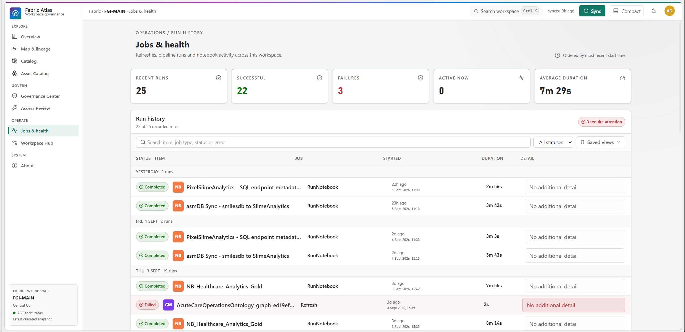{ width=100% }

The example deployment recorded 25 recent runs: 22 completed and three failed,
with an average duration of 7 minutes and 29 seconds. Atlas retains the error
message when an endpoint returns one. An optional job endpoint failure does not
invalidate an otherwise authoritative metadata snapshot, but the missing
collection state remains visible.

### Workspace Hub configuration

Workspace Hub keeps technical configuration and human context in the same
place. Configuration facts are grouped by item and section rather than shown as
one unstructured JSON payload.

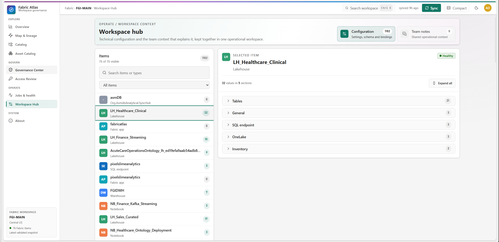{ width=100% }

The captured workspace contained 1,182 configuration facts. The selected
Lakehouse exposed 32 values in five sections. Schema lists are chunked when
necessary so complete metadata can fit within bounded SQL text fields.

### Team notes

Team notes attach operational context to the workspace or a selected Fabric
item. They are stored in the Fabric-backed Rayfin database and survive metadata
refreshes.

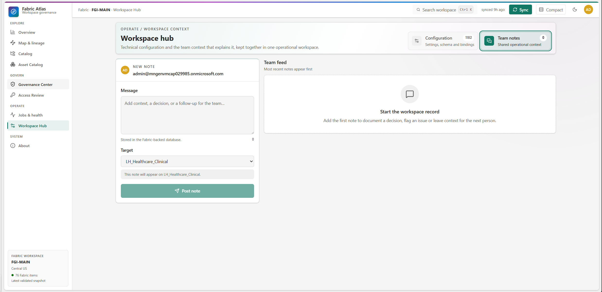{ width=100% }

The fresh deployment had no team notes at capture time, so Figure 19 shows the
empty feed and the workspace-level note composer. Notes are append-only in
version 1.x. The stored author label comes from the authenticated email. Update
and delete operations are not exposed because Atlas does not yet have a
reviewed editing policy and user experience for shared notes.

## Architecture and synchronization

Fabric Atlas is a React and Vite single-page application deployed as a Rayfin
Data App. Fabric brokered authentication supplies the signed-in Entra identity.
A published Fabric User Data Function performs the metadata scan because a
browser application cannot call all required Fabric management APIs directly.

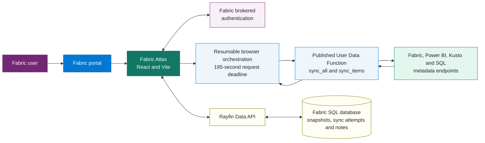

### Synchronization contract

The User Data Function returns a versioned contract with required sections,
optional enrichment and metadata capability status. The browser first requests
an authoritative workspace topology, then sends type-grouped `sync_items`
slices for deeper metadata. A required-section failure or any failed item
enrichment rejects publication.

Each UDF invocation has a 180-second monotonic budget, leaving 20 seconds below
Fabric's 200-second platform timeout. A global budget expiry, one slow request
and a `Retry-After` window that does not fit in the remaining slice are separate
conditions. All three return a continuation instead of pretending the item is
complete. The browser uses a 195-second deadline, renews expiring tokens between
slices and supports cancellation before the manifest is published.

The UDF URL is validated before token acquisition. It must be an HTTPS Fabric
User Data Function endpoint for the configured workspace, and redirects are
rejected in both browser and server transports. The main Fabric token is
read-oriented. A separate optional token is requested only for definition
metadata that requires `Item.ReadWrite.All`; Kusto and SQL tokens remain
optional. Upstream and final payloads are capped at 25 MiB, and the browser
independently caps the streamed response before JSON parsing.

### Immutable snapshots

Each successful refresh writes a new immutable snapshot. Child rows are written
first. The Workspace manifest is written last, after row counts and required
metadata have been validated. Only that final manifest makes the snapshot
visible.

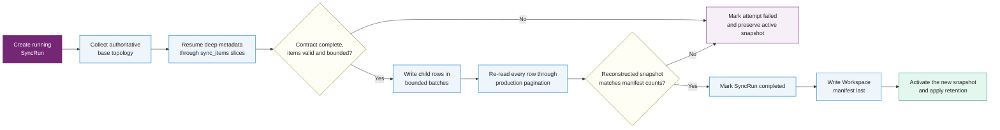

If collection, cancellation, persistence or reconstruction fails, the child
rows have no visible manifest. Hydration ignores them and loads the newest
complete trusted snapshot. Writes use batches of eight requests, and every
persisted entity is read back through the same cursor pagination path used at
startup before the visibility marker is created.

The `SyncRun` row exists before Fabric collection begins. It records the
correlation ID, start time, terminal state, duration and a bounded failure
summary. Status updates are retried. Abandoned snapshot rows are eligible for
cleanup only after a grace period, while the attempt record remains available
for audit.

### Retention and writer trust

Snapshot retention defaults to 12 and can be configured between 2 and 50.
Cleanup starts only after the new manifest is published. Child rows are deleted
before their stale manifest, and a cleanup failure does not convert a successful
sync into a failed one.

The configured synchronization account is the trusted writer. Publication
policies compare the authenticated immutable subject with deployment
configuration. Email remains the visible contact and historical writer label,
but it is not the authorization key. Former synchronizers can be listed
explicitly for historical reads and cleanup during a controlled rotation; they
cannot publish a new snapshot.

### Persisted entities

| Entity | Stored purpose |
|---|---|
| Workspace | Complete snapshot manifest and compact governance summary |
| FabricItem | One row per Fabric item |
| LineageEdge | Directed source-to-consumer dependency |
| Principal | User, group, service principal or guest identity |
| AccessGrant | Workspace or item access evidence |
| JobRun | Recent refresh, pipeline or notebook activity |
| ConfigEntry | Bounded configuration facts and schema chunks |
| Comment | Shared workspace or item note |
| SyncRun | Durable running, completed or failed synchronization attempt |
| SavedView | Personal navigation and filter preset |
| AccessReview | Personal review decision for an effective access pair |
| AccessReviewEvent | Personal append-only access review history |
| FindingAck | Personal Radar acknowledgement or mute |
| GovernancePolicy | Shared posture targets for the workspace |
| GovernanceException | Shared, time-bounded exception with reason and scope |

## Security and data boundaries

Fabric Atlas should be understood as a metadata system. Its security boundary
is defined by what it collects, who can read that collection and who can write
each kind of state.

### Data that Atlas stores

Atlas stores item identity, documented ownership fields, descriptions, labels,
tags, object schema, measure expressions, lineage, principals, grants, recent
job metadata, configuration facts, snapshot summaries and team notes.

### Data that Atlas excludes

| Excluded content | Reason |
|---|---|
| Table and event rows | Business data is outside the product purpose |
| Data source and connection details | The catalog does not need credentials or connection payloads |
| Power Query and source expressions | Source logic is not required for the governance graph |
| Notebook source and cells | Atlas inventories the item without copying its code |
| Pipeline definitions and expressions | The product records the item and exposed lineage, not orchestration source |
| User Data Function source | Functions remain visible as items without copying implementation code |
| Complete report visual and field bindings | The current metadata flow does not expose them reliably |
| KQL rows, query text and policy bodies | Atlas reads schema metadata through Kusto but does not copy business events or executable query content |

The scanner response passes through an explicit allowlist before persistence.
Unexpected fields are not serialized by default.

### Authentication and authorization

Fabric brokered authentication runs the application under the signed-in Entra
identity. The token used for live synchronization must match the current
Fabric user and tenant. Sync tokens use session storage so a later user cannot
silently inherit the first account from a persistent browser cache.

Snapshot publication is bound to the configured Entra subject, which is stable
across email changes. Team-note author IDs are also bound to the authenticated
subject, while the displayed author label comes from the authenticated email.
External identity is stored as true, false or unknown so absent evidence is not
presented as proof that a principal is internal.

| State | Read scope | Write scope |
|---|---|---|
| Synchronized catalog and history | Every authenticated user admitted to the deployed app | Configured synchronizer only |
| Shared team notes | Every authenticated app user | Authenticated author, with email and subject claim binding |
| Saved views | Current user only | Current user only |
| Access review decisions | Current user only | Current user only |
| Radar acknowledgements and mutes | Current user only | Current user only |

The shared catalog scope is intentional in the single-workspace version. Every
user who can open the deployed Fabric App can read the complete synchronized
governance graph and shared notes for that workspace. Deployment owners should
treat the Fabric App audience as the catalog read boundary.

### Failure behaviour

Atlas favours explicit failure over success-shaped fallbacks:

* A required sync section failure rejects the refresh.
* A failed item enrichment rejects the complete candidate snapshot.
* Malformed authoritative lineage or workspace identifiers fail closed.
* Payloads above the configured bounds are rejected before persistence.
* An incomplete snapshot never becomes active.
* Cancellation before manifest publication leaves the current snapshot active.
* Unknown sensitivity rankings do not create downgrade alerts.
* Ambiguous DAX references and ambiguous principals are omitted rather than
  guessed.
* Personalization failures do not hide the underlying governance finding.

## Deployment and operating model

### Prerequisites

A live deployment requires:

1. A Microsoft Fabric workspace on supported capacity.
2. Fabric Apps enabled for the relevant tenant users.
3. A Rayfin deployment with Fabric authentication, data, storage and static
   hosting.
4. An Entra single-page application registration for delegated sync access.
5. A Fabric Administrator for the metadata scanner, plus the documented tenant
   settings and Entra consent.
6. The `atlas_sync_functions` User Data Function published in the workspace.
7. One configured synchronization account.

The application can run locally with the bundled preview data, but live
synchronization and brokered identity require the Fabric portal.

### Deployment flow

The standard deployment commands are:

```powershell
npx rayfin login --tenant <tenant-id> --select
npx rayfin up --workspace "<workspace-name>"
```

The public runtime values are supplied through the git-ignored Rayfin
environment file:

```dotenv
RAYFIN_PUBLIC_ATLAS_SPA_CLIENT_ID=<entra-client-id>
RAYFIN_PUBLIC_ATLAS_UDF_URL=https://<host>/functions/sync_all/invoke
RAYFIN_PUBLIC_ATLAS_WORKSPACE_NAME=<workspace-display-name>
RAYFIN_PUBLIC_ATLAS_SYNC_ADMIN_EMAIL=<authorized-sync-user>
RAYFIN_PUBLIC_ATLAS_SYNC_ADMIN_SUBJECT=<entra-object-id>
RAYFIN_PUBLIC_ATLAS_SNAPSHOT_RETENTION_COUNT=12
```

Deployment provisions or updates the Rayfin backend, applies the schema, builds
the React application and publishes the Fabric App. The exact hosting origin
must be registered as an SPA redirect URI.

### First sync and upgrades

The first deployment shows a guided synchronization gate. The same gate appears
when the major or minor snapshot contract changes. One sync may require several
UDF invocations: an authoritative base scan followed by resumable deep-metadata
slices. The progress display reports the active phase and completed items
without inventing progress while a Fabric request is still running.

Only the configured synchronizer can publish the first snapshot or a later
refresh. If another user reaches the gate, Atlas shows the configured account
to contact.

After a successful refresh, current data and history switch together. The
active view is remounted against the new snapshot so stale selections do not
survive into an incompatible graph.

### Routine operation

The expected operating pattern is simple:

1. Restrict the Fabric App audience to people allowed to read the full workspace
   metadata graph.
2. Keep the synchronizer account and UDF permissions current.
3. Run synchronization after material workspace changes or on the team's chosen
   review cadence.
4. Review Radar for new priority risks.
5. Use Change Center when the team needs exact before and after evidence.
6. Track low posture pillars through the linked catalog, access or operations
   view.
7. Rotate the trusted writer explicitly when the synchronization owner changes.

## Coverage and known limits

Atlas always indexes top-level Fabric items. Deeper inventory depends on the
item type, tenant settings and what the relevant Fabric or Power BI endpoint
returns.

| Fabric element | Current depth | Important boundary |
|---|---|---|
| Lakehouse | Item metadata, tables, columns, SQL endpoint context and lineage | Schema-enabled variants use OneLake listing and SQL endpoint metadata refresh where needed |
| Warehouse and SQL Database | Item metadata, scanner schema, optional read-only SQL catalog, access, lineage and jobs | SQL schema remains unknown when the optional token or endpoint is unavailable |
| SQL endpoint | Item identity, scanner metadata, read-only catalog where available and storage-to-model bridge | The generated endpoint is still represented separately from its parent store |
| Semantic Model | Tables, columns, measures, descriptions, hidden flags, measure DAX and object dependencies | Requires scanner schema and expression options; ambiguous references are discarded |
| Report | Item metadata, bound model, documented owner and pages | Visual and field bindings are not exposed by this flow |
| Notebook | Item metadata, lineage, access and recent runs | Source code and cells are not read |
| Data Pipeline | Item metadata, lineage, access and recent runs | Activities, expressions and definitions are not copied |
| Dataflow and Datamart | Item metadata, documented owner and official upstream IDs | Query content is not copied and cross-workspace dependencies are omitted |
| Eventhouse and KQL Database | Item metadata, Kusto tables, columns, functions, materialized views, lineage, access and jobs | Business rows, query text and policy bodies are not copied |
| Ontology, Graph Model and Data Agent | Definition metadata, selected elements, relationships and object lineage | Definition access uses a separate optional write-scoped token |
| Fabric App, AppBackend and User Data Function | Top-level item and exposed relationships | Internal service inventory and function source are not copied |

### Version 1.x scope

Version 1.x indexes one configured workspace per deployment. It is not an
automatic tenant-wide crawler.

Multi-workspace support is planned as a controlled scope. The roadmap first
adds independent workspace manifests and refresh queues, then aggregates
catalog experiences, and later adds verified cross-workspace lineage only when
both endpoints are inside the indexed scope.

### Reading unknown and not applicable states

Three states must remain separate:

* A value is present.
* The metadata family was collected and the value is empty.
* The metadata family was not exposed or was not applicable.

Atlas uses capability flags and explicit `N/A` states to preserve that
difference. This prevents a missing API response from becoming a false
governance failure.

## Open source implementation

Fabric Atlas is MIT licensed. The deployed About page exposes the current
version, build identifier, source repository, release history and clone command.

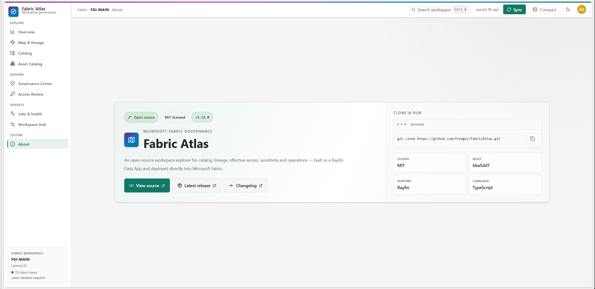{ width=100% }

The front end uses React 19, TypeScript, Vite, Tailwind CSS and Radix
primitives. Rayfin defines and provisions the authenticated data application.
The metadata scan runs in a Fabric User Data Function.

| Repository area | Responsibility |
|---|---|
| `src/App.tsx` | Application shell and hash-based navigation |
| `src/atlas/model.ts` | Shared UI data model |
| `src/atlas/store.tsx` | Hydration, synchronization and comments |
| `src/atlas/live-sync.ts` | User Data Function invocation and response mapping |
| `src/atlas/backend.ts` | Rayfin persistence and trusted snapshot loading |
| `src/atlas/lineage.ts` | Lineage normalization, traversal, impact and layout |
| `src/atlas/schema-lineage.ts` | DAX-resolved schema object dependencies |
| `src/atlas/history.ts` | Validated snapshot comparison and trends |
| `src/atlas/views/` | Product pages |
| `rayfin/data/` | Persisted entities and row policies |
| `fabric/udf/atlas_sync_functions/` | Server-side Fabric metadata collection |

The project uses strict TypeScript checking and validates changes with:

```powershell
npm test
npm run lint
npm run build
```

The production build is intentionally straightforward for the current
application size. Version 1.12.0 ships one main application chunk of about
1.0 MB minified, or about 0.28 MB gzip, plus a smaller Rayfin dependency chunk.
That tradeoff is documented rather than hidden behind an ineffective dynamic
import.

## Conclusion

Fabric Atlas gives a workspace team one consistent metadata snapshot and
several ways to read it. The same indexed evidence supports catalog search,
lineage, DAX dependency analysis, access review, governance findings, snapshot
comparison and operations.

Its limits are as important as its features. Atlas does not store business
rows, does not copy source code and does not claim report field usage that the
current APIs do not expose. Within those boundaries, it provides a practical
answer to three recurring questions: what exists, what changed and what could
be affected.

## Appendix A: figure index

| Figure | Subject |
|---:|---|
| 1 | Overview |
| 2 | Catalog |
| 3 | Asset Catalog |
| 4 | Measure expression and dependency evidence |
| 5 | Item lineage |
| 6 | Object lineage |
| 7 | Semantic model impact report |
| 8 | Verified DAX consumer |
| 9 | Object impact report |
| 10 | Governance Radar and findings |
| 11 | Change Center |
| 12 | Metadata coverage |
| 13 | Posture targets |
| 14 | Access Review |
| 15 | Access Review grouped by principal |
| 16 | Departure pack |
| 17 | Jobs and health |
| 18 | Workspace configuration |
| 19 | Team notes |
| 20 | Deployment and metadata flow |
| 21 | Immutable snapshot lifecycle |
| 22 | About and open-source information |

## Appendix B: glossary

| Term | Meaning in Fabric Atlas |
|---|---|
| Active snapshot | Newest complete trusted snapshot selected by its Workspace manifest |
| Capability | Evidence that a metadata family was collected or was unavailable |
| Consumer | Item or schema object that depends on the selected source |
| DAX edge | Dependency resolved from a measure expression to one synchronized object |
| Effective access | Highest permission produced by all workspace and item grants |
| Finding | Reproducible governance check evaluated from synchronized evidence |
| Inferred object hop | Cross-item source connection requiring item lineage and one unique schema match |
| Radar occurrence | New priority finding or risky change in the latest adjacent snapshot pair |
| Reachable pair | Principal and item combination with effective access |
| Trusted writer | Configured immutable Entra subject allowed to publish and prune snapshots |

## References

* Fabric Atlas source: <https://github.com/fredgis/FabricAtlas>
* Fabric Atlas releases: <https://github.com/fredgis/FabricAtlas/releases>
* Rayfin source: <https://github.com/microsoft/rayfin>
* Microsoft Fabric documentation: <https://learn.microsoft.com/fabric/>
