> This paper documents Fabric Atlas 2.0.0. FGI-MAIN and FGI-ORACLE are used
> as real deployment examples, captured on 3 October 2026. Counts and findings
> describe those workspaces at that point in time. They are not product
> defaults, limits or benchmarks.

## Executive summary

Microsoft Fabric brings data engineering, analytics, real-time processing and
business intelligence into one service. The workspace is where teams build and
operate that estate, but the metadata needed to understand it is spread across
item pages, REST APIs, the Power BI scanner, run history, permissions and
definition files.

Fabric Atlas collects that metadata into a Fabric App. It indexes selected
workspaces without copying business data. Users can browse Fabric items,
inspect internal objects, trace lineage, review effective access, compare
validated snapshots and keep operational notes beside the catalog.

Version 2.0 changes how the metadata is collected. Typed Rayfin Functions now
own core inventory, definitions, Item Relations, SQL metadata, KQL structure,
source provenance and access-policy evidence. A smaller Python User Data
Function remains only for documented platform gaps: the Power BI admin
scanner, PBIR-Legacy report pages, Kusto live metadata and explicit rollback.

The browser coordinates those collectors, isolates item failures, validates
every response and publishes the workspace manifest last. Each selected
workspace has an independent snapshot. A failed refresh in one workspace
cannot replace another workspace's catalog.

Atlas distinguishes observed facts from derived context:

* Atlas snapshot lineage is the trusted source for stored impact analysis.
* Item Relations Preview is an optional Beta view of raw API relationships.
* DAX dependencies are resolved only when a measure or column reference matches
  one synchronized object.
* Access What-if removes recorded grant paths locally. It never changes Fabric
  permissions and never claims to model unavailable restriction layers.
* Missing metadata remains unknown, unsupported, excluded or not applicable.
  It is not silently treated as healthy or compliant.

### What Atlas provides

| Area | Practical outcome |
|---|---|
| Workspace scope | A shared, administrator-selected list of workspaces with independent snapshots and active-workspace switching |
| Catalog | One searchable inventory of Fabric items with type, ownership, health, labels, tags and context |
| Asset inventory | Relational, semantic, KQL, ontology, graph and Data Agent objects grouped under their parent item |
| Search | One command palette for items, objects, people, jobs and notes, with optional OneLake Catalog Preview integration |
| Lineage | Stable source-to-consumer graphs, object expansion, evidence review and focused impact paths |
| DAX X-Ray | Direct and transitive measure-to-column and measure-to-measure dependencies |
| Governance | Findings, changes, history, collection coverage, posture targets and policy context |
| Access review | Effective recorded access, principal review, local What-if scenarios and departure packs |
| Operations | Recent jobs, observed failures, inferred downstream reach and explicit monitoring boundaries |
| Collaboration | Shared append-only notes attached to a workspace or Fabric item |
| MCP | Optional local read-only tools over validated Atlas snapshots |

## Why a workspace atlas is useful

Fabric already exposes extensive metadata. The difficulty is that a reviewer
must move between several experiences to answer one operational question.

Consider a semantic model change. A reviewer may need to identify:

* the Lakehouse or Warehouse that supplies the model;
* notebooks and pipelines that update the source;
* reports and Data Agents that consume the model;
* measures that reference a changed column;
* people who can edit the model;
* the latest refresh status;
* policy or sensitivity evidence that Fabric exposed;
* workspaces at the other end of a reported relationship.

Each fact may exist, but not in one place and not always at the same point in
time. Atlas treats the selected workspace scope as a versioned metadata graph.
Catalog, lineage, access, governance and operations are different views of the
same validated snapshots.

The snapshot model supports questions that a current-state list cannot answer:

* What changed between two accepted snapshots?
* Did a change introduce a new priority risk?
* Which consumers are reachable from this item?
* Which measures use this selected model column?
* Is an access path inherited, direct or mixed?
* Which evidence was unavailable rather than negative?
* Did another workspace retain its valid snapshot when this refresh failed?

Atlas does not replace Fabric administration, deployment or monitoring tools.
It is a metadata reading and review layer. Links return users to Fabric when a
portal-only control is required.

## Deployment evidence

### Controlled main-to-v2 comparison

The release comparison used clean deployments and fresh FGI-MAIN snapshots.
The stable `main` build and the FabCon candidate were scanned against the same
workspace.

| Metric | Stable `main` | Version 2 candidate |
|---|---:|---:|
| Fabric items | 78 | 79 |
| Tabular assets | 623 | 2,436 |
| Tables and schema objects | 75 | 217 |
| Columns | 486 | 2,157 |
| Measures | 62 | 62 |
| Atlas lineage links | 66 | 67 |
| Principals | 2 | 2 |
| Access grants | 144 | 146 |
| Recent jobs | 28 | 28 |

No product inventory metric decreased. The larger schema inventory comes from
SQL Database, Warehouse, schema-enabled Lakehouse and Mirrored Database
collection through SQL endpoint identities.

The broader Asset Catalog shown in later screenshots contains 2,915 objects
across 39 items. That total also includes KQL functions, ontology objects,
graph types, Data Agent sources and selected source elements. The controlled
comparison table above uses the narrower tabular bucket so the two releases can
be compared consistently.

### Example workspace state

The FGI-MAIN manifest used by the screenshots reports:

| Observed value | Current evidence |
|---|---:|
| Fabric items | 79 |
| Atlas lineage links | 67 |
| Principals | 2 |
| Stored access grants | 146 |
| Evaluated principal-item pairs | 158 |
| Recent job runs | 28 |
| Failed recent job runs | 3 |
| Configuration entries | 1,585 |
| Shared team notes | 0 |

FGI-MAIN and FGI-ORACLE are selected in the shared Atlas scope. FGI-MAIN is
the active workspace in the screenshots. FGI-ORACLE remains separately
addressable and is loaded only when a user switches to it.

## Workspace orientation

### Radar-led Overview

The Overview is designed for orientation. The governance radar is the main
visual, with workspace health and priority signals beside it. The current
snapshot places four of six posture pillars at or above their 70 percent
targets.

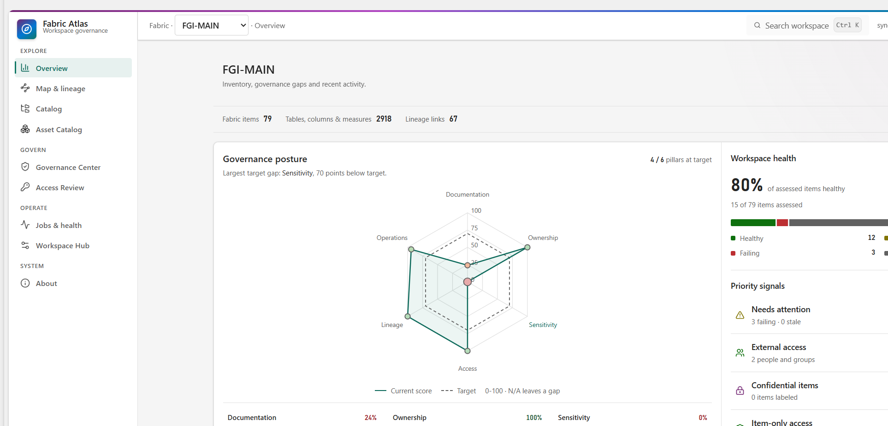{ width=100% }

The screenshot reports:

* 79 Fabric items;
* 67 lineage links;
* 80 percent health across the 15 items with assessed health evidence;
* three failing items;
* no detected external or confidential item signal in the current workspace;
* 146 indexed access grants.

Unknown health does not count as failure. Sixty-four items have no assessed
health status and remain visibly separate from healthy, failing and stale
states.

### Item Catalog

The Catalog keeps every item returned by Fabric visible, including types that
do not yet have a dedicated deep collector. Users can switch between cards and
a sortable table, search by name or tag and filter by item family.

{ width=100% }

Groups remain collapsed by default unless the user searches. This keeps a
large workspace readable while preserving access to every item.

### Workspace-wide search

`Ctrl+K` opens a command palette over the active snapshot. The search index
covers workspaces, items, tables, columns, measures, principals, jobs,
configuration and notes.

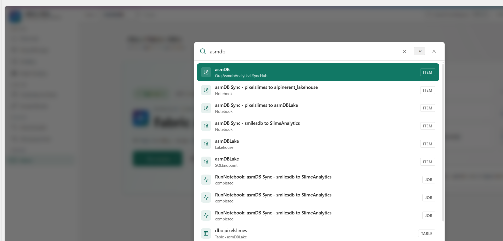{ width=100% }

The `asmdb` search returns the Workload Hub item, related notebooks,
`asmDBLake`, SQL endpoint metadata, completed notebook runs and synchronized
schema objects. Search results navigate back into the matching Atlas view.

OneLake Catalog Preview can extend the same dialog when the deployment enables
the feature and the API is available. Results outside the selected Atlas scope
open in Fabric instead of being copied into the snapshot.

## Internal asset inventory

### Asset Catalog

The Asset Catalog moves below the item boundary. Items and objects are sorted
alphabetically. Filters separate tables, views, columns, measures and the
specialized object kinds collected from KQL, SQL, ontology, graph and Data
Agent definitions.

{ width=100% }

The captured catalog contains 2,915 objects across 39 Fabric items. It includes
generic model tables and columns plus SQL-specific, KQL-specific and definition
objects. Items that support schema collection remain visible even when Fabric
returns no objects.

### Measure metadata and provenance

Measure expressions are retained when Fabric exposes them as semantic model
metadata. Atlas strips comments and string literals before resolving qualified
columns and measures against the synchronized schema.

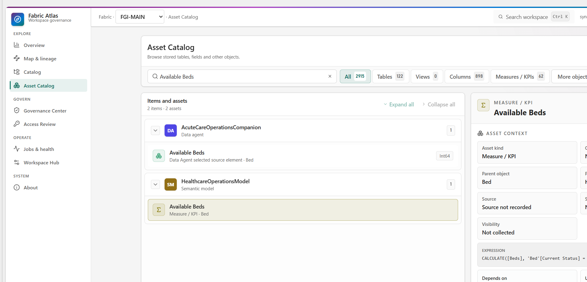{ width=100% }

`Available Beds` depends on the `Beds` measure and
`Bed[Current Status]`. Atlas also exposes the unique upstream Lakehouse object
when item lineage and schema identity support that hop. Same-model references
are labelled DAX. Cross-item source hops remain labelled inferred.

Ambiguous references are omitted. Atlas does not create object lineage from
name similarity alone.

## Lineage and impact analysis

### Trusted Atlas graph

The Atlas graph normalizes stored relationships from source to consumer. Its
initial layout is staged from orchestration through storage, endpoints, models
and consumers. The computed layout contains no backward edges in the initial
view.

{ width=100% }

Impact mode removes unrelated components. The selected
`HealthcareOperationsModel` keeps its upstream Lakehouse and its downstream
report and Data Agent in view. The inspector reports the complete upstream and
downstream path, not only the lines visible in the current viewport.

Users can move Atlas nodes freely. Reset clears selection, focus, impact,
dragging and Preview expansion, then restores the computed layout.

### Item Relations Preview

Item Relations Preview is a separate graph source. Enabling it replaces Atlas
relationships rather than combining two sources into one graph.

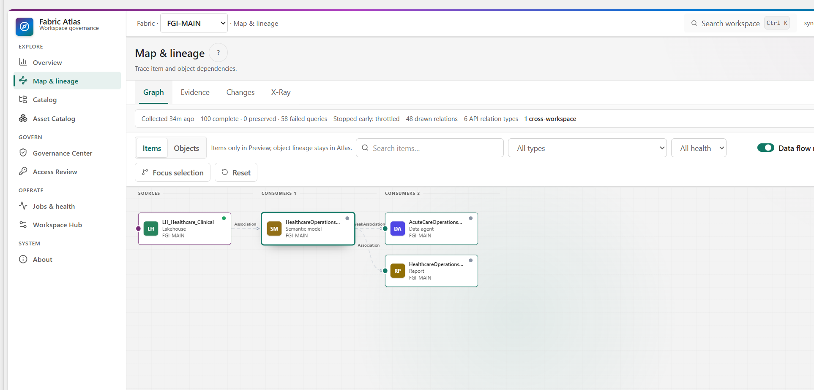{ width=100% }

Preview keeps the raw Fabric API `relationType` on each line. The captured
evidence contains 48 drawn relationships, six relation types and one
cross-workspace relationship. Observed types include:

* `Association`;
* `CascadeDelete`;
* `Datasource`;
* `PushData`;
* `Shortcut`;
* `WeakAssociation`.

The status row also reports incomplete or throttled queries. In this capture,
100 item queries completed, 58 failed and the collection stopped early after
throttling. Atlas preserves that boundary instead of presenting the result as a
complete authoritative graph.

### Evidence desk

The Evidence tab lists the relationships behind the current Preview graph. It
shows source, target, raw relation type, workspace boundary and observation
time.

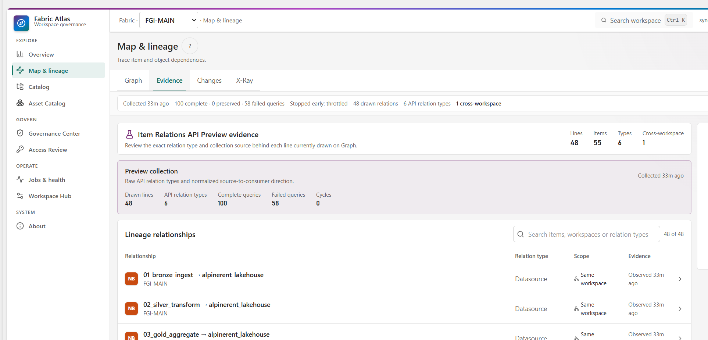{ width=100% }

The summary separates drawn lines, item count, relation types and
cross-workspace evidence. A reviewer can search by item, workspace or relation
type without returning to the graph.

### Semantic model X-Ray

X-Ray reads the resolved DAX dependency index for one semantic model. It
supports measure and column search, Depends on or Used by direction, and direct
or transitive depth.

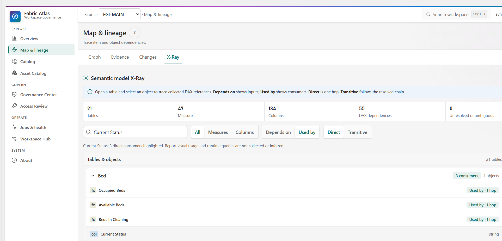{ width=100% }

The selected model contains 21 tables, 47 measures, 134 columns and 55 resolved
DAX dependencies. No unresolved or cyclic dependency is reported in this
snapshot. Selecting `Bed[Current Status]` highlights three direct consumers:
`Occupied Beds`, `Available Beds` and `Beds In Cleaning`.

X-Ray does not infer report visual usage or runtime query behaviour. It shows
the dependency evidence that was collected from model metadata.

### Object lineage

Object mode expands synchronized tables, columns and measures while retaining
the surrounding item graph.

{ width=100% }

Connected items use collapsible summary nodes. Selecting an object in another
item switches the active context and rebuilds the graph. Users can pan the
canvas, move boxes and expand or collapse all item groups.

The boundary remains explicit. Atlas can prove that a report consumes a
semantic model without claiming that a particular visual uses a selected
field.

### Exportable impact reports

An item impact report combines upstream, downstream and relationship evidence
from the trusted snapshot.

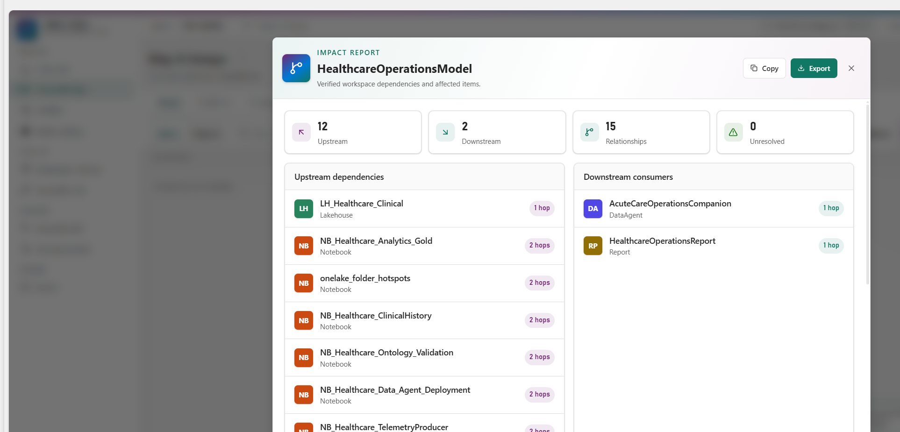{ width=100% }

At object level, the Asset Catalog exposes reverse DAX consumers for a selected
column.

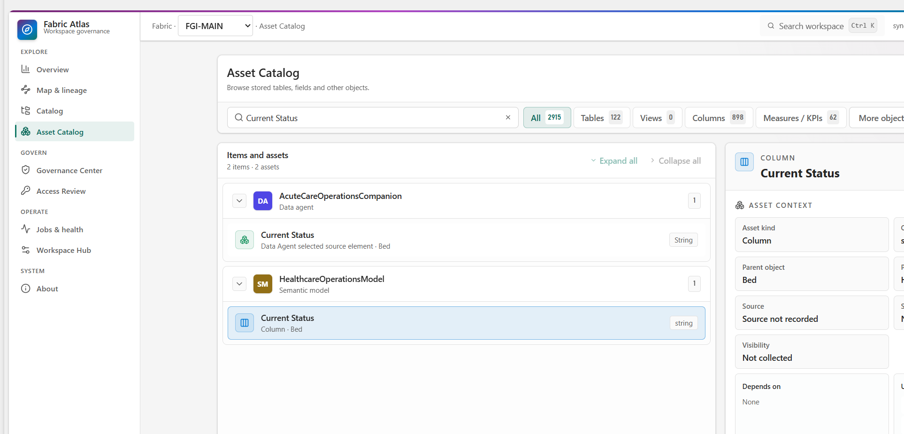{ width=100% }

The object impact dialog can export the same evidence as Markdown. It keeps
verified DAX dependencies separate from inferred cross-item source hops and
Data Agent selected-element evidence.

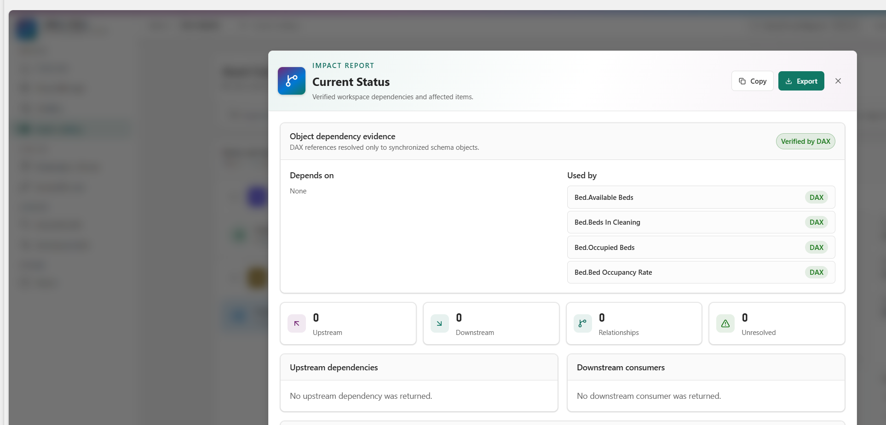{ width=100% }

This distinction prevents an overclaim. Atlas can identify reports that depend
on a semantic model and measures that depend on a model field. It cannot
currently identify the exact report visual that uses that field.

## Governance and policy evidence

### Findings

Governance findings are reproducible checks over the current validated
snapshot. They cover documentation, sensitivity, access, lineage, operations
and metadata coverage.

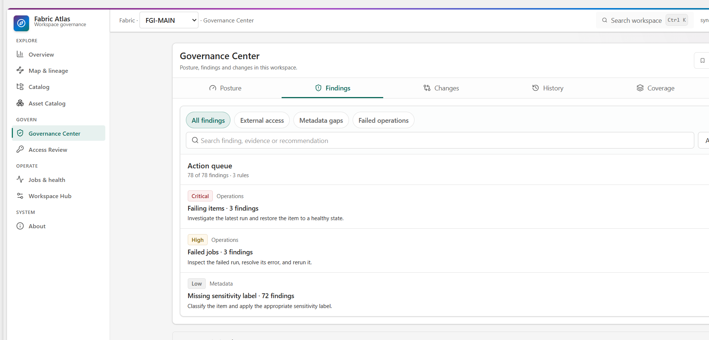{ width=100% }

Findings remain visible until the underlying evidence changes. Personal
acknowledgements and mutes do not hide the finding from other users and do not
alter its raw score.

### Change Center

Change Center compares two validated snapshots across item metadata, schema,
access, sensitivity, lineage and jobs.

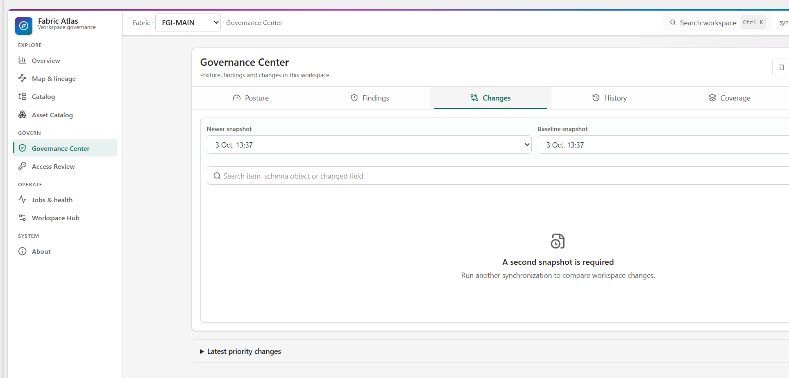{ width=100% }

Workspace manifests retain compact trend summaries. Older detailed catalogs
are loaded only when the reviewer selects a comparison, which avoids hydrating
every historical row at startup.

### Metadata coverage

Coverage reports what Atlas collected, excluded, deferred or could not obtain
through a verified public contract.

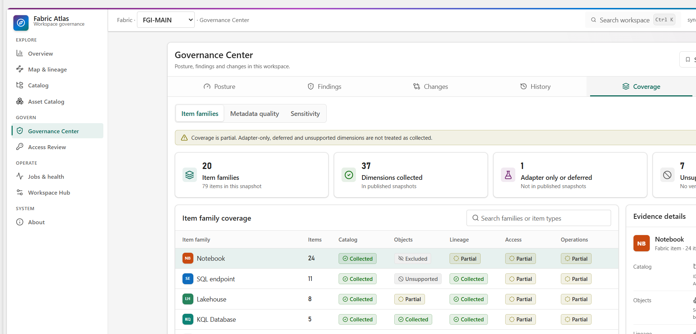{ width=100% }

The captured snapshot covers 20 item families and 37 collected dimensions.
One dimension is adapter-only or deferred, and seven are unsupported. Coverage
keeps catalog, object, lineage, access and operations depth separate for each
item family.

This prevents two different states from being confused:

* Fabric returned the metadata family and the item has no value.
* Fabric did not expose the metadata family through the collection path.

### Posture targets

Atlas scores six pillars independently: documentation, ownership, sensitivity,
access, lineage and operations.

{ width=100% }

The current scores are:

| Pillar | Score | Target |
|---|---:|---:|
| Documentation | 24% | 70% |
| Ownership | 100% | 70% |
| Sensitivity | 0% | 70% |
| Access | 100% | 70% |
| Lineage | 100% | 70% |
| Operations | 94% | 70% |

Non-applicable evidence is excluded rather than scored as zero. Every pillar
links back to the items and findings behind the score.

### Policies & AI

Policies & AI lists semantic models, Data Agents, source metadata and
protection evidence without inventing an exposure verdict.

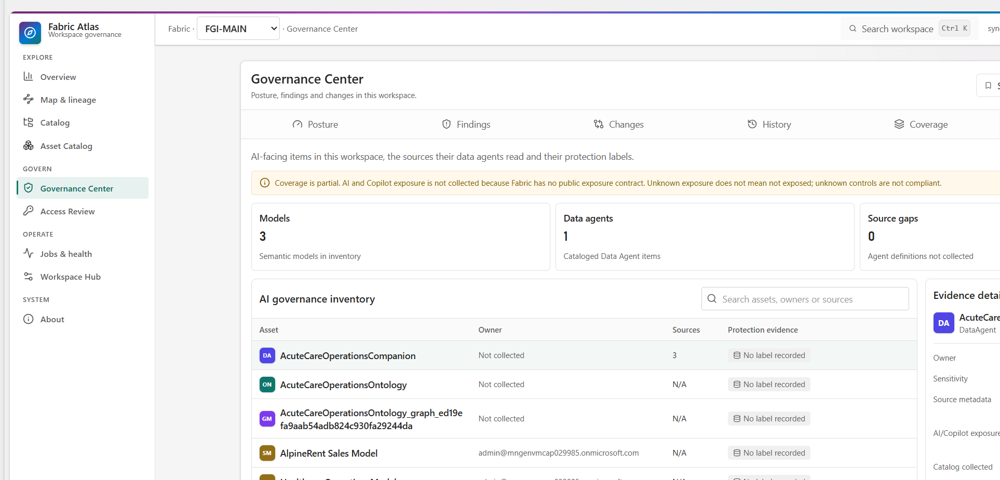{ width=100% }

The captured inventory contains three semantic models and one Data Agent. The
Data Agent has three configured source references and no missing definition.
No sensitivity label is recorded for the displayed assets.

Fabric Policies evaluation is stored separately from recorded grants. If the
collector is off or the tenant contract is unavailable, Atlas labels that
evidence unavailable. Unknown exposure does not mean not exposed, and an
unknown control is not presented as compliant.

## Access review and departure planning

### Review matrix

Fabric permissions are additive. A workspace role can grant access to every
item while a direct item share adds another path. Atlas calculates the
strongest recorded permission for every reachable principal-item pair.

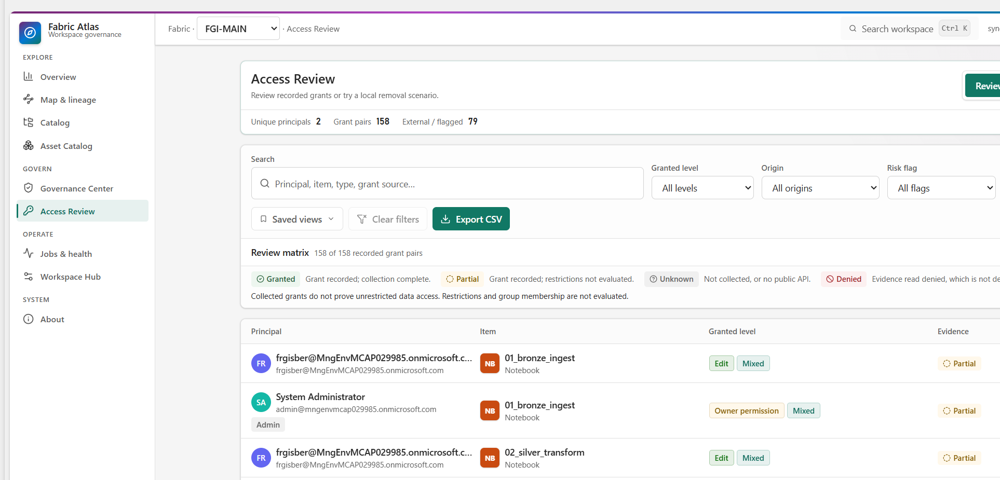{ width=100% }

The captured workspace contains two resolved principals and 158 recorded
principal-item pairs. Filters cover level, origin, risk flag and evidence
coverage. The matrix can be exported as CSV.

Recorded grants do not prove unrestricted data access. Group membership,
OneLake security, Purview DLP and Fabric Policies are shown as collected,
unavailable, unsupported or not evaluated.

### Principal-centred review

Principals mode groups the filtered pairs by identity and strongest recorded
permission.

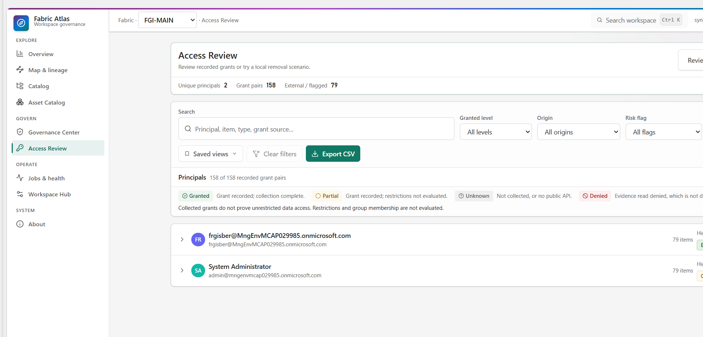{ width=100% }

Personal review decisions are stored per authenticated user. Reviewed,
Accepted and Needs action events do not become a team-wide approval.

### Read-only What-if

What-if removes selected recorded grant paths in memory. It does not call a
Fabric write API.

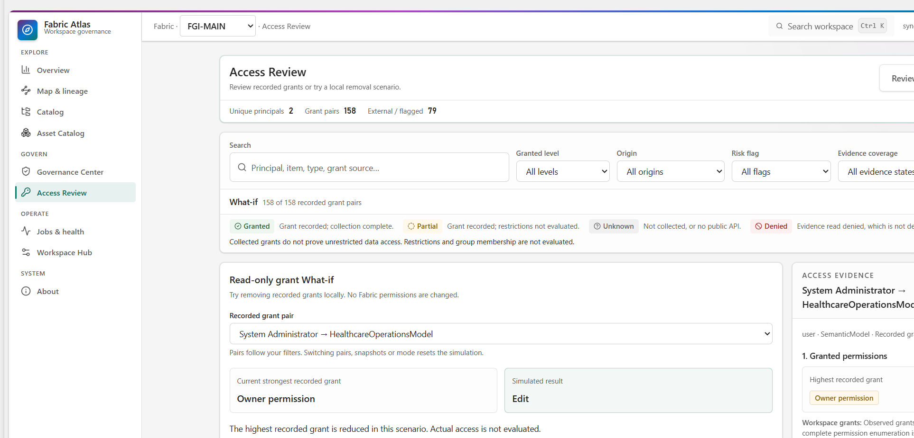{ width=100% }

The selected pair has Owner permission through the workspace Admin role and an
Edit-level direct item share. Excluding workspace-inherited grants lowers the
simulated result to Edit. The panel states that actual access is not evaluated
because restriction and group-membership layers remain outside this
grant-only model.

The scenario can be exported as Markdown or CSV with the evidence boundary
attached.

### Departure packs

A Departure pack combines ownership, effective owner access, sole ownership,
downstream blast radius and reassignment evidence for a person or guest.

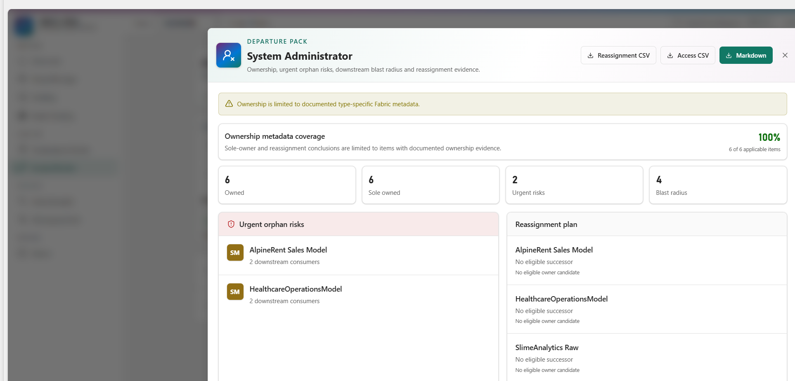{ width=100% }

Ownership conclusions require type-specific Fabric metadata. A matching display
name alone is not accepted as proof. If no eligible successor can be supported
by the graph and access evidence, the report states that no candidate was
found.

Exports include reassignment CSV, effective-access CSV and a complete Markdown
pack.

## Operations and workspace context

### Jobs & health

Jobs & health separates observed execution evidence from downstream items
inferred through stored lineage.

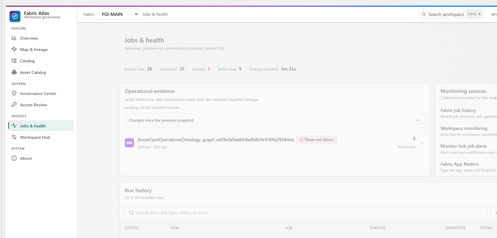{ width=100% }

The captured snapshot contains 28 recent runs: 25 successful and three failed,
with an average duration of 6 minutes and 31 seconds.

Monitoring sources are explicit:

* Fabric job history is collected.
* Workspace monitoring is not collected by Atlas.
* Monitor Hub alerts remain portal-only.
* Fabric App Metrics remain portal-only.

An optional monitoring gap does not invalidate a trusted catalog snapshot.

### Multi-workspace scope

The synchronizer chooses which workspaces belong to the shared Atlas scope.
Unselected discovery results are never stored.

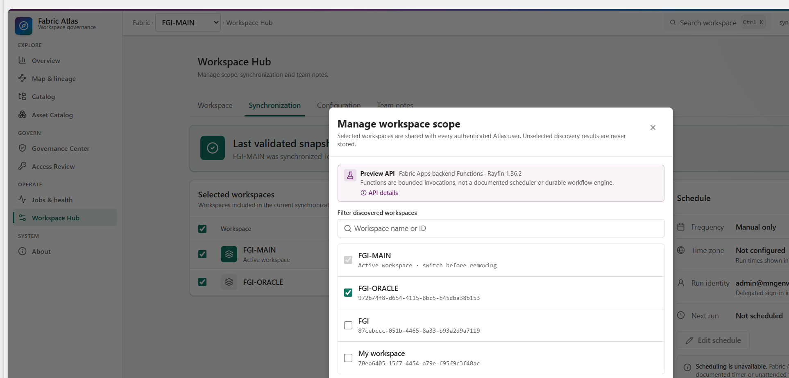{ width=100% }

FGI-MAIN and FGI-ORACLE are selected. The dialog also shows unselected
workspaces returned by discovery. The active workspace cannot be removed until
the user switches away from it.

Every authenticated app user can read the selected catalog scope. Only the
configured synchronizer can change the shared scope or publish snapshots.

### Synchronization

Each workspace has an independent synchronization state and manifest.

{ width=100% }

The panel shows selected workspaces, snapshot status, manual run history and
schedule state. FGI-MAIN has a validated snapshot. FGI-ORACLE remains listed
but is not loaded until selected.

Scheduled refresh is disabled. Fabric Apps backend Functions do not expose a
documented timer or unattended trigger, and the collectors need a delegated
identity that Atlas never stores.

### Configuration

Workspace Hub groups synchronized configuration by item and section instead of
showing one unstructured JSON payload.

{ width=100% }

Configuration includes bounded schema chunks, endpoint context, definitions
and source provenance. Target URLs, source rows, credentials and executable
source code remain outside the snapshot.

### Team notes

Team notes attach shared operational context to the workspace or a selected
Fabric item.

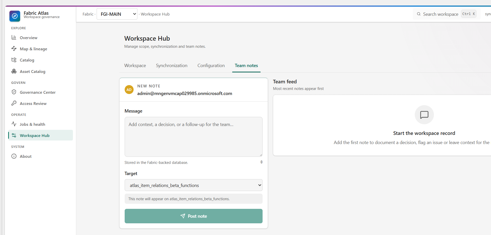{ width=100% }

Notes are append-only. Update and delete actions remain unavailable until Atlas
has a reviewed policy and user experience for shared-note editing.

## Architecture and synchronization

Fabric Atlas is a React and Vite application deployed through Rayfin inside the
Fabric portal. Fabric brokered authentication supplies the signed-in Entra
identity.

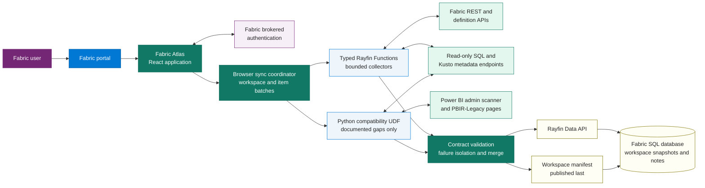
```mermaid
flowchart LR
  U["Fabric user"] --> P["Fabric portal"]
  P --> A["Fabric Atlas\nReact application"]
  A <--> AUTH["Fabric brokered\nauthentication"]
  A --> C["Browser sync coordinator\nworkspace and item batches"]
  C --> RF["Typed Rayfin Functions\nbounded collectors"]
  C --> PY["Python compatibility UDF\ndocumented gaps only"]
  RF <--> FAPI["Fabric REST and\ndefinition APIs"]
  RF <--> DATA["Read-only SQL and\nKusto metadata endpoints"]
  PY <--> PBI["Power BI admin scanner\nand PBIR-Legacy pages"]
  PY <--> DATA
  RF --> V["Contract validation\nfailure isolation and merge"]
  PY --> V
  V --> R["Rayfin Data API"]
  R --> DB[("Fabric SQL database\nworkspace snapshots and notes")]
  V --> M["Workspace manifest\npublished last"]
  M --> DB

  classDef user fill:#742774,stroke:#742774,color:#ffffff;
  classDef portal fill:#0078d4,stroke:#005a9e,color:#ffffff;
  classDef app fill:#117865,stroke:#0c695a,color:#ffffff;
  classDef auth fill:#f7eff8,stroke:#742774,color:#242424;
  classDef function fill:#eef6fc,stroke:#0078d4,color:#242424;
  classDef api fill:#e3f7ef,stroke:#117865,color:#242424;
  classDef data fill:#fffef5,stroke:#817400,color:#242424;

  class U user;
  class P portal;
  class A,C,V app;
  class AUTH auth;
  class RF,PY function;
  class FAPI,PBI,DATA api;
  class R,DB,M data;
```

### Collector ownership

| Evidence | Primary collection path | Compatibility path |
|---|---|---|
| Workspaces, items, roles and jobs | `workspaceCollectCore` | Explicit Python rollback only |
| Definitions and structural metadata | Rayfin definition, Power BI, KQL and SQL collectors | Semantic-model scanner fallback when a definition is unavailable |
| Lakehouse, Warehouse, SQL Database and Mirrored Database objects | `workspaceCollectSqlMetadata` plus Lakehouse REST | None; missing application-identity coverage stays explicit |
| Shortcuts, mirroring and materialized lake view provenance | `workspaceCollectSourceProvenance` | None |
| Item Relations evidence | `workspaceCollectItemRelations` | None; the API remains Beta and non-authoritative |
| Access-policy context | `workspaceCollectAccessPolicyEvidence` | Portal-only layers remain unavailable |
| Power BI admin scanner and scanner lineage | Python UDF | Retained because Rayfin Functions have no documented Power BI audience |
| PBIR-Legacy report pages | Python UDF | Retained until a supported application-identity path exists |
| Kusto live schema | Python UDF | Retained because Rayfin Functions have no documented Kusto audience |

### Why one synchronization can take several minutes

The browser sends bounded collector calls instead of one unbounded function
request. Each call has deadlines, pagination, retries, cancellation and
response-size limits. Item failures are isolated so one optional collector
cannot erase valid metadata from another item.

The browser publishes nothing until every required collector has completed and
the merged snapshot passes validation.

### Immutable snapshots

Child rows are written first. The Workspace manifest is written last. Only that
manifest makes the new snapshot visible.

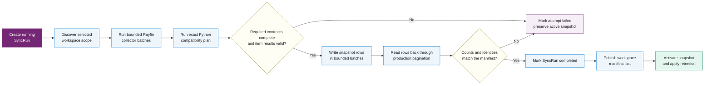
```mermaid
flowchart LR
  S["Create running\nSyncRun"] --> D["Discover selected\nworkspace scope"]
  D --> B["Run bounded Rayfin\ncollector batches"]
  B --> P["Run exact Python\ncompatibility plan"]
  P --> V{"Required contracts complete\nand item results valid?"}
  V -->|No| F["Mark attempt failed\npreserve active snapshot"]
  V -->|Yes| W["Write snapshot rows\nin bounded batches"]
  W --> R["Read rows back through\nproduction pagination"]
  R --> C{"Counts and identities\nmatch the manifest?"}
  C -->|No| F
  C -->|Yes| T["Mark SyncRun completed"]
  T --> M["Publish workspace\nmanifest last"]
  M --> A["Activate snapshot\nand apply retention"]

  classDef start fill:#742774,stroke:#742774,color:#ffffff;
  classDef process fill:#eef6fc,stroke:#0078d4,color:#242424;
  classDef decision fill:#fffef5,stroke:#817400,color:#242424;
  classDef safe fill:#e3f7ef,stroke:#117865,color:#242424;
  classDef fallback fill:#f7eff8,stroke:#742774,color:#242424;

  class S start;
  class D,B,P,W,R,T,M process;
  class V,C decision;
  class A safe;
  class F fallback;
```

If collection, cancellation, persistence or reconstruction fails, child rows
without a complete manifest remain invisible. Hydration loads the newest
trusted snapshot for that workspace.

### Retention and writer trust

Retention defaults to 12 validated snapshots and can be configured from 2 to
50. Cleanup starts only after the new manifest is published.

Snapshot publication is bound to the configured immutable Entra subject.
Email remains the visible contact and historical writer label, but it is not
the authorization key. Former synchronizers can be retained for historical
reads and controlled cleanup without being allowed to publish.

### Persisted entities

| Entity | Stored purpose |
|---|---|
| Workspace | Workspace-scoped manifest and compact governance summary |
| FabricItem | One row per Fabric item |
| LineageEdge | Directed source-to-consumer dependency |
| Principal | User, group, service principal or guest identity |
| AccessGrant | Workspace or item access evidence |
| JobRun | Recent refresh, pipeline and notebook activity |
| ConfigEntry | Bounded configuration facts, schema chunks and provenance |
| Comment | Shared workspace or item note |
| SyncRun | Running, completed or failed synchronization attempt |
| SavedView | Personal navigation and filter preset |
| AccessReview | Personal decision for one effective access pair |
| AccessReviewEvent | Personal append-only review history |
| FindingAck | Personal Radar acknowledgement or mute |
| GovernancePolicy | Shared posture targets |
| GovernanceException | Shared, time-bounded exception with reason and scope |

## Security and data boundaries

### Data Atlas stores

Atlas stores workspace and item identity, documented ownership, descriptions,
labels, tags, object schema, measure expressions, lineage, principals, grants,
job metadata, configuration facts, snapshot summaries and team notes.

### Data Atlas excludes

| Excluded content | Boundary |
|---|---|
| Table and event rows | Business data is outside the product purpose |
| Data source credentials and connection payloads | Cataloging does not require secrets |
| Power Query and source expressions | Source logic is not copied |
| Notebook source and cells | The item is indexed without copying code |
| Pipeline activities and expressions | The item and exposed lineage are stored, not orchestration source |
| User Data Function source | Functions remain visible as items without copying implementation code |
| KQL rows, query text and policy bodies | Atlas reads structural metadata only |
| Mirroring source rows, source database names and target URLs | Only bounded provider, selection and replication context is retained |
| Complete report visual field bindings | The current collection path does not expose them reliably |

Collector output passes through explicit contracts and allowlists before
persistence. Unexpected fields are not serialized by default.

### Authentication and authorization

Fabric brokered authentication runs the app under the signed-in Entra identity.
Collection tokens must match the current Fabric user and tenant.

| State | Read scope | Write scope |
|---|---|---|
| Selected workspace catalog and history | Every authenticated user admitted to the deployed app | Configured synchronizer only |
| Shared team notes | Every authenticated app user | Authenticated author with email and subject binding |
| Saved views | Current user only | Current user only |
| Access review decisions | Current user only | Current user only |
| Radar acknowledgements and mutes | Current user only | Current user only |

The Fabric App audience is the catalog read boundary. Selected workspace
metadata and team notes are shared with that complete audience. Personal review
state remains user-scoped.

### Failure behaviour

Atlas favours explicit failure over success-shaped fallbacks:

* A required contract failure rejects the refresh.
* An incomplete snapshot never becomes active.
* Cancellation before manifest publication keeps the current snapshot.
* One workspace failure cannot invalidate another workspace manifest.
* Malformed workspace IDs, endpoint identities or authoritative lineage fail
  closed.
* Payloads above the configured bounds are rejected before persistence.
* Unknown sensitivity rankings do not create downgrade alerts.
* Ambiguous DAX references and ambiguous principals are omitted.
* Personalization failures do not hide the underlying governance evidence.

## Deployment and operating model

### Prerequisites

A live deployment requires:

1. A Microsoft Fabric workspace on supported capacity.
2. Fabric Apps enabled for the relevant tenant users.
3. A Rayfin deployment with Fabric authentication, data, storage, static
   hosting and Functions.
4. An Entra single-page application registration for delegated compatibility
   collection.
5. A Fabric Administrator for the Power BI scanner and its required tenant
   settings.
6. The minimal `atlas_sync_functions` UDF published for retained gaps.
7. One configured synchronization account.

### Deployment flow

The release deployment command is:

```powershell
npx rayfin login --tenant <tenant-id> --select
npx rayfin up --tenant <tenant-id> --workspace-id <workspace-id> --item-name fabric-atlas --yes
```

Rayfin applies the MSSQL schema, deploys typed Functions, publishes the static
app and writes runtime settings. The compatibility UDF must be updated by
round-tripping its complete Fabric definition and replacing only
`function_app.py`.

### First sync and upgrades

The first deployment blocks catalog access until the configured synchronizer
publishes a trusted snapshot. The same gate can reappear when a major or minor
snapshot contract changes.

If another user reaches the gate, Atlas keeps the configured synchronizer
contact visible.

### Routine operation

1. Restrict the Fabric App audience to people allowed to read the selected
   workspace scope.
2. Keep the synchronizer identity and compatibility permissions current.
3. Run synchronization after material workspace changes.
4. Review failed items and optional collector boundaries.
5. Review Radar and Change Center after a new validated snapshot.
6. Use Coverage before treating a missing value as a governance defect.
7. Rotate the trusted writer explicitly when responsibility changes.

Scheduled and durable unattended refresh remain blocked by platform contracts.
Atlas does not store a delegated user token to work around that limit.

## Fabric item coverage

Atlas always indexes top-level items. Deeper inventory depends on item type,
tenant settings and the endpoints Fabric exposes.

| Fabric element | Current depth | Important boundary |
|---|---|---|
| Lakehouse | Item metadata, tables, columns, SQL endpoint context, shortcuts, materialized lake views and lineage | Schema-enabled variants use SQL endpoint metadata when the legacy tables route returns HTTP 400 |
| Warehouse | Item metadata, SQL tables, views, columns, access, lineage and jobs | SQL endpoint visibility is required for deep structure |
| SQL Database | Item metadata, schemas, tables, views, columns, access, lineage and jobs | Read-only fixed catalog queries only |
| Mirrored Database | Item metadata, provider, selected source context, replication state, SQL tables, views and columns | Source rows, source database names and replication contents are not read |
| SQL endpoint | Item identity, read-only catalog and storage-to-model bridge | The generated endpoint remains distinct from its parent store |
| Semantic Model | Tables, columns, measures, descriptions, hidden flags, DAX and object dependencies | Ambiguous references are discarded |
| Report | Item metadata, bound model, documented owner and pages | PBIR-Legacy pages use compatibility; visual field bindings are not claimed |
| Notebook | Item metadata, lineage, access and recent runs | Source code and cells are not read |
| Data Pipeline | Item metadata, lineage, access and recent runs | Activities and expressions are not copied |
| Dataflow and Datamart | Item metadata, owner and official upstream IDs | Query content is not copied |
| Eventhouse and KQL Database | Tables, columns, functions, parameters, materialized views, lineage, access and jobs | Business rows, query text and policy bodies are not copied |
| Ontology | Entities, properties, relationships, bindings and contextualizations | Document and resource-link payloads are excluded |
| Graph Model | Node types, edge types, properties and source mappings | Graph instances and filter values are excluded |
| Data Agent | Draft and published sources plus selected elements | Instructions, few-shots and prompts are excluded |
| Fabric App, AppBackend and User Data Function | Top-level identity and exposed relationships | Internal service inventory and function source are not copied |
| OneLake shortcut | Name, path, target type and bounded target identity | Target URLs, buckets, subpaths and target columns are not stored |

## Read-only Atlas MCP

Version 2 includes an optional local stdio MCP server for deterministic,
read-only access to validated Atlas evidence. It runs on the MCP client machine,
not as a Rayfin Function or permanent Fabric backend service.

Available tools cover:

* catalog search;
* item context;
* item and object impact;
* access evidence;
* incident evidence;
* snapshot comparison.

The server is disabled by default. Activation requires a dedicated public
client, delegated `Item.Execute.All`, a reviewed external Entra exchange
configuration and live validation under the target Conditional Access policy.
No MCP tool changes Fabric permissions or Atlas data.

## Open source implementation

Fabric Atlas is MIT licensed. The About page exposes the product version,
build identifier, source repository, release history and clone command.

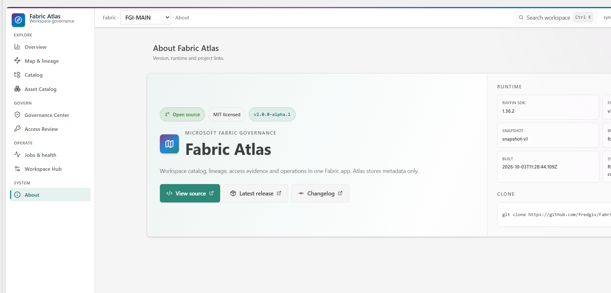{ width=100% }

| Repository area | Responsibility |
|---|---|
| `src/App.tsx` | Application shell, active workspace and hash navigation |
| `src/atlas/model.ts` | Shared UI data model |
| `src/atlas/store.tsx` | Hydration, workspace switching, synchronization and notes |
| `src/atlas/browser-collector-sync.ts` | Browser-serialized Rayfin collection and compatibility planning |
| `src/atlas/live-sync.ts` | Snapshot contracts, Python compatibility invocation and merge logic |
| `src/atlas/backend.ts` | Workspace-scoped persistence and trusted snapshot loading |
| `src/atlas/lineage.ts` | Lineage normalization, traversal and layout |
| `src/atlas/item-relations-evidence.ts` | Preview contracts and relation semantics |
| `src/atlas/source-provenance-snapshot.ts` | Shortcut, mirroring and materialized lake view projection |
| `src/mcp/` and `src/atlas/mcp/` | Local read-only MCP transport and tools |
| `rayfin/functions/` | Typed metadata collectors and durable-execution probes |
| `rayfin/data/` | Persisted entities and row policies |
| `fabric/udf/atlas_sync_functions/` | Minimal Python compatibility collector and rollback |

The repository validates release changes with:

```powershell
npm test
npm run lint
npm run build
```

## Current limits

| Area | Current state | Required next contract |
|---|---|---|
| Scheduled synchronization | Disabled | Supported unattended trigger and identity for every required API |
| Durable server execution | Additive commands and checkpoints exist as a fail-closed probe | Distributed claim or transaction primitive plus browser-closure recovery |
| Python compatibility | Limited to Power BI scanner, PBIR-Legacy pages, Kusto live metadata and rollback | Documented Power BI and Kusto audiences for Rayfin Functions |
| Atlas MCP | Implemented and disabled by default | Public client, delegated permission, reviewed exchange and live validation |
| OneLake security and Purview DLP | Portal guidance and explicit unavailable states | Public read APIs for role membership and restriction evidence |
| Report visual usage | Not collected | Supported report definition path with sensitivity and permission handling |
| Shared actions and notifications | Not implemented | Reviewed ownership model and delivery channel |

## Conclusion

Fabric Atlas gives a Fabric team one consistent metadata system for selected
workspaces. The same validated evidence supports catalog search, lineage,
Preview review, DAX X-Ray, access analysis, governance, operations and team
context.

Its boundaries are part of the product. Atlas does not copy business rows,
source code, prompts or credentials. It does not turn missing metadata into a
positive control, and it does not claim report field usage that the current
APIs do not expose.

Within those limits, Atlas answers four recurring questions:

1. What exists across the selected workspaces?
2. How are items and internal objects connected?
3. What changed, failed or lacks evidence?
4. Who can reach an item, and which recorded path grants that access?

## Appendix A: figure index

| Figure | Subject |
|---:|---|
| 1 | Radar-led Overview |
| 2 | Item Catalog |
| 3 | Workspace-wide search for `asmdb` |
| 4 | Asset Catalog |
| 5 | Measure expression and dependency evidence |
| 6 | Atlas item lineage |
| 7 | Item Relations Preview |
| 8 | Lineage Evidence |
| 9 | Semantic model X-Ray |
| 10 | Object lineage |
| 11 | Semantic model impact report |
| 12 | Model column DAX consumers |
| 13 | Object impact report |
| 14 | Governance findings |
| 15 | Change Center |
| 16 | Metadata coverage |
| 17 | Governance posture |
| 18 | Policies & AI |
| 19 | Access Review matrix |
| 20 | Principal-centred review |
| 21 | Read-only access What-if |
| 22 | Departure pack |
| 23 | Jobs & health |
| 24 | Multi-workspace scope |
| 25 | Synchronization |
| 26 | Configuration |
| 27 | Team notes |
| 28 | Architecture and metadata flow |
| 29 | Immutable snapshot lifecycle |
| 30 | About and open-source information |

## Appendix B: glossary

| Term | Meaning in Fabric Atlas |
|---|---|
| Active workspace | Workspace whose latest trusted snapshot drives the current page |
| Atlas snapshot | Stored, validated and manifest-backed workspace evidence |
| Capability | Evidence that a metadata family was collected, unavailable, unsupported or not applicable |
| Consumer | Item or object that depends on the selected source |
| DAX edge | Dependency resolved from one model expression to a synchronized object |
| Effective recorded access | Strongest permission produced by the recorded workspace and item grant paths |
| Finding | Reproducible governance check over synchronized evidence |
| Inferred object hop | Cross-item source connection supported by item lineage and one unique schema match |
| Item Relations Preview | Beta graph built from raw Fabric Item Relations responses |
| Radar occurrence | New priority finding or risky change in the latest adjacent snapshot pair |
| Reachable pair | Principal and item combination with recorded effective access |
| Trusted writer | Configured immutable Entra subject allowed to publish and prune snapshots |
| What-if | Local simulation that excludes recorded grant paths without changing Fabric |

## References

* Fabric Atlas source: <https://github.com/fredgis/FabricAtlas>
* Fabric Atlas releases: <https://github.com/fredgis/FabricAtlas/releases>
* Rayfin source: <https://github.com/microsoft/rayfin>
* Microsoft Fabric documentation: <https://learn.microsoft.com/fabric/>
